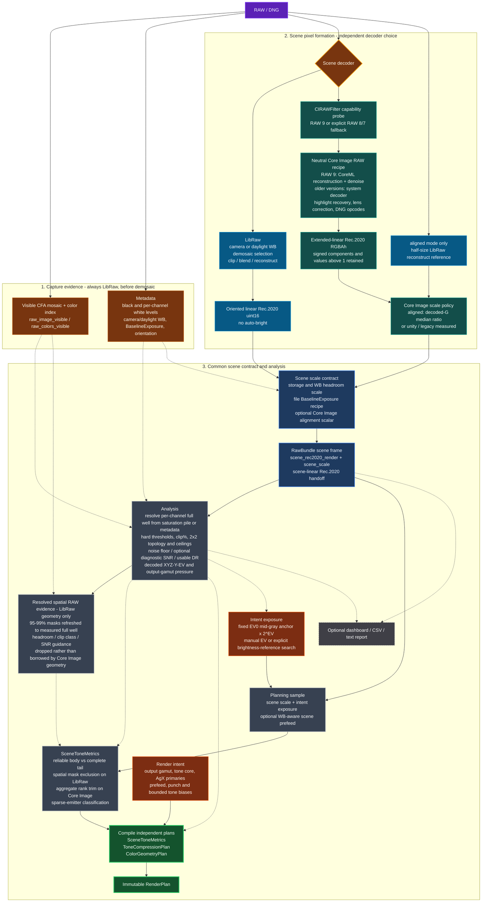
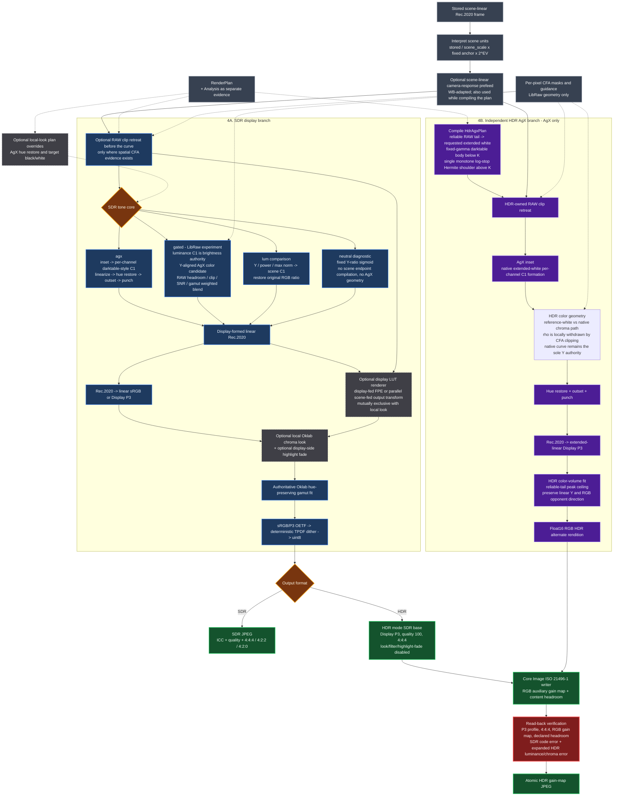
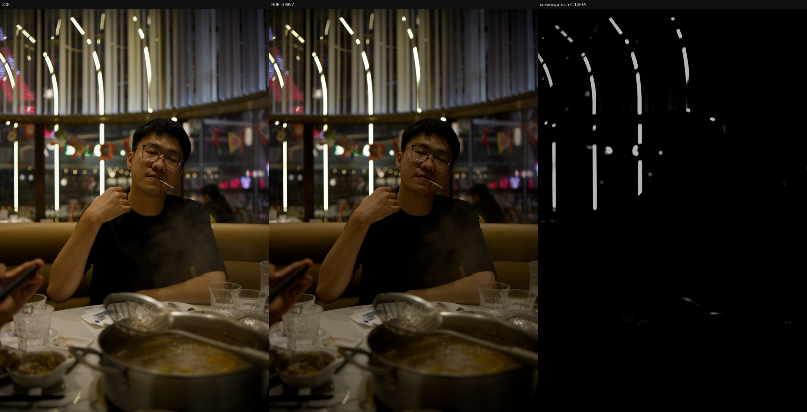
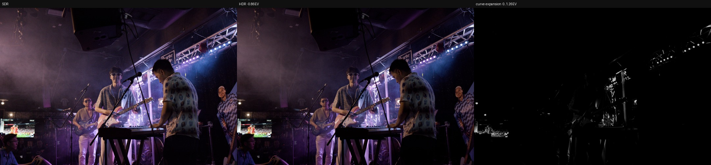
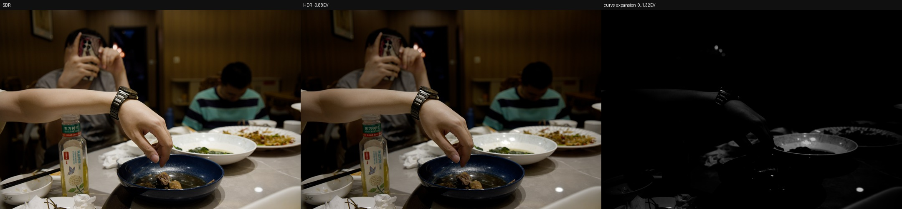

# dngscan

dngscan is a small personal RAW-to-JPEG tool.

The starting point is a preference for how AgX handles digital images, especially
highlights and highly saturated colors, combined with a narrow use case: developing one
RAW through AgX without opening a full photo editor. darktable's scene-linear pipeline is
the foundation of the project, but a complete editor contains far more than this job needs.

dngscan follows that one path: read the RAW, analyse the signal the sensor actually
recorded, form the image in scene-linear Rec.2020, compile a tone plan from the RAW
analysis, and compress it through AgX into an sRGB or Display P3 JPEG. It is not a photo
editor. It is a very narrow digital developer, or a small signal-and-algorithm toy.

The repository is public mainly so friends can use it too. Anyone interested can tinker
with the code, parameters, and data from other cameras.

[中文说明](README.zh-CN.md) · [License](LICENSE) · [Third-party notices](NOTICE.md)

## How to read this

To just convert a photo, [Quick start](#quick-start) is enough; the rest is optional.

To understand why a stage behaves the way it does, read the four layers in order:

| Layer | Decides | Does not decide |
|---|---|---|
| [Capture](#layer-1--capture-where-the-raw-evidence-comes-from) | measurable facts read from the RAW | anything about taste |
| [Tone](#layer-2--tone-exposure-and-curve-construction) | luminance relationships and display range | hue or chroma |
| [Color geometry](#layer-3--color-geometry-what-agx-actually-changes) | hue paths, chroma compression, path to white | the black and white endpoints |
| [Delivery](#layer-4--delivery-sdr-and-hdr-output) | encoding, container, gain map | pixels that are already formed |

The [decoder](#decoders-libraw-and-the-optional-core-image--raw-9-path) is an axis
orthogonal to all four: it decides how RAW becomes scene-linear pixels, not what happens
to those pixels afterwards.

The separation is deliberate. When a stage changes the image, its reason should stay
identifiable -- which is the trade this project makes against a single "make it look
good" slider.

## Quick start

Python 3.10 or newer is required.

```bash
git clone https://github.com/Gen-416/dngscan.git
cd dngscan
python3 -m venv .venv
source .venv/bin/activate
pip install -r requirements.txt
python -m dngscan.gui
```

Open the localhost address printed in the terminal. The GUI runs entirely on the local
machine and uploads nothing. The first open decodes and analyses the file and builds a
1280px proxy; later previews reuse memory and disk caches, while full export always
returns to the full-resolution scene buffer. Full export runs in a short-lived worker
process so its large arrays leave with that process instead of remaining in the GUI
server.

On macOS the cache defaults to `~/Library/Caches/dngscan/preview-v1`, is limited to
768 MB, and evicts older entries automatically.

A practical starting point is EV 0 with `AgX`, `base` primaries, camera WB, and highlight
reconstruction, followed by adjustments based on the photograph. Quality 100 and 4:4:4
are the default output settings.

### CLI

```bash
# Default AgX JPEG
python -m dngscan photo.dng --jpeg photo.jpg

# Highlight reconstruction and Display P3
python -m dngscan photo.dng --jpeg photo_p3.jpg \
  --highlight-mode reconstruct --output-gamut p3

# Apple ISO 21496-1 HDR gain-map JPEG (macOS, Display P3, AgX only)
python -m dngscan photo.dng --jpeg photo_hdr.jpg \
  --output-format ultrahdr --hdr-headroom 3

# RAW analysis dashboard and CSV
python -m dngscan photo.dng --jpeg photo.jpg --scan --csv photo.csv

# Compare another core at the same EV
python -m dngscan photo.dng --jpeg gated.jpg --tone-core gated

# Optional Core Image scene buffer (macOS; evidence stays on LibRaw)
python -m dngscan photo.dng --jpeg ci.jpg --decoder coreimage
python -m dngscan photo.dng --jpeg ci8.jpg --decoder coreimage --coreimage-version 8
python -m dngscan photo.dng --jpeg ci1.jpg --decoder coreimage --coreimage-scale unity

# Deliberately use the brightness reference
python -m dngscan photo.dng --jpeg reference.jpg --ev auto
```

Run `python -m dngscan --help` for the complete list.

### Optional C++ acceleration

NumPy is the reference implementation and works without a native build. The pybind11
C++ kernel accelerates only the normal AgX hot path: formation, C1 curve, hue restoration,
and punch. RAW analysis, tone-plan compilation, and fallback policy remain in Python.

```bash
pip install pybind11 cmake
tools/build_native.sh
```

`DNGSCAN_FAST=auto` is the default; `0` forces NumPy; `1` requires the native kernel and
raises if it cannot be used. The kernel releases the GIL and works with the existing
chunked export path; the AgX hot stage measures at roughly 2x. Import checks its ABI and
runs a self-test. Current real-scene linear differences are around `2e-6`, with final
8-bit differences within one dither step. Its job is only to reduce export time, not to
change the imaging decisions.

## Why a separate pipeline

darktable's scene-referred pipeline works well as a signal-processing laboratory, where
much of the interest comes from understanding what every module does to the signal.
dngscan isolates the path most relevant to this goal: LibRaw interpretation,
scene-linear Rec.2020, and the curve construction and primary geometry from darktable's
GPL `agx` module. AgX originated with Troy Sobotka and developed through the Blender /
EaryChow ecosystem; this project mainly inherits it through darktable's photographic
implementation.

There would not be much point in merely extracting darktable's AgX module. The useful
part of dngscan is carrying information from RAW capture all the way into the final
display transform.

darktable's AgX module receives a floating-point image after demosaic, white balance,
and exposure. It sees the image, but not the original CFA: it cannot know which channel
really clipped on the sensor, or whether a smooth highlight contains measured signal or
values invented by highlight reconstruction. A small integrated pipeline can preserve
that evidence before demosaic, then use it to distinguish the reliable scene body, the
sensor tail, and highlights whose original information has already been lost.

That is also what “automatic” means here. It is not an attempt to make aesthetic choices
for a photograph. It assigns measurable questions to measurements: black and white
levels, per-channel CFA clipping, noise floor, usable dynamic range, the luminance body,
and the highlight tail. These can decide how much scene EV the curve must contain, when
chroma may retreat toward white, and when a reconstructed pixel should not be trusted.

Exposure compensation, white balance, looks, and LUTs are different. They express
capture intent or taste, so they remain explicit choices outside the automatic AgX
analysis. Exposure and white balance do not have to remain untouched; the constraint is
that a content-adaptive algorithm must not silently turn a night scene gray or remove the
color of its original light.

## Pipeline

The first graph follows capture evidence and decoded pixels until they become an
immutable render plan. Solid arrows carry image data; dotted arrows carry evidence or
control data.



Colour marks provenance, which is the thing that is easy to lose: amber is RAW evidence
read before demosaic, blue is the LibRaw decoder, teal is Apple's, grey is the shared
contract both feed, orange is the intent a person supplies, and green is the compiled
plan everything downstream must obey.

The second graph expands the actual render. SDR and HDR share capture, scene intent,
exposure, and the optional prefeed, then split before display formation. HDR never uses
the completed SDR pixels as its tone-map input.



Purple is the HDR branch, blue the SDR one. They meet only at the grey shared nodes on
the left and at packaging on the right — there is no arrow from a finished SDR pixel into
the HDR branch, which is the property the whole split exists to guarantee. The red node
is the only gate that can reject a finished file: it re-reads what was written and
compares it against the rendition it claims to carry.

These layers are deliberately separate. Tone controls luminance relationships and the
display dynamic range. Color geometry controls hue paths, chroma compression, and the
path to white. Capture supplies evidence without directly deciding taste. When one
stage changes the image, its reason should remain identifiable.

Core Image appears twice for unrelated jobs: `CIRAWFilter` is an optional scene decoder,
while `CIContext` is the HDR container writer. Selecting LibRaw does not prevent Apple
gain-map export, and selecting RAW 9 does not turn Apple's native render into the HDR DRT.
In both cases dngscan's own SDR/HDR formation still sits between scene decoding and JPEG
delivery. Preview proxies and streamed C++/NumPy chunks change resolution or execution,
not this ordering; full-resolution export uses the same plan semantics.

### Architecture contract

The decoder and tone core are two orthogonal choices. `libraw` / `coreimage` decide how
RAW becomes scene-linear pixels; `agx` / `gated` / `lum` / `neutral` decide how those
pixels become display-linear values. RAW 9 is not a fifth tone curve, and `neutral` is
not another decoder.

Several invariants are intended to survive future changes:

- The original CFA, levels, clipping rates, and noise statistics always come from
  LibRaw before demosaic. Only the LibRaw scene frame can carry those facts as spatial
  masks. Core Image executes different geometry, so it receives aggregate evidence but
  never borrowed per-pixel masks.
- Both decoders hand off scene-linear Rec.2020. Negative components and values above
  diffuse white remain valid until the DRT; output-gamut fitting happens after tone and
  optional looks, not inside capture.
- DNG [`BaselineExposure`](https://developer.apple.com/documentation/coreimage/cirawfilter/baselineexposure)
  is file-authored baseline rendering compensation. It is not
  shutter/aperture/ISO, an absolute sensor calibration, or content-adaptive auto
  exposure. The explicit `--ev` adjustment comes after it.
- Scene luminance compiles tone endpoints and toe/shoulder behavior. RAW clipping and
  output-gamut pressure compile color permissions. A color metric must not move the
  black/white endpoints, and a tone percentile must not pretend to restore lost CFA
  color.
- `agx` with darktable `base` primaries is the production default. `lum` and `neutral`
  are controlled comparisons; `gated` is the LibRaw-only RAW-evidence experiment.

## Layer 1 — Capture: where the RAW evidence comes from

### Black, white, and per-channel clipping

dngscan reads the pre-demosaic CFA from `raw_image_visible` and
`raw_colors_visible`. Black level comes from metadata. Full well first looks for a
credible saturation pile at the top of each channel and uses that measured ceiling
when present; otherwise it falls back to per-channel metadata white levels. The values
are never collapsed into one scalar for all R/G/B, so clipping is a threshold map
indexed by CFA color. If no channel has a reliable pile, the report labels full well as
a metadata fallback rather than presenting the estimate as a measurement.

This affects more than the clip percentage in a report. Hard clip percentages, 2x2 cell
metrics, highlight classes, and diagnostic clip maps use the same per-channel threshold
map. The render-time **soft headroom mask** is related but intentionally not identical:
it ramps from 0 at 95% to 1 at 99% of each channel's black-subtracted full well, so color
can retreat before interpolation reaches a hard discontinuity. If green reaches full
well before red, both the hard statistics and the soft permission map preserve that
channel distinction.

Highlight reconstruction can create continuous luminance and plausible color, but it
cannot recover signal the sensor never recorded. Clipping evidence is saved before
reconstruction, so a repaired pixel can never feed back and define the global white
endpoint.

### Demosaic

Full-resolution `auto` export tries DHT, DCB, then AHD according to what the local
rawpy/LibRaw build actually supports. Non-Bayer data such as X-Trans stays on the
corresponding LibRaw path. Preview uses half-size 2x2 superpixel binning, so it is useful
for exposure, color, and highlight decisions but not for judging final texture.

dngscan performs no denoising, which makes demosaic the main texture choice. DHT suits
clean low-ISO signal; DCB, AAHD, VNG, or PPG can look more natural on noisy night files.
Standard rawpy wheels do not necessarily include GPL demosaic-pack algorithms such as
AMaZE, LMMSE, VCD, or AFD, so the available set depends on the local LibRaw build. The
GUI/CLI can select `dht / dcb / ahd / aahd / vng / ppg` manually; an algorithm supplied
by another LibRaw build only needs an entry in `DEMOSAIC_CHOICES` to use the existing
availability check and fallback logic.

### White balance

`camera` uses the file's AsShot measurement. `daylight` uses LibRaw's calibrated
daylight multipliers and is useful when a group of images under the same light should
keep a fixed balance.

Sun, overcast, and shade lie roughly on a predictable daylight locus, where the camera
measurement is usually useful. Mixed light, narrow-band LED, fluorescent, and sodium
light are not a simple color-temperature problem. Some changes that look like incorrect
white balance also come from a tone curve redistributing luminance and purity, which is
why WB and the DRT remain separate stages. The AsShot deviation from the daylight
multipliers is also written into the analysis: it is both WB data and evidence about the
light at capture.

An adapted eye in front of a display is not an absolute white-point meter.
Hunt, Stevens, Abney, and Bezold-Brücke appearance effects can make changes in luminance
and purity look like changes in hue or warmth, while memory colors such as skin, sky,
and foliage are not simple colorimetric targets. When something looks “off,” separating
the illuminant, camera balance, tone, and color geometry is more useful than immediately
turning the temperature control.

### Highlight handling

LibRaw's three choices affect the appearance after reconstruction:

- `clip` cuts at saturation. It is closest to sensor state, but staggered channel
  clipping can leave colored borders.
- `blend` feathers the clipping boundary.
- `reconstruct` estimates missing channels from surviving ones. It can recover
  continuous structure, but its chroma is inferred.
- Its hue often leans toward the surviving channel, so continuity is not color truth.

For normal photographs, `reconstruct` is the practical default; `clip` is more useful when
inspecting the sensor or the algorithm itself. The saved RAW clipping evidence is unchanged
in every case.

LibRaw stores `blend` and `reconstruct` darker in uint16 by exactly the normalized peak
white-balance multiplier, reserving container codes for reconstructed values above
nominal white. dngscan records that reserve in `scene_scale` instead of treating it as
an exposure change. On the Sigma fp sample (`max WB = 2.33`, or 1.22 EV), clip and
reconstruct now agree in the reliable body within 0.03 EV while reconstruct keeps its
extra highlight range.

## Decoders: LibRaw and the optional Core Image / RAW 9 path

`--decoder coreimage` is an alternate capture decoder, independent of the selected tone
core. It is not a quality upgrade and is never the default. Before decoding, dngscan asks
that file's `CIRAWFilter.supportedDecoderVersions()` whether RAW 9 is actually available;
a camera-name list is not treated as proof. If the file stops at RAW 8 or 7, the GUI asks
before using the older decoder and the CLI prints a warning. Explicit
`--coreimage-version 9` refuses the file instead of silently downgrading. The decoded
frame is signed RGBA half-float in extended-linear Rec.2020. Negative
color components and values above diffuse white therefore reach AgX unchanged. Look
controls are configured for a neutral linear handoff (with RAW 9's moire value deliberately
left at Apple's detail-preserving default); highlight recovery and lens correction are
enabled explicitly. The configuration follows Apple's separation of the linear RAW recipe
from its editable render recipe in [WWDC21 session 10160](https://developer.apple.com/videos/play/wwdc2021/10160/).

It is a **separate pipeline, not a LibRaw back end.** Core Image executes the DNG
opcodes a file carries; on a Sigma fp DNG that means a per-plane `WarpRectilinear` plus
a lens-shading `GainMap`. The warp moves corners by tens of pixels (measured ~70 px on a
24 MP frame), so LibRaw's per-pixel CFA masks describe different pixels and are dropped
rather than re-mapped — carrying them over would put clip retreat on the wrong part of
the image. Consequently this path has no per-pixel CFA evidence: `--tone-core gated` is
refused, clip retreat does not run, and `--highlight-mode` does not apply because Core
Image performs its own highlight recovery. Aggregate RAW facts (levels, clipping
percentages, SNR, noise floor, white-balance testimony) are distributions rather than
pixel positions, so they remain valid and still come from LibRaw. For tone planning,
the measured clipped-cell percentage removes the same fraction from the top of RAW 9's
luminance rank. This is an aggregate comparison heuristic, not a claim that a particular
RAW 9 pixel maps to a particular CFA site: reconstructed pixels still describe highlight
topology, but cannot set the global white endpoint. The report names the decoder, its
version, and the opcodes that were executed.

Core Image and LibRaw do not expose the same scene unit, and a single fitted correction
did not generalize across cameras or scenes. The default is therefore
`--coreimage-scale aligned`: dngscan makes a cheap half-size LibRaw reconstruction of the
same file and applies the ratio of the two decoded green-channel medians as one scalar.
The RAW-green term used by an earlier explanation cancels algebraically; this is a
per-file decoder A/B ruler, not an absolute sensor calibration. It does not target 18%
gray or alter within-frame light ratios, but decoder color, geometry, and reconstruction
can influence the statistic.

`--coreimage-scale unity` bypasses that comparison and preserves Core Image's native
units. `measured` applies the old fixed `1/1.0293` Sigma-fp fit only to reproduce earlier
A/B renders. These modes are mutually exclusive in effect; the fixed multiplier is not
followed by an alignment that cancels it.

Two luminance conventions appear in these comparisons and they must not be quoted
interchangeably. The *reliable body* median is scene-linear, measured before the tone
curve and after excluding RAW-clipped samples; the *final output* median is measured on
the rendered image, where AgX has already compressed both ends. On `_SDI0150` the same
pair of decoders differs by +0.123 EV on the first and +0.02–0.03 EV on the second — the
tone curve absorbs most of a scene-linear offset, so the two figures are roughly 5x
apart. Both are correct answers to different questions; state which one a number is.

Beyond alignment the paths differ mainly in camera interpretation — color separation,
noise reconstruction, and highlight rendering on the Sigma fp samples. Three behavioural
differences follow from the decoders themselves rather than from taste:

- **The brightness-reference button can choose a different EV on each path.** It reads
  the reliable body median from the selected decoder after the selected scene transform,
  rather than reusing LibRaw's CFA histogram as a brightness proxy. It then searches the
  final output for highlight safety with one fixed compiled plan. This makes the button
  useful across decoders without turning EV 0 into hidden auto exposure. Compare at a
  fixed `--ev` when the decoder itself is the question.
- **Apple's buffer carries specular values above diffuse white, but reconstruction is not
  radiometry.** The full RAW 9 tail remains available to classify broad highlights versus
  sparse emitters. The global white endpoint uses only the reliable rank after subtracting
  the full-resolution CFA clipped-cell fraction. This keeps Apple's smooth reconstruction
  while preventing it from claiming sensor headroom that was already lost.
- **A fixed `--ev` still does not isolate the decoder.** The buffers can compile slightly
  different plans, and Core Image also executes a different geometry. `tools/decode_ab.py`
  renders each buffer through each plan to separate decode and plan effects. On the current
  SD-card checks, an ISO 3200 frame differed by +0.006 EV at median output and a bright
  ISO 100 frame by -0.020 EV; a near-dark ISO 25600 frame differed by -0.413 EV, almost
  entirely in the RAW 9 decode. The last case is why this remains an alternate path rather
  than a silent replacement for LibRaw.

**RAW 9 denoises by construction.** Apple describes it as a tiled CoreML model that
fuses demosaic *with* denoise ([WWDC26 session 305](https://developer.apple.com/videos/play/wwdc2026/305/)), so there is no unprocessed mode to
ask for: the reconstruction is the decoder. Note that `luminanceNoiseReductionAmount` at
0 therefore does not mean "no denoising" — it selects the least-smoothed end of a
calibrated range over a model that always runs.

dngscan clears the exposed look controls anyway, including `sharpnessAmount`, which is
inert on version 8, live on version 9, and whose default is file- and version-dependent
(0.485 and 0.954 both seen). Measured at full resolution against Apple's own defaults,
only three of the exposed controls do anything on version 9, and the configuration is
already at or near the most detailed end the API can reach:

| control | change vs the settings used here |
| --- | --- |
| `colorNoiseReductionAmount`, `detailAmount` | none — 0.00 % of pixels over 0 / 0.5 / 1.0 |
| `sharpnessAmount` at Apple's default | +5.9 % high-frequency energy |
| `luminanceNoiseReductionAmount` at its 0.043 default | −3.1 %; at 1.0, −59.8 % |
| `moireReductionAmount` forced to 0 | −59.8 % |

Two of those are worth reading twice. The first row corrects an earlier claim in this
file that the three behaved as aliases of one internal control changing 93.6 % of pixels:
re-measured, they do not, and Apple's documentation is right about them. And
`moireReductionAmount` is deliberately left at Apple's 0.55 rather than cleared — its
zero is the control's *smoothest* end, not "off", so forcing it would cost as much detail
as full luminance denoising. That leaves `sharpnessAmount` as the only detail still on the
table, and it is spatial sharpening, which has no place in a scene-referred buffer.

So the softness that remains in a RAW 9 render is the model, not a switch left on. There
is nothing further to turn off.

Even so the residual difference remains large, and how large depends on the scene.
Measured as the median local standard deviation over 8×8 tiles in the darkest 30 % of the
frame, with both paths at a fixed `--ev 0`:

| frame | ISO | luma noise vs LibRaw | chroma noise vs LibRaw | fully black px |
| --- | --- | --- | --- | --- |
| stage, near-darkness | 25600 | 15 % | 15 % | 9.5 % vs 8.1 % |
| garden, overcast daylight | 12800 | 78 % | 28 % | 1.5 % vs 1.4 % |

The chroma cleanup is consistent; the luma cleanup is not. The model earns most of its
advantage where SNR is genuinely poor, and on a well-exposed frame the dark 30 % is dark
in *tone* rather than starved of signal, so the two paths nearly converge. The shadows
are not paid for: once `shadowBias` is zeroed (see below) the fully-black counts sit
within about a point of the LibRaw path. Switching LibRaw to a smoother demosaic (VNG,
PPG) does not close the gap, so this is the model rather than interpolation choice.
Worth weighing against this tool's position that it performs no denoising and leaves
texture to the demosaic choice.

**The decode follows Apple's linear-extraction structure directly.** `baselineExposure`,
`shadowBias`, `boostAmount`, `localToneMapAmount`, and RAW `exposure` are zeroed inside
CIRAWFilter; EDR and gamut mapping are disabled; and the result is rendered into
`extendedLinearITUR_2020`. The original `baselineExposure` is recorded before clearing,
then restored exactly once through `scene_scale`, just as it is on the LibRaw path. The
handoff pixels remain directly scene-linear without discarding the file's rendering intent
or applying it again with the user's EV.

**Aligned mode is a practical per-file decoder comparison.** The half-size LibRaw
reference uses the same white balance, highlight reconstruction, and storage-scale
contract as the main LibRaw path. Its decoded green median is divided by RAW 9's decoded
green median, then that one scalar is applied to the Core Image frame. The old RAW-mosaic
normalizer contributed the same term to numerator and denominator and therefore did
nothing; describing the result as a raw-to-scene sensor gain was incorrect.

The half-size reference is cheap and has tracked the full-resolution factor within about
0.02 EV in the current samples. The report names the factor, or names the failure and
falls back to identity if the statistic is invalid or implausible. The operation aligns
neither geometry nor tone plans: each buffer still compiles its own endpoints, and RAW 9
retains its own reconstruction, color separation, and noise behavior. Use `unity` when
those native scale differences are themselves part of the comparison.

This scalar is intentionally narrower than auto exposure. It has no external target and
cannot reorder light levels inside the photograph; a night scene remains a night scene.
It can still be content-sensitive because the two decoders do not produce identical
colors or geometry, which is why the README calls it an A/B ruler rather than physical
calibration.

The alignment belongs at the capture handoff, before the common fixed exposure anchor and
DRT. It changes how a decoder unit is interpreted; it does not compile or reshape the
tone curve. Keeping it there prevents decoder comparison policy from leaking into AgX.

One residual asymmetry is worth knowing before trusting a preview. The Core Image preview
decodes to a 1280 px proxy while the LibRaw preview bins 2×2 superpixels, so the two see
different amounts of noise and can compile slightly different black endpoints than their
own exports. Measured across three frames the Core Image preview-to-export black shift
was −0.01, −0.22 and +0.01 EV, against −0.05, +0.02 and −0.04 EV on the LibRaw path: the
same order of magnitude except on a noisy frame, where the proxy's averaged-away noise
reads as a cleaner shadow than the export will produce.

**BaselineExposure is honoured on both paths.** Apple defines it as baseline exposure to
apply during RAW rendering; its default can vary with camera settings, and ProRAW can
write a per-image recipe based on scene dynamic range. It is not the physical capture
exposure described by shutter/aperture/ISO, nor a command to normalize image content.
LibRaw does not apply the tag, so dngscan folds its gain into `scene_scale`. Core Image now
reads and clears the property first, then restores the same gain after the linear handoff.
Changing the scale rather than multiplying a storage buffer preserves headroom and
precision. Use `--ev` for subjective adjustment on top; the report names the file value
and where it was applied.

`shadowBias` is the one that is easy to miss: it defaults to **5.0**, subtracts from the
shadows, and is a display-referred black pedestal with no place in a scene-linear buffer.
Leaving it at the default drove components to exactly zero on 1.4 % of an ISO 12800 frame
and 21.0 % of an ISO 25600 one — against 0.006 % and 0.18 % once zeroed, both *below* the
LibRaw path's own 0.16 % and 1.9 % — and pushed the 1st luminance percentile negative.
Shadow loss that looks like the CoreML denoiser eating detail is mostly this subtraction.

**Clearing controls stops at reconstruction.** "Zero every control" is otherwise a rule
inherited from the LibRaw path, and applying it wholesale to a decoder built on different
assumptions produces a worse decode, not a purer one. Reconstruction controls are set
explicitly so an OS default change cannot silently alter the contract:

- **`highlightRecoveryEnabled` is explicitly on.** It reconstructs clipped
  channels, which is the same job `--highlight-mode reconstruct` does on the LibRaw side,
  not a look control. Disabling it returns clipped highlights with green pinned far below
  red and blue — near-white mean R 1.933 / G 0.681 / B 1.816, green the largest channel
  in 0 % of them — which renders as magenta highlight cores with pink halos, a +0.077
  magenta bias in the exported JPEG where LibRaw sits at −0.000. With recovery on the
  same pixels average 1.981 / 1.980 / 1.980 and the bias falls to +0.002, while the
  specular headroom survives (p99.995 2.08, max 2.22). That makes it strictly better than
  the LibRaw path's clip-to-common-white, which buys neutral highlights by throwing the
  roll-off away.
- **`lensCorrectionEnabled` is explicitly on.** RAW 9 and the file's DNG opcodes form one
  calibrated camera decode. This is also why LibRaw's pixel masks cannot be reused.
- **`gamutMappingEnabled` stays off.** It is an output-referred clamp and belongs after
  the view transform. Enabling it cut p99.995 from 2.08 to 1.07, zeroed every negative
  component — real scene colours outside Rec.2020 — and changed 14 % of pixels. AgX does
  its own gamut work downstream, so the handoff stays scene-referred.

The pixel handoff follows Apple's example as closely as the Python bridge allows:
`RGBAh`, extended-linear Rec.2020, signed half-float, no percentile normalisation and no
unsigned clamp. Preview asks `CIRAWFilter.scaleFactor` for a 1280-pixel long edge instead
of decoding a 6 MP intermediate and shrinking it later. The interactive `CIContext` is
reused with `cacheIntermediates=true`; full export uses a separate reused context with
intermediate caching disabled and a 1024 MB memory target. On a 24 MP Sigma fp sample,
RAW 9 decode measured 1.24 s at 1280 px and 2.08 s at 6000x4000; the complete full-size
decode, analysis, plan and render took about 5.1 s before JPEG encoding.

`extendedDynamicRangeAmount` is explicitly set to 0 so Apple's display-side HDR mapping
cannot precede AgX in the scene buffer. Raising it to 1.0 does
expose more separation at the very top (range 0.11 → 1.74 across the topmost pixels), but
the highlight region correlates at 0.996 in log2 with the default render, so it is
substantially a remap of the same information — and it pushes the peak to 20, far past
the headroom this pipeline reserves.

**Which decoder version, and which variant.** A freshly initialised filter reports
version 8, not 9, so RAW 9 must be opted into explicitly even where the file supports it;
`supportedCameraModels` lists 921 models on macOS 27 and includes the Sigma fp. The
version list also offers `.dng` variants (`9.dng` alongside `9`) which are a genuinely
different decode — 99.96 % of pixels differ. Measured against the colour LibRaw derives
from the file's own matrices, plain `9` sits at a chromaticity distance of 0.015 and
`9.dng` at 0.041, noticeably bluer, so the plain version is the one this pipeline
requests.

**Controls that stay adjustable.** RAW 9 is a computational decoder, and several of its
knobs are calibrated controls over the model rather than stages that can be switched off.
`exposure` is plumbed through. The white-balance interface (`neutralTemperature` /
`neutralTint` / `neutralChromaticity` / `neutralLocation`) is the supported way to move
white balance and is why `--wb daylight` is refused rather than approximated on this
path. `linearSpaceFilter` is Apple's own hook for inserting a CIFilter while the image is
still linear, which is the architecturally correct place for any scene-referred operation
this pipeline might want to push into the decode. Until that white-balance interface has
a validated temperature/tint mapping, `--wb daylight` is rejected on this path rather
than approximated.

RAW 9 ships with the OS, so a macOS update can replace the model while `decoderVersion`
continues to report "9". Reports now record the system version/build fingerprint alongside
the decoder token, making two renders traceable to their actual runtime. The golden matrix
still covers only the stable post-decode algorithm layer; Core Image tests pin properties
rather than bytes, so an OS update still requires an explicit A/B on the same RAW corpus.

## Layer 2 — Tone: exposure and curve construction

### Fixed exposure anchor

The pipeline uses scene-linear `0.18` as nominal middle gray. Its current render anchor
is one global fixed scalar, `0.18 * 2^3`, followed by manual EV; it is not yet a
per-camera calibration and it never forces an image median to 18% gray. DNG
`BaselineExposure`, when present, is honoured earlier as part of the file recipe.
Constant scaling preserves scene intent: a dark scene remains dark before AgX, a bright
scene remains bright, and content-adaptive exposure does not reorder photographs.

The GUI's **brightness reference**, also available as `--ev auto`, is an explicitly
requested alternate reading. It tries to place the reliable scene-body median at 18% gray while
respecting a budget for newly created highlight clipping. The median comes from the
selected decoder's reliable scene body after the selected scene transform; RAW-clipped
samples do not define it. The highlight search renders that same fixed plan at candidate
EVs, so the target cannot move while it is being measured. A dominant background can
still mislead any full-frame statistic, so this remains a reference and not the default
exposure.

### Scene statistics are not simple min/max

The tone plan separates the reliable body from the highlight tail. On LibRaw, body
statistics exclude spatial CFA-clipped samples. On Core Image, they use the aggregate
rank-trim described above; SNR constrains the black end and gated color permission, but
is not a second body mask. The tail only reserves space for the shoulder. Sparse emitters
and large bright surfaces are also different: letting a few lamps define white EV makes
the highlights harsh while the rest of the image remains dark.

The controls in the tone plan therefore have different evidence:

- `black point` and `toe` follow the noise floor, usable shadows, and target display black.
- `white point` and `shoulder` follow the reliable luminance tail, display headroom, and emitter topology.
- `pivot` is currently fixed at calibrated EV 0 and `contrast` at 3.0. Subject/body
  statistics do not move either one; bounded GUI adjustments are explicit biases.
- `view brightness` raises only the curve interior while preserving true black and the target white endpoint.

### The four GUI tone adjustments

The GUI does not expose the calibrated pivot or compiled black/white EV directly. Instead,
it adds four bounded biases to the compiled tone plan. The center **Auto** value is the
analysed result, not another preset. With all four at zero, the original render plan is
used directly and the output is unchanged.

| Control | Move left | Move right | What stays fixed |
| --- | --- | --- | --- |
| **Midtone brightness** | Makes the subject darker and more restrained | Raises the subject and visible shadows | Scene exposure, black point, and white point |
| **Midtone contrast** | Softens midtone separation | Increases separation across the calibrated pivot | The pivot position itself |
| **Shadow transition** | Deepens the toe and reaches black sooner | Opens the toe and reveals more shadow separation | Black point; it cannot create low-SNR information |
| **Highlight transition** | Makes the shoulder more direct and highlights more forceful | Softens the shoulder and preserves bright detail earlier | White point and RAW clipping position |

**Midtone brightness** is not exposure compensation. Exposure EV scales the
scene-linear signal, changes where content enters the shoulder, and consumes highlight
headroom. Midtone brightness reshapes only the display-referred curve interior while
true black and target white remain fixed. **Midtone contrast** is not another brightness
control either: it changes slope around the calibrated pivot, separating values within
the subject instead of moving the subject as a whole.

In practice, set subject placement with **midtone brightness**, shape it with **midtone
contrast**, then tune the two ends with **shadow transition** and **highlight
transition**. Opening shadows only reveals what the sensor recorded; in a low-SNR scene
it also reveals read and chroma noise. **Highlight fade** is separate from these four
luminance controls and changes only the chroma path near display white.

### The darktable-style C1 curve

The main curve follows darktable AgX's C1 construction. Toe, linear latitude, and
shoulder meet with both value and first derivative continuous. The tone plan supplies
black/white EV, contrast, toe and shoulder powers, and latitude, while the calibrated
EV 0 to 18% anchor remains stable.

Feeding scene min/max directly into a generic sigmoid lets a handful of lamps define
white EV, producing bright, sharp highlights over a dark body. C1 endpoints plus the
body/tail split make “how wide the scene is” and “where its important content should
sit” two different questions.

## Layer 3 — Color geometry: what AgX actually changes

A bare per-channel S-curve sends R, G, and B into the toe and shoulder at different
rates, so highly saturated colors change hue with brightness. AgX is not only a
sigmoid; its defining structure is the primary geometry around that curve.

The pre-curve `inset` contracts the working primaries toward the neutral axis and adds
a small rotation. Extreme colors do not hit a single channel ceiling directly and gain
a smoother path to white. The post-curve `outset` restores purity, but is deliberately
not the exact inverse of the inset. The difference between the two, plus optional hue
restoration, is part of AgX's color character. This also addresses the notorious six of
bare per-channel curves, such as pure red moving toward orange-yellow and pure blue
toward cyan as they brighten; the inset rotation carries some Abney-style perceptual hue
compensation as well.

dngscan pins this math to darktable commit `cf5e698c1a5afac52de785c3bf63fcbcb71707d3`.
Its scene-referred default is the `base` geometry with hue restore at 0.6, so that is now
dngscan's default as well. Matrix construction follows darktable's transposed storage
order and its D50 ICC profile connection space; using unadapted D65 Rec.2020 coordinates
or reversing the product changes the color path and can break neutral-axis preservation.
`smooth`, `punchy`, and `muted` remain explicit geometric comparisons. They do not alter
RAW analysis or exposure.

Hue restore is a per-preset value rather than one global default: the compiler writes 0.6
for `base`, `punchy` and `muted`, and 0.0 for `smooth`, whose sigmoid-like geometry
disables restoration upstream. Three places can name the number — the
`ToneCompressionPlan` dataclass default, that per-preset write in the compiler, and the
`AGX_HUE_RESTORE` fallback that only pre-rename plan objects ever reach — so tests pin
all three. Asserting on the constant alone proves nothing: changing it leaves every
golden render byte-identical.

AgX pays for this behavior through the same structure. The inset removes purity before
the curve, and content largely earns it back through per-channel expansion in the toe.
This is why high-ISO night images can look rich while bright wide-DR daylight images can
look comparatively flat. Blender's common Base-plus-Punchy pairing addresses the same
fact. Chroma is also coupled to where content lands on the curve: the same object can
render at a different purity after a change in framing or exposure. `punch`, `gated`,
and `lum` exist to separate and inspect these effects, not to reject AgX.

### Four compression cores

All four share the same exposure anchor and delivery safeguards so they can be compared
at the same EV. They do **not** all receive the same spatial CFA evidence: masks exist on
LibRaw only, and each core consumes the available evidence differently.

| Core | Underlying difference |
| --- | --- |
| `agx` | Complete inset -> per-channel C1 curve -> hue path -> outset. The default render. |
| `gated` | LibRaw-only experiment: computes AgX-color and luminance-preserving candidates, then mixes them per pixel from RAW clipping, headroom, and noise confidence. |
| `lum` | Applies the same scene-compiled C1 curve to a luminance norm while preserving RGB ratios; no AgX inset/outset. |
| `neutral` | Fixed Y-ratio diagnostic curve without scene-compiled endpoints or AgX geometry; not a production baseline. |

`gated` is not another exposure curve. It first normalizes the AgX candidate to the same
Rec.2020 luminance as the lum candidate, then chooses how much chromatic path to mix.
There is one luminance authority, so confidence-mask boundaries cannot create brightness
seams. It uses CFA information that a mid-pipeline darktable module cannot see: whether
a color change came from valid channels or from an area already clipped and rebuilt.

`lum` deliberately preserves RGB ratios. It retains mid-frequency purity, but bright
saturated colors can look neon because they do not retreat toward white as AgX colors
do. The `y`, `max`, and `power` norms trade colorimetric luminance, loudest-channel
protection, and a compromise between the two.

`neutral` goes further by holding the tone window fixed as well. It is useful for
isolating scene-plan and AgX-geometry effects, but ratio preservation can drive a
narrowband saturated highlight directly against the sRGB/P3 boundary. The final gamut
fit prevents invalid output; it does not make that path equivalent to AgX's gradual
path-to-white.

### RAW clip retreat, punch, and gamut fit

RAW headroom retreat only engages where the pre-demosaic CFA says a channel is near or at
full well. Its soft 95–99% ramp is a conservative permission signal: the lower end means
"approaching unreliable", not "already clipped". It moves color toward the neutral axis
at the same luminance before the curve. This is different from AgX's global inset: one is
driven by sensor headroom, while the other is the color geometry of the display transform
itself.

`punch` (labelled **mid-frequency purity** in the GUI) compensates for the broad loss
of purity caused by the AgX inset in bright, wide-dynamic-range scenes. It works in
Oklab and its automatic strength is gated by
subject brightness, usable DR, and tone-window width. It fades on the neutral axis, in
deep shadows, in highlights, on already vivid colors, and in the skin band. Every
weight multiplies the gain increment, so gain is always >= 1: it only restores purity
and never reverses into local desaturation. Night or high-ISO scenes can gate exactly to
zero and short-circuit the operator so shadow chroma noise is not amplified. The GUI
strength is a multiplier on the analysed value: `1` uses it and `0` disables it. This is
still a global policy tuned on a limited image set, not a sensor measurement itself.

**Highlight fade** is a separate, restrained display-side chroma bias. It does not alter
the luminance shoulder or pretend to reconstruct clipped RAW data. Moving it right sends
colors near display white toward the neutral axis earlier; moving it left retains more
highlight chroma under the protection of the final gamut fit.

Final gamut fitting occurs after tone and looks. It pushes colors that do not fit the
target sRGB/P3 gamut back along Oklab chroma rather than clipping each RGB channel. This
keeps highlight colors retained by AgX or P3 from collapsing into hard primaries at the
last step.

## Layer 4 — Delivery: SDR and HDR output

SDR output is an 8-bit JPEG with deterministic TPDF dither, quality 100 and 4:4:4 by
default. Dither is applied before quantization to reduce banding in smooth gradients; it
does not alter the tone plan. 4:2:2 and 4:2:0 are available when smaller files matter at
the cost of chroma resolution. Display P3 embeds an ICC profile and export stops if that
profile is unavailable rather than writing untagged wide-gamut values.

HDR output is an optional Apple ISO 21496-1 gain-map JPEG, currently available only through
the macOS/Core Image backend and only with the AgX tone core. It does not amplify the
finished SDR image. The same scene-linear Rec.2020 buffer splits before display formation
into independent SDR and HDR AgX DRTs. They share capture exposure intent and RAW analysis,
but HDR owns its tone curve, colour geometry, and extended-P3 projection; no pixel region
is required to equal the SDR rendition.

Selected display headroom is a ceiling, not a target. The initial request comes from a
reliable highlight tail filtered by RAW clipping evidence. LibRaw uses its aligned
per-pixel CFA mask; RAW9 conservatively rank-trims the luminance tail by the full-resolution
clipped-cell fraction. Insufficient evidence means zero headroom and an explicitly refused
HDR export; reconstructed highlights and the SDR white endpoint cannot stand in for sensor
evidence.

That request compiles an HDR curve without rewriting its body. Below K, the darktable-style
AgX body keeps its historical internal gamma of 2.2. Above K, one cubic Hermite in output
stops leaves the actual rendered body with matching value and analytic tangent, reaches the
scene-earned peak at W, and arrives with zero slope. Monotonicity is accepted only when its
normalized start tangent `alpha <= 3`. Because W and requested headroom are coupled through
the same reliable RAW tail, the default contrast-3 policy is bounded at 1.8494 for normal
scenes and 1.9537 for sparse emitters. Including the full user-adjustable contrast range
of 1.5-4.5 raises those bounds to 2.7358 and 2.9306, still below 3. A future policy or
control-range retune that crosses 3 fails closed instead of silently selecting another
tone shape. There is no global-gamma lift, post-curve
smootherstep gain, allocation window, or lift-rate heuristic.

The native HDR curve is the only luminance authority. `rho` mixes chromaticity between a
reference-white AgX path and the extended-white native path after both are aligned to that
native luminance. The fixed reference-white endpoint is not coupled to scene W, so this
auxiliary colour candidate may explicitly subdivide its Hermite interval; it never enters
the authoritative tone plan and cannot change output Y. Per-pixel CFA clipping withdraws
the native path from unreliable channels.
A Y-preserving neutral-axis projection then fits the result into extended P3 `[0, peak]`
without per-channel hard clipping. It preserves a linear-P3 opponent direction, not a
strict perceptual hue. ACES 2 does the stronger job in a colour-appearance JMh space;
dngscan's current projector is intentionally simpler and remains an HDR calibration boundary.

Core Image only packages the two completed SDR/HDR renditions as an RGB gain map. Every
written file is expanded again and checked for its P3 profile, 4:4:4 base, RGB auxiliary
image, declared headroom, and whole-frame pixel/chromaticity error. A failed gate leaves no
output file. Display looks and filters remain unavailable in HDR because those SDR
operators do not yet have an independent HDR definition. The equations and acceptance
gates are documented in
[`docs/HDR_AGX_V2_IMPLEMENTATION_PLAN.zh-CN.md`](docs/HDR_AGX_V2_IMPLEMENTATION_PLAN.zh-CN.md).

### HDR comparisons

These are SDR diagnostic sheets, not screenshots of an HDR display. Each sheet shows SDR,
the native HDR rendition exposed down by its measured headroom, and the curve-expansion map.
The middle panel is expected to look darker because reference-white-plus detail has been
brought back into the page's SDR range.

| Mixed indoor portrait | Stage highlights |
|---|---|
|  |  |



The [earlier comparison gallery](docs/HDR_COMPARISONS.md) records the RAW9/LibRaw and
AgX/neutral experiments made with the retired smootherstep allocator. It is kept as
development history, not as a current pixel reference. Core Image/ISO delivery round-trips
on macOS; Android/Chrome
interoperability and EDR corpus calibration of the project-specific colour parameters still
need physical-device testing.

The HDR boundary was reviewed against Apple's [Adaptive HDR and Core Image
workflow](https://developer.apple.com/videos/play/wwdc2024/10177/), Android's
[libultrahdr gain-map math](https://android.googlesource.com/platform/external/libultrahdr/+/refs/heads/main/lib/include/ultrahdr/gainmapmath.h), the [darktable AgX processing
order](https://docs.darktable.org/usermanual/development/en/module-reference/processing-modules/agx/),
and ACES 2's published [chroma](https://docs.acescentral.com/system-components/output-transforms/technical-details/chroma-compression/)
and [gamut](https://docs.acescentral.com/system-components/output-transforms/technical-details/gamut-compression/)
compression notes. These sources define the contracts and comparison points; they do not
turn dngscan's project-specific thresholds into upstream constants.

## Appendix: the prefeed experiment

The experiment starts from compensating repeatable camera defects with measurements
before the image reaches AgX. If two sensor and filter-stack responses are measured well
enough, the same layer can also approximate some response relationships of another
camera, within the information the original sensor actually recorded.

The included ARRI-like prefeed came from a subjective target: moving the Sigma fp a little
toward the warm skin and cooler cyan field associated here with ARRI footage. The original
hypothesis involved the ALEV filter stack's red/near-IR behavior and the different filter
and magenta behavior of the fp/IMX410.

The current implementation integrates public camera SSFs, illuminant SPDs, and material
reflectance spectra. It fits constrained 3x3 mappings for skin, foliage, cyan, neutral,
and magenta classes, then limits every mapping with a soft window in the `(R/G, B/G)`
chromaticity plane. The windows move with selected white balance through von Kries
scaling. A neutral-axis constraint prevents it from becoming hidden white balance,
while per-class residual and cross-class leakage enter its confidence.

The ALEV III SSF was digitized from Leonhardt & Brendel's CIC23 paper. ARRI averaged
measurements from five ALEXA bodies because interference patterns in the sensor stack
vary between units. The Sigma fp side currently uses the full-camera Sony A7 III SSF
measured by Weta Digital in AMPAS `rawtoaces-data`; it shares the IMX410 sensor but is
not the same complete filter stack as the fp. The camera-to-Rec.2020 profile is fitted
on AMPAS's 190 training reflectances. The calibration files keep these sources and
substitutions explicit rather than treating “same CMOS” as “same camera.”

There is a firm physical limit. If two materials have already become metameric on the
fp, a per-pixel matrix cannot recreate the distinction they would have shown on ALEV.
Sensor stacks also vary between individual bodies, so serious calibration should target
the exact camera in hand. Controlled illuminants, targets, and spectral equipment were
not available for this calibration, so the present result is closer to a restrained
geometric color mapping than the original ARRI skin target. Sources, assumptions, CSV
data, and fit reports are in [`dngscan_assets/spectral/`](dngscan_assets/spectral/).

## Appendix: looks and LUTs

The repository includes one locally designed and regularly used look,
`optic_warm_cyan`. It is an Oklab chroma field after AgX, not a vendor LUT and not a
camera prefeed.

The code also keeps optional `.cube` slots for Kodak 2383, RED IPP2, and Sony
LC-709TypeA. Legally obtained LUTs can be placed in the corresponding paths under
`dngscan_assets/vendor_luts/`, where the GUI discovers them automatically. The files
themselves are not distributed here. Prefeed, AgX geometry, and a display-side LUT sit
at three different points in the pipeline even when some of their visual effects look
similar.

## Appendix: RAW reports

`--scan` writes a six-panel report with SNR versus stops, separate R/G/B RAW
distributions, exposure and gamut pressure, spatial exposure zones, clipped-channel
maps, and per-channel full-well, clip, black-level, and WB readouts. RAW distributions
use stops from clipping on the horizontal axis and peak-normalized linear density on the
vertical axis. Density curves may be lightly smoothed for display; clip percentages,
medians, percentiles, and all other statistics always come from the unsmoothed samples.
SNR and dynamic range are single-frame estimates, not full photon-transfer measurements;
container bit depth is not the same as usable dynamic range.

## License and sources

dngscan is GPL-3.0-or-later because its AgX curve and primary-geometry implementation
derives from darktable's GPL `agx` code. See [NOTICE.md](NOTICE.md) for code, spectral
data, and optional dependency attribution.

AgX was created by Troy Sobotka and developed through the Blender/EaryChow ecosystem;
this project mainly follows darktable's photographic implementation. ARRI, ALEXA, ALEV,
Sony, Sigma, RED, Kodak, darktable, Blender, and other names belong to their respective
owners and are used here only to describe sources, compatibility, and comparisons in
the pipeline.
