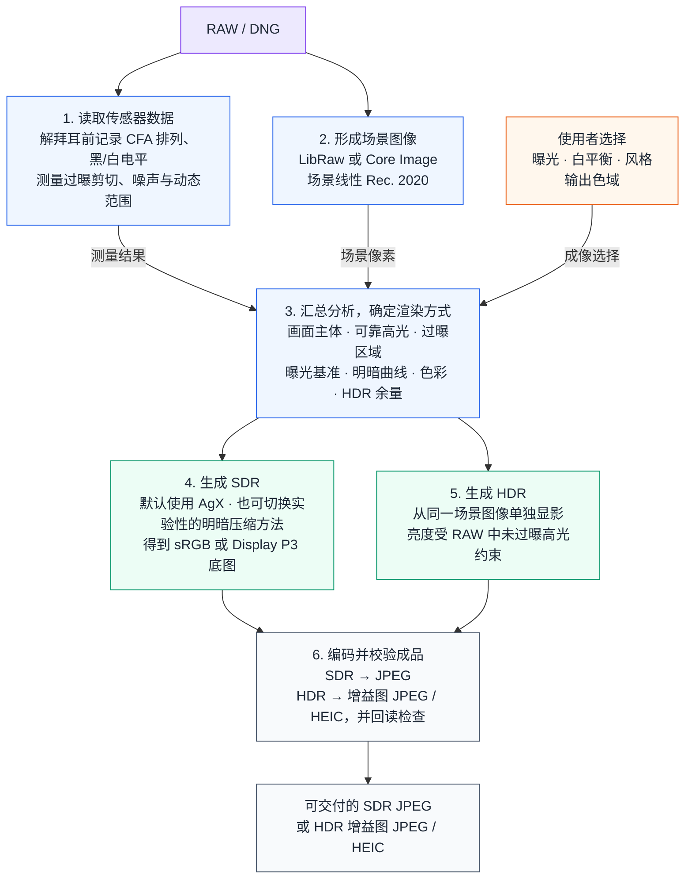

# dngscan

一套从传感器数据出发、用于生成和研究 SDR / HDR 影像的开源数字成像工作台。

它最早只是想解决一个很具体的问题：怎样不打开完整编辑器，也能用 AgX 把一张 RAW
显影好。真正做下去，问题很快变大了：传感器到底保留了多少高光？高光重建补出的像素
还能信多少？同一份场景数据怎样分别生成 SDR 和 HDR？胶片的白平衡、感色特性和显影
曲线，能不能拆开研究，而不是揉成一层滤镜？

dngscan 把这些问题放进同一套可测量的流程里。它在解拜耳前保存传感器数据，用
LibRaw 或 Core Image 形成场景线性 Rec. 2020 图像，再把测量结果与使用者的成像选择
汇总成渲染方案，最后生成经过颜色管理的 SDR 或 HDR 文件，并检查实际交付结果。

它现在可以直接当作本地 RAW 显影器使用，也已经长成了一座小型成像实验台。解码、
传感器分析、显示变换、胶片观察和交付编码各有边界；新的解码器、明暗压缩方法、胶片模型
或交付格式，可以在同一份 RAW 数据和同一套验证方法上比较，不必重新发明整条管线。

[English](README.md) · [使用说明](docs/USER_GUIDE.zh-CN.md) ·
[工程记录](docs/ENGINEERING_NOTES.zh-CN.md) · [许可证](LICENSE) ·
[第三方声明](NOTICE.md)

## 一张图看 HDR


从左到右分别是普通 SDR、单独生成的 HDR，以及 HDR 新增亮度的分布。右图越亮，表示
该区域用到的 HDR 余量越多；黑色表示没有增加，白色表示已经用满。

可以看到，额外亮度集中在灯具和反光处，房间本身并没有跟着变亮。支持 HDR 的设备会
显示这些亮部；普通屏幕则显示文件中的 SDR 底图。如果 RAW 里没有未过曝的高光，
dngscan 也不会凭空增加 HDR 余量。

## 功能

- **读懂拍摄数据**：在解拜耳前测量黑电平、白电平、各颜色通道的过曝剪切和彩色滤光片
  阵列（CFA）排列，并据此估算噪声、可用动态范围和可靠的高光余量。
- **选择场景解码器**：LibRaw 与 Core Image / RAW 9 是两种独立选择，但都会向后续步骤
  交付场景线性 Rec. 2020 图像。
- **试验成像方法**：AgX 是默认选择，同时保留 RAW 门控、仅亮度和固定曲线等实验或诊断
  方法。曝光、白平衡、高光处理、场景变换、镜前滤镜和胶片观察都可以明确选择。
- **分别生成 SDR 与 HDR**：SDR 输出到 sRGB 或 Display P3；HDR 则从同一份场景图像
  重新显影，只使用 RAW 中未过曝高光真正支持的额外亮度。
- **观察并复现实验**：本地图形界面和命令行使用同一套设置，诊断图与 CSV 报告让测量
  结果可查、对照过程可复现；RAW 文件不会上传。
- **交付后再验证**：`archive` / `share` 档只改变编码，不改变成像。在 macOS 上，HDR
  可写成符合 ISO 21496-1 的增益图 JPEG 或 HEIC，随后回读检查颜色配置文件、增益图、
  文件声明的 HDR 余量和像素误差。

## 快速开始

需要 Python 3.10 或更新版本。

### 图形界面

```bash
git clone https://github.com/Gen-416/dngscan.git
cd dngscan
python3 -m venv .venv
source .venv/bin/activate
pip install -r requirements.txt
python -m dngscan.gui
```

在浏览器中打开终端显示的本机地址（localhost）即可。可以先用 `EV 0`、`AgX`、`base` 原色、
`camera` 白平衡和 `reconstruct` 高光处理，再根据照片本身调整。

顶部的 RAW 入口使用浏览器原生文件选择器。选中的文件只会传给同一台电脑上的 localhost
服务，并保存在进程级临时目录中；退出 dngscan 后临时副本会自动清理，不会发送到外部服务。

### 命令行

```bash
# 默认 AgX JPEG
python -m dngscan photo.dng --jpeg photo.jpg

# 高光重建 + Display P3
python -m dngscan photo.dng --jpeg photo_p3.jpg \
  --highlight-mode reconstruct --output-gamut p3

# HDR 增益图 JPEG（macOS、Display P3、仅 AgX）
python -m dngscan photo.dng --jpeg photo_hdr.jpg \
  --output-format ultrahdr --hdr-headroom 3

# RAW 分析图和 CSV
python -m dngscan photo.dng --jpeg photo.jpg --scan --csv photo.csv

# 对比实验性的 RAW 门控明暗压缩
python -m dngscan photo.dng --jpeg photo_gated.jpg --tone-core gated

# 使用胶片观察位置
python -m dngscan photo.dng --jpeg photo_portra.jpg --film portra400
```

完整参数见 `python -m dngscan --help`。

### 可选的 C++ 加速

NumPy 是参考实现，不编译原生扩展也可以正常使用。可选的 pybind11 C++ 内核只加速 AgX
中计算量最大的几个步骤；RAW 分析、渲染方案和出错时的回退处理仍由 Python 负责。

```bash
pip install pybind11 cmake
tools/build_native.sh
```

## 工作原理

dngscan 会先把传感器测到的数据与使用者主动选择的设置分开处理，到生成图片时再汇总成
一份渲染方案。



1. **读取传感器数据。** 解拜耳之前，dngscan 会记录彩色滤光片阵列各通道发生过曝剪切的位置
   和满阱容量，并估算噪声水平。后面处理高光时，仍能分清哪些像素来自传感器，哪些像素
   是高光重建补出来的。
2. **形成场景图像。** LibRaw 或 Core Image 将 RAW 解码为场景线性 Rec. 2020 图像。
   解码器只决定 RAW 怎样变成像素；之后怎样压缩亮度、怎样处理颜色，由后面的步骤决定。
3. **把测量与选择汇总起来。** 分析会把画面主体、可靠高光和过曝区域分开，再与使用者
   选择的曝光、白平衡、风格和输出色域一起，确定这张照片的渲染方式。
4. **生成 SDR。** 默认由 AgX 完成显示变换，也可以切换其他明暗压缩方法做对照和诊断；
   结果是一张 sRGB 或 Display P3 底图。
5. **单独生成 HDR。** 这一支从同一张场景图像重新显影，不会把完成的 SDR 硬拉亮；能用
   多少额外亮度，只看 RAW 里还保留了多少未过曝的高光。
6. **编码并检查成品。** SDR 直接写成普通 JPEG；HDR 则把两版图像装进带增益图的 JPEG
   或 HEIC，写完后重新打开，确认文件里的图像和 HDR 余量都符合预期。

## 与常见 RAW 处理流程的区别

区别不在于少了多少按钮，而在于传感器数据从什么时候开始不再参与处理。

darktable 的 AgX 和许多显示变换模块接收的是解拜耳后的浮点图像；dngscan 则一直保留
解拜耳前的彩色滤光片阵列数据。这样，明暗曲线仍然知道哪些高光可信，颜色处理也能
降低对过曝剪切区域和重建区域的信任。

dngscan 还会把测量与审美分开。黑电平、白电平、过曝剪切、噪声、动态范围和高光范围交给
程序分析；曝光补偿、白平衡、风格和查找表（LUT）仍由使用者选择。自动分析只负责说明
照片里有什么，不替使用者决定照片应该是什么样子。

HDR 也不是更亮的 SDR。两版图像都从同一份场景线性图像出发，各自完成显影。文件写完后，
dngscan 还会重新打开成品，确认 SDR 底图、HDR 效果和增益图都符合预期。

这些边界也给项目留下了扩展空间。增加解码器时，只要交出约定好的场景图像，后面的分析
和成像就不用重写；新的明暗压缩方法或胶片模型可以复用同一份分析；新的交付格式只接收已经
形成的图像，不会反过来改变它们。测量与校验始终可见，因此新方法仍然能放在一起比较。

dngscan 目前不管理图库，也不做局部调整。这是现阶段产品的边界，不是项目想象力的边界。
它更大的潜力，是成为一套开放、可解释的数字成像工作台：既能直接用来出片，也能在同一
批照片上比较算法、验证标准，并继续发展新的成像方法。

## 文档

- [使用说明](docs/USER_GUIDE.zh-CN.md)：支持的相机、界面字段、导出选择与常见问题。
- [架构与技术细节](docs/ARCHITECTURE.zh-CN.md)：完整的管线展示与每个环节的设计理由
  ——四层结构、解码器轴、胶片观察位置、HDR 对比与附录。
- [工程记录](docs/ENGINEERING_NOTES.zh-CN.md)：架构决策、实验依据与实现过程。
- [设计合同](docs/FILM_OBSERVATION_PLAN.zh-CN.md)：胶片观察功能群的生产合同与
  声明的计算边界。
- [第三方声明](NOTICE.md)：darktable、AgX 与其他上游组件的来源。

## 许可证

dngscan 以 [GPL-3.0-or-later](LICENSE) 发布。
