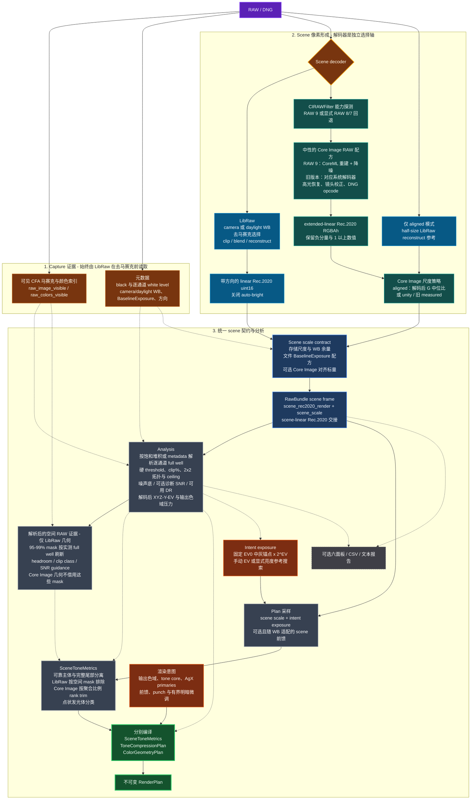
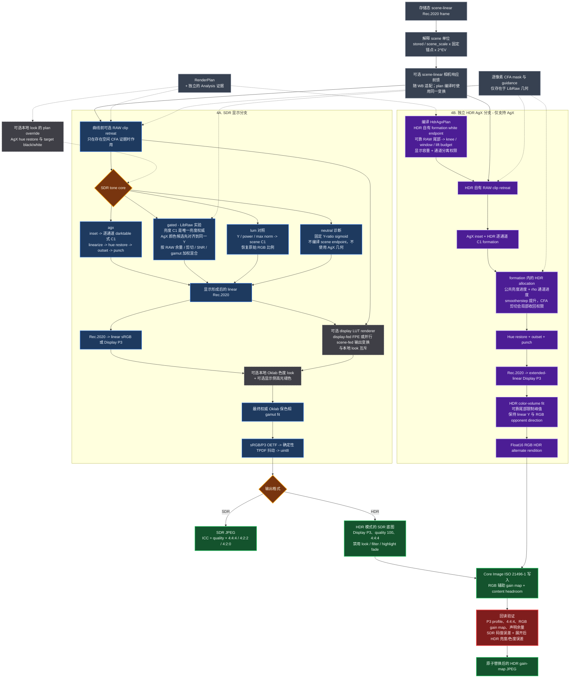

# dngscan

这是一个用途很窄的个人 RAW 转 JPEG 小工具。

出发点是对 AgX 处理数码影像方式的偏好，尤其是它的高光和高纯度颜色；实际需求则很窄：
把一张 RAW 用 AgX 显影出来，而不是每次都打开一整套修图软件。darktable 的 scene-linear
管线是项目基础，但完整编辑器提供的内容远远超过了这件事本身。

所以 dngscan 只做这一条路径：读取 RAW，分析传感器真正记录下来的信号，在
scene-linear Rec.2020 中形成图像，用 RAW 分析结果编译 tone plan，再经由 AgX 压缩成
sRGB 或 Display P3 JPEG。它不是修图工具，更像一个非常偏科的数码显影器，或者一个
信号与算法处理的小玩具。

仓库公开主要是为了方便认识的朋友使用；代码、参数和不同相机的数据都可以自由折腾。

[English](README.md) · [许可证](LICENSE) · [第三方声明](NOTICE.md)

## 为什么单独做这条管线

darktable 的 scene-referred 管线很像一间信号处理实验室，理解每个模块怎样改变信号正是
其中的重要部分。dngscan 从里面取出与目标最相关的路径：LibRaw 解释、scene-linear
Rec.2020，以及 darktable GPL `agx` 模块里的曲线构造与原色几何。AgX 本身来自 Troy
Sobotka，并在 Blender / EaryChow 生态里发展；这里主要通过 darktable 面向照片的实现来
继承它。

但如果这里只是把 darktable 的 AgX 模块单独拆出来，意义其实不大。dngscan 真正想做的，
是把 RAW 采集层的信息一直带到最终显示变换里。

darktable 的 AgX 模块工作在去马赛克、白平衡和曝光之后的浮点图像上。它能看到图像，却
看不到原始 CFA：不知道哪个通道真的在传感器上剪切了，也不知道一块平滑高光究竟来自
真实信号还是高光重建。dngscan 是一体化的小管线，可以在去马赛克前保存这些证据，再用
它们区分可靠的场景主体、传感器尾部和已经丢失的高光信息。

这里的“自动”也建立在同一原则上。自动判断不是替照片决定审美，而是把可以测量的东西交给
测量：黑白电平、逐通道 CFA 剪切、噪声底、可用动态范围、亮度主体和高光尾部。这些信息
可以决定曲线需要容纳多少 scene EV、什么时候允许色度向白退让，以及什么时候不应该相信
一个重建出来的像素。

曝光补偿、白平衡、风格和 LUT 是另一回事。它们表达的是拍摄意图或个人口味，因此留在
这套自动分析之外，作为明确的选择。曝光与白平衡不必永远不动；约束在于内容自适应算法
不能在没有说明的情况下把夜景拉成灰色，或者把现场光本来的颜色抹掉。

## 管线

第一张图从采集证据与解码像素开始，一直画到不可变的 render plan。实线表示图像数据流，
虚线表示证据或控制信息。



配色标记的是**来源**，这是最容易在阅读中丢失的信息：琥珀色是去马赛克前读到的 RAW 证据，
蓝色是 LibRaw 解码器，青色是 Apple 的，灰色是两者共同汇入的契约层，橙色是人给出的意图，
绿色是编译完成、下游必须遵守的 plan。

第二张图展开真正的渲染过程。SDR 与 HDR 共享 capture、scene intent、曝光和可选前馈，随后在
显示形成之前分叉；HDR 不会把已经完成的 SDR 像素当作 tone-map 输入。



紫色是 HDR 分支，蓝色是 SDR。两者只在左侧的灰色共享节点和右侧的封装处相遇——**没有任何
箭头从完成的 SDR 像素指向 HDR 分支**，这正是整个分叉要保证的性质。红色节点是唯一能否决
成品文件的关卡：它重新读回已写出的内容，与文件声称承载的 rendition 比对。

这几个层次是刻意分开的。Tone 层只负责亮度关系和显示动态范围；Color geometry 层负责
色相路径、色度压缩与向白过渡；Capture 层提供事实，但不直接决定口味。这样调整某个环节
时，至少能知道画面为什么发生变化。

Core Image 在图里出现两次，但用途完全不同：`CIRAWFilter` 是可选的 scene decoder，
`CIContext` 则是 HDR 容器写入器。选择 LibRaw 不妨碍使用 Apple gain-map 导出；选择 RAW 9
也不等于直接采用 Apple 原生成片作为 HDR DRT。两种情况下，dngscan 自己的 SDR/HDR
formation 都位于 scene 解码与 JPEG 交付之间。预览 proxy 与 C++/NumPy 分块只改变分辨率或
执行方式，不改变上述顺序；全分辨率导出沿用相同的 plan 语义。

### 架构契约

解码器与 tone core 是两个正交的选择轴。`libraw` / `coreimage` 决定 RAW 怎样变成
scene-linear 像素；`agx` / `gated` / `lum` / `neutral` 决定这些像素怎样进入显示域。
RAW 9 不是第五条 tone curve，`neutral` 也不是另一种 RAW 解码器。

以后修改这套管线时，下面几条应当保持不变：

- 原始 CFA、黑白电平、剪切比例与噪声统计始终由 LibRaw 在去马赛克前读取。只有
  LibRaw 的 scene frame 能携带对应的空间 mask；Core Image 执行了不同几何，只能接收
  聚合证据，不能借用逐像素 mask。
- 两种解码器都交接 scene-linear Rec.2020。负色彩分量和 diffuse white 以上的数值在
  DRT 前都是合法信号；输出色域 fit 发生在 tone 和可选 look 之后，不属于 capture。
- DNG [`BaselineExposure`](https://developer.apple.com/documentation/coreimage/cirawfilter/baselineexposure)
  是文件写入的基线显影补偿。它不是快门/光圈/ISO，不是传感器
  绝对标定，也不是内容自适应自动曝光；显式 `--ev` 调整发生在它之后。
- 场景亮度只编译 tone endpoint 与 toe/shoulder；RAW 剪切和输出色域压力只编译颜色
  权限。颜色指标不能移动黑白端点，亮度百分位也不能冒充已经丢失的 CFA 色彩。
- `agx` 配 darktable `base` primaries 是成片默认。`lum`、`neutral` 是受控对照，
  `gated` 是仅限 LibRaw 的 RAW 证据实验。

## Capture：RAW 证据从哪里来

### 黑白电平与逐通道剪切

dngscan 从 `raw_image_visible` 和 `raw_colors_visible` 读取去马赛克前的 CFA 数据。黑电平
来自 metadata；full-well 则先检查每个通道顶端是否存在可信的饱和堆积，有就使用实测
ceiling，没有才回退到逐通道 metadata white level。它不会拿一个标量替所有 R/G/B，
剪切阈值因此也是一张按 CFA 颜色生成的 threshold map。没有任何通道出现可靠堆积时，
报告会明确把 full-well 标为 metadata fallback，而不是把估计值写成实测值。

这一点会影响的不只是报告里的 clip%。硬 clip%、2×2 cell 指标、高光分类和诊断剪切图
使用同一张逐通道 threshold map。渲染时的**软余量 mask**与它相关，但刻意不完全相同：
每个通道都按扣黑后的 full-well 从 95% 处的 0 平滑渐入到 99% 处的 1，让颜色能在插值形成
硬断层前开始退让。如果绿色比红色更早到满阱，硬统计与软权限图都会保留这个通道差别。

高光重建可以补出连续的亮度和看起来合理的颜色，但它不能重新获得传感器没有记录的信号。
因此剪切证据在重建之前保存，后面重建得再平滑，也不能反过来定义全图的 white endpoint。

### 去马赛克

全分辨率导出的 `auto` 顺序是 DHT → DCB → AHD，具体取当前 rawpy/LibRaw 构建实际支持的
最高优先级算法；X-Trans 等非 Bayer 数据继续走 LibRaw 对应路径。预览使用 half-size
2×2 超像素合并，所以预览适合看曝光、颜色和高光路径，不适合评价最终纹理。

dngscan 不做降噪，因此去马赛克也是主要的纹理选择。DHT 适合低 ISO 的干净信号；重噪声
夜景里，DCB、AAHD、VNG 或 PPG 有时比更激进的细节插值自然。标准 rawpy wheel 不一定包含
AMaZE、LMMSE、VCD、AFD 等 GPL demosaic pack 算法，实际可选项取决于本机 LibRaw 构建。
GUI/CLI 可手动指定 `dht / dcb / ahd / aahd / vng / ppg`；如果本机 LibRaw 还带有其他
算法，把它加入 `DEMOSAIC_CHOICES` 即可交给现有的可用性检测与回退逻辑。

### 可选 Core Image 管线

`--decoder coreimage` 是另一种 capture decoder，与 tone core 的选择彼此独立；它不是
默认画质升级。解码前，dngscan 会查询当前文件的
`CIRAWFilter.supportedDecoderVersions()`，不会把相机型号名单当作文件必然支持 RAW 9 的
依据。文件只支持 RAW 8/7 时，GUI 会先询问是否使用旧版解码器，CLI 则输出明确警告；显式
指定 `--coreimage-version 9` 会直接拒绝不支持的文件，不会静默降级。解码结果以 signed
RGBA half-float 渲染到 extended-linear Rec.2020。负色彩分量和 diffuse white 以上的值
会原样交给 AgX，不再经过 uint16 百分位缩放。look 类控制项按中性线性交接配置（RAW 9 的
moire 值刻意保留 Apple 更保细节的默认）；高光重建与镜头校正则显式开启。配置遵循 Apple
在 [WWDC21 session 10160](https://developer.apple.com/videos/play/wwdc2021/10160/) 中对线性 RAW 配方与可编辑显影配方的区分。

它是**独立管线，不是 LibRaw 的后端**。Core Image 会执行文件里的 DNG opcode：在
Sigma fp 的 DNG 上是逐平面 `WarpRectilinear` 加一张镜头阴影 `GainMap`。这个畸变校正
把画面角落移动了数十像素（24MP 实测约 70px），所以 LibRaw 的逐像素 CFA 掩码描述的
已经是另一批像素——它们被丢弃而不是重映射，因为沿用会让 clip retreat 作用在错误的
位置上。于是这条路径没有逐像素 CFA 证据：`--tone-core gated` 会被拒绝，clip retreat
不运行，`--highlight-mode` 也不适用（Core Image 有自己的高光重建）。而聚合型 RAW 事实
（黑白电平、剪切百分比、SNR、噪声底、白平衡证词）是分布而非像素位置，依然有效，仍由
LibRaw 提供。Tone plan 会用实测的剪切 cell 比例，从 RAW 9 亮度排序的最高端剔除等量样本。
这是聚合层面的对照启发式，不表示某个 RAW 9 像素能对应到某个 CFA site：重建高光仍可描述
尾部拓扑，但不能反过来定义全局白点。报告会写明解码器、版本，以及被执行的 opcode。

Core Image 与 LibRaw 并没有暴露同一个 scene unit，单一固定补偿也无法跨相机、跨场景成立。
所以默认改为 `--coreimage-scale aligned`：dngscan 会对同一文件快速做一次 half-size LibRaw
重建，再用两种解码结果的绿色通道中位比，对 RAW 9 整幅乘一个标量。以前解释里引入的 RAW
green 项会在分子分母中严格约掉；这里得到的是逐文件解码器 A/B 标尺，不是传感器绝对标定。
它不会把中位数拉到 18% 灰，也不改变画面内部的光比，但解码器色彩、几何和重建都会影响
这个统计量。

`--coreimage-scale unity` 会跳过该比较，保留 Core Image 原生单位；`measured` 只应用旧的
Sigma fp 固定 `1/1.0293` 倍率，用来复现早期 A/B。三个模式现在在效果上互斥，固定倍率不会
再被后续逐文件对齐抵消。

这类对比里有两种亮度口径，**不能互相引用**。**可靠主体**中位是 scene-linear 的，量在色调
曲线之前，且已剔除 RAW 剪切样本；**最终输出**中位量在渲染完成的图像上，此时 AgX 已经把
两端都压过。同一对解码器在 `_SDI0150` 上，前者相差 +0.123 EV，后者只有 +0.02~0.03 EV
——色调曲线吸收掉了 scene-linear 偏移的大部分，两个数字差了约 5 倍。它们都是正确答案，
只是回答的不是同一个问题；引用时必须写明是哪一个。

除对齐之外，差别主要来自相机解释本身——色彩分离、噪声重建和高光走向。另有三点行为差异
来自解码器本身而非口味：

- **亮度参考按钮在两条管线上可能给出不同 EV。** 它从当前解码器且经过所选
  scene transform 的结果里读取可靠主体中位，不再拿 LibRaw CFA 直方图代替亮度。然后用同一份
  已编译 plan 搜索最终输出的高光安全上限。这让按钮可以跨解码器工作，却不会把 EV 0 变成
  隐式自动曝光。要比较解码器本身，仍应固定 `--ev`。
- **Apple 缓冲保留 diffuse white 以上的镜面值，但重建结果不等于传感器测量。** 完整的
  RAW 9 尾部仍用来区分大面积高光与点状灯源；全局白点只读取减去全分辨率 CFA 剪切比例之后
  的可靠排序。这样既保留 Apple 的平滑重建，也不让它虚构已经丢失的传感器余量。
- **固定 `--ev` 依旧不能完全隔离解码器差异。** 两个缓冲可能编译出略有差别的 plan，Core
  Image 还执行了不同的几何。`tools/decode_ab.py` 会让每个缓冲分别走过两套 plan，把解码与
  plan 的影响拆开。当前 SD 卡抽样里，ISO 3200 的输出中位只差 +0.006 EV，明亮 ISO 100
  样张差 -0.020 EV；近乎全黑的 ISO 25600 样张则差 -0.413 EV，而且几乎全部来自 RAW 9
  解码本身。这也是它仍作为对照路径而非静默替换 LibRaw 的原因。

**RAW 9 的降噪来自架构本身。** Apple 把它描述为一个把去马赛克与降噪融合在一起的分块
CoreML 模型（[WWDC26 session 305](https://developer.apple.com/videos/play/wwdc2026/305/)），所以不存在"未处理模式"可以索取：重建本身就是解码器。
也因此 `luminanceNoiseReductionAmount` 为 0 **并不等于"不降噪"**——它只是在一个始终运行
的模型上选中了标定范围里最不平滑的一端。

dngscan 仍会清零暴露出来的 look 类控制项，包括 `sharpnessAmount`——它在版本 8 上无效、
版本 9 上生效，默认值随文件与版本而变（见过 0.485 和 0.954）。在全分辨率下逐项对着
Apple 默认值实测，版本 9 上真正起作用的只有三项，而当前配置已经处在 API 所能达到的
**最锐一端**：

| 控制项 | 相对本文所用设置的变化 |
| --- | --- |
| `colorNoiseReductionAmount`、`detailAmount` | 无——0/0.5/1.0 全程改变 0.00% 像素 |
| `sharpnessAmount` 取 Apple 默认 | 高频能量 +5.9% |
| `luminanceNoiseReductionAmount` 取默认 0.043 | −3.1%；取 1.0 则 −59.8% |
| `moireReductionAmount` 强制为 0 | −59.8% |

其中两行值得重读。第一行**订正了本文此前的一个论断**——先前写的是"这三者表现得像同一个
内部控制的别名，0.5 的默认值会改变 93.6% 的像素"；重测后不成立，在这两项上 Apple 的文档
是对的。而 `moireReductionAmount` 是**有意保留** Apple 的 0.55 而非清零：它的零点是这个
控制**最平滑**的一端而不是"关闭"，强行清零付出的细节代价与满强度亮度降噪相当。于是唯一
还能拿到的只剩 `sharpnessAmount`，而那是空间锐化，不该出现在 scene-referred 缓冲里。

所以 RAW 9 渲染里残留的柔化来自模型本身，不是某个没关掉的开关。没有可以再关的东西了。

即便如此，残余差异依然很大，而且差多少取决于场景。以画面最暗 30% 区域内 8×8 块局部标准差
的中位数为度量，两条路径都固定 `--ev 0`：

| 片子 | ISO | 亮度噪声 / LibRaw | 色度噪声 / LibRaw | 纯黑像素 |
| --- | --- | --- | --- | --- |
| 演出，近乎全黑 | 25600 | 15% | 15% | 9.5% 对 8.1% |
| 园林，阴天日光 | 12800 | 78% | 28% | 1.5% 对 1.4% |

色噪的清理是稳定的，亮噪不是。模型的优势主要来自信噪比真正糟糕的地方；在曝光正常的
片子上，最暗的 30% 只是**影调**暗而并不缺信号，两条路径于是几乎收敛。阴影并没有付出
代价：`shadowBias` 清零后（见下），纯黑像素比例与 LibRaw 路径相差约一个百分点。把
LibRaw 换成更平滑的去马赛克（VNG、PPG）并不能缩小差距，所以这是模型本身而非插值选择。
这一点与本工具"不做降噪、把纹理选择留给去马赛克"的立场需要各自权衡。

**解码严格采用 Apple 的线性提取结构。** `baselineExposure`、`shadowBias`、`boostAmount`、
`localToneMapAmount` 和 RAW `exposure` 在 CIRAWFilter 内部清零，EDR 与 gamut mapping 关闭，
结果渲染到 `extendedLinearITUR_2020`。文件原本的 `baselineExposure` 会在清零前记录，再像
LibRaw 路径一样通过 `scene_scale` 恢复一次。这样交接像素本身保持直接 scene-linear，文件的
显影意图也没有丢失，更不会和用户 EV 重复。

**aligned 是逐文件的实用解码器对照。** half-size LibRaw 参考使用与主 LibRaw 路径相同的
白平衡、高光重建与存储尺度契约；它的解码绿色中位除以 RAW 9 的解码绿色中位，得到整幅使用
的单一标量。旧解释中的 RAW mosaic 归一项在分子分母里完全相同，数学上会约掉，因此把结果
称作 raw→scene 传感器增益并不正确。

当前样张中 half-size 因子与全分辨率约在 0.02 EV 内。报告会写明因子；统计无效或超出可信
范围时会写明失败并回退为 1×。这一步不对齐几何，也不对齐 tone plan：两个缓冲仍各自编译
端点，RAW 9 也保留自己的重建、色彩分离与噪声行为。要检查这些原生尺度差异，应使用
`unity`。

这个标量比自动曝光窄得多：它没有外部亮度目标，也不会重排照片内部的光比，夜景仍然是夜景。
但两种解码器的颜色和几何并不完全一致，所以统计仍可能受内容影响；因此这里把它称作 A/B
标尺，而不是物理标定。

还有一处残余的不对称，看预览前值得知道。Core Image 的预览解码到 1280px 代理，而 LibRaw
的预览做 2×2 超像素合并，两者看到的噪声量不同，因此各自编译出的黑端可能与自己的导出略有
出入。三张片子实测，Core Image 的预览→导出黑端位移是 −0.01、−0.22、+0.01 EV，LibRaw
一侧是 −0.05、+0.02、−0.04 EV：除了噪声大的那张之外量级相当，而在那张上，代理把噪声
平均掉之后读出的阴影比导出实际会给的更干净。

**BaselineExposure 在两条管线上都被遵从。** Apple 明确把它定义为 RAW 文件请求的 baseline
exposure，默认值可以随相机设置变化；ProRAW 还会随场景动态范围写入逐图配方。它不是快门/
光圈/ISO 所描述的物理拍摄曝光，也不是要求把画面归一到某个中位亮度。LibRaw 不应用该标签，
所以 dngscan 在两条路径都把 gain 折进 `scene_scale`：Core Image 先读取并清零该属性，再在
线性交接后恢复，LibRaw 则直接从 DNG metadata 恢复。改变尺度而不放大存储缓冲，可以保留
高于名义白点的码值与精度。主观微调仍由 `--ev` 完成，报告会写出文件值及其应用位置。

`shadowBias` 是最容易漏掉的一项：默认值 **5.0**，作用是从阴影中减去一个量，本质是
display-referred 的黑电平基座，在 scene-linear 缓冲里没有立足之地。保留默认值会让
ISO 12800 那张有 1.4%、ISO 25600 那张有 21.0% 的分量被压到恰好为零——清零后分别是
0.006% 和 0.18%，**都低于** LibRaw 路径自身的 0.16% 和 1.9%——并且会把亮度的第 1 百分位
推成负值。看上去像被 CoreML 降噪吃掉的暗部细节，大部分其实是这个减法。

**清零控制项的边界在“重建”处。** 除此之外，“把控制项全部清零”是从 LibRaw 路径继承来的
规矩，把它不加分辨地套到一个假设完全不同的解码器上，得到的不是更纯净的解码，而是更错误
的解码。重建类控制会被显式设定，避免系统默认值变化悄悄改变数据契约：

- **`highlightRecoveryEnabled` 显式开启。** 它重建的是被剪切的通道，干的
  是 LibRaw 那边 `--highlight-mode reconstruct` 同样的活，不是 look 控制。关掉它，被剪
  高光返回时绿通道被钉在远低于红蓝的位置——近白均值 R 1.933 / G 0.681 / B 1.816，绿为
  最大通道的占比 0%——渲染出来就是品红色的高光核心和粉色光晕，导出 JPEG 上实测品红偏移
  +0.077，而 LibRaw 在同处是 −0.000。开启后同一批像素均值为 1.981 / 1.980 / 1.980，
  偏移降到 +0.002，同时镜面余量完好（p99.995 2.08、max 2.22）。这比 LibRaw 路径的
  "剪到同一白点"严格更好——后者的中性高光是靠丢掉滚降换来的。
- **`lensCorrectionEnabled` 显式开启。** RAW 9 与文件中的 DNG opcode 共同组成相机标定
  解码；这也正是 LibRaw 的逐像素掩码不能沿用的原因。
- **`gamutMappingEnabled` 保持关闭**。它是输出端钳位，位置应在视图变换之后。开启后
  p99.995 从 2.08 压到 1.07，所有负分量（Rec.2020 之外的真实场景色）被清零，14% 的像素
  发生变化。AgX 在下游有自己的色域处理，因此这一级的交接保持 scene-referred。

像素交接尽量直接照 Apple 的示例：`RGBAh`、extended-linear Rec.2020、signed half-float，
没有百分位归一化，也没有 unsigned clamp。预览通过 `CIRAWFilter.scaleFactor` 直接请求长边
1280px，而不是先解出约 6MP 再缩小；交互 `CIContext` 复用并启用
`cacheIntermediates=true`，全分辨率导出使用另一套复用 context，关闭中间缓存并给出 1024MB
memory target。一张 24MP Sigma fp 的实测中，RAW 9 解码在 1280px 为 1.24s、6000x4000 为
2.08s；完整全尺寸 decode + analyze + plan + render 在 JPEG 编码前约 5.1s。

`extendedDynamicRangeAmount` 被显式设为 0，避免 Apple 的显示侧 HDR 映射先于 AgX 进入
scene 缓冲。调到 1.0 确实在最顶端拉出更多分离度
（顶部像素极差 0.11 → 1.74），但高光区与默认渲染在 log2 上的相关系数是 0.996，说明基本
是同一批信息的重映射，而且会把峰值推到 20，远超这条管线预留的余量。

**选哪个解码版本，以及哪个变体。** 全新初始化的 filter 报告的是版本 8 而非 9，因此即使
文件支持 RAW 9 也必须显式 opt-in；macOS 27 上 `supportedCameraModels` 列出 921 个机型，
其中包含 Sigma fp。版本列表里还提供 `.dng` 变体（`9.dng` 与 `9` 并存），二者是真正不同的
解码，99.96% 的像素有差异。以 LibRaw 依据文件自带矩阵得到的色彩为基准，`9` 的色度距离是
0.015，`9.dng` 是 0.041 且明显偏蓝，因此本管线请求的是不带后缀的 `9`。

**需要留住的可调接口。** RAW 9 是计算导向的解码器，它的若干旋钮是对模型的**标定控制**，
而不是可以关掉的处理级。`exposure` 已接线。白平衡接口（`neutralTemperature` /
`neutralTint` / `neutralChromaticity` / `neutralLocation`）是移动白平衡的受支持途径，
也正是 `--wb daylight` 在这条路径上被拒绝而非近似的原因。`linearSpaceFilter` 是 Apple
自己提供的钩子，用于在图像仍处于线性状态时插入一个 CIFilter——任何想下沉进解码阶段的
scene-referred 操作，架构上都该放在这里。在那套白平衡接口的温度/色调映射得到验证之前，
`--wb daylight` 在这条路径上会被直接拒绝，而不是拿近似值糊弄过去。

RAW 9 随系统分发，一次 macOS 更新就可能换掉模型，而 `decoderVersion` 仍然回答 "9"。
现在报告会同时记录系统版本/build fingerprint，至少能把两次输出追溯到具体运行环境。金样本
回归仍只覆盖预解码后的稳定算法层；Core Image 解码测试断言性质而非固定字节，系统升级后仍需
用同一组 RAW 做显式 A/B，不能把相同的版本号当作相同模型。

### 白平衡

`camera` 使用文件里的 AsShot 测量，`daylight` 使用 LibRaw 的日光标定乘子。前者跟随拍摄
现场，后者适合让同一光线下的一组照片保持固定配平。

日光、阴天和阴影大致落在可预测的日光轨迹上，机内测量通常足够有用；混合光、窄谱 LED、
荧光灯和钠灯则不是一个简单的色温问题。还有些看起来像“白平衡不对”的变化，实际来自
tone curve 对亮度与纯度的重新分配，所以 WB 与 DRT 在管线里保持独立。AsShot 相对日光
乘子的偏离也会写入分析结果，它既是白平衡数据，也是拍摄现场光源留下的信息。

显示器前已经适应环境的肉眼不能作为绝对白点测量。Hunt、
Stevens、Abney、Bezold–Brücke 等色貌效应还会让亮度和纯度变化被感知成色相或冷暖变化，
肤色、天空和植物这些记忆色也不是简单的色度学目标。看见“偏色”时，先区分它来自光源、
相机配平，还是 tone/color geometry，通常比直接转动色温更有用。

### 高光处理

LibRaw 的三种选择处理的是重建后的观感：

- `clip` 在饱和处直接截断，最接近传感器实际状态，但逐通道剪切可能留下色边。
- `blend` 在剪切边界混合，让过渡更平缓。
- `reconstruct` 根据幸存通道估算丢失通道，可以恢复连续结构，但色度属于推断。
- 重建色相往往会向幸存通道偏移，因此连续不等于色彩真实。

日常出片通常以 `reconstruct` 为实用默认，检查传感器和算法本身时则更适合用 `clip`。
无论选哪一个，RAW 剪切证据都不会改变。

LibRaw 会把 `blend` 和 `reconstruct` 的 uint16 整幅缩暗，倍数正好是归一化后的最大
白平衡增益，目的是给名义白点以上的重建值留容器码值。dngscan 现在把这段余量记进
`scene_scale`，不再把它当成整张照片的曝光下降。Sigma fp 样张上 `max WB = 2.33`，也就是
1.22 EV；修正后 clip 与 reconstruct 的可靠主体在 0.03 EV 内一致，而 reconstruct 仍保留更多
高光范围。

## Tone：曝光和曲线怎样确定

### 固定曝光锚点

整条管线以 scene-linear `0.18` 作为名义中灰。当前显影锚点是统一固定标量
`0.18 * 2^3` 再叠加手动 EV；它还不是逐机型标定，也不会把每张照片的中位数自动变成
18% 灰。文件存在 DNG `BaselineExposure` 时，会更早按文件显影配方遵从。常数缩放不会
破坏场景意图：暗场景进 AgX 前依然暗，明亮场景依然亮。

GUI 里的“亮度参考”是一个主动调用的对照读数，也就是 CLI 的 `--ev auto`。它会尝试把
可靠主体中位放到 18% 灰，并受新增高光剪切预算约束。这个中位来自当前解码器、当前
scene transform 之后的可靠 scene body，RAW 已剪切样本不会定义它。高光搜索会在同一份固定
plan 上尝试候选 EV，不会边测边改变目标。全图统计仍可能被占比很大的背景误导，所以它只是参考，
不是默认曝光。

### 场景统计不是简单 min/max

Tone plan 会把可靠主体和高光尾部分开。LibRaw 路径剔除空间 CFA clip mask 对应的样本；
Core Image 路径使用前文的聚合 rank trim。SNR 会约束黑端和 gated 颜色权限，但不是另一张
主体 mask。尾部只负责给 shoulder 留出空间。点状灯源与大面积明亮表面也不是同一种高光：
前者可以进入 roll-off，后者如果被同样压到顶端，会让整张图显得又暗又刺眼。

因此 tone plan 里的几件事分别有自己的依据：

- `black point` 与 `toe` 参考噪声底、暗部可用范围和目标黑场。
- `white point` 与 `shoulder` 参考可靠亮度尾部、显示余量和发光体拓扑。
- `pivot` 当前固定在校准 EV 0，`contrast` 固定为 3.0；主体统计不会自动移动它们，GUI
  中的有限调整是明确的人为偏置。
- `view brightness` 只抬曲线内部，保持真黑与目标白端点，用于干净但整体偏暗的场景。

### GUI 中的四个明暗微调

GUI 不直接暴露校准 pivot 或编译后的 black/white EV，而是在 tone plan 上提供四个有限
偏置。四个滑块的`自动`中心值就是分析结果，不是另一套 preset；全部归零时直接沿用原来的
render plan，输出不变。

| 选项 | 向左 | 向右 | 不会改变什么 |
| --- | --- | --- | --- |
| `中间调亮度` | 主体更沉、更暗 | 提亮主体和可见暗部 | 不移动 scene exposure、黑点或白点 |
| `中间调对比` | 中间调更柔和 | 拉开校准 pivot 两侧的明暗距离 | 不移动 pivot 本身 |
| `暗部过渡` | toe 更深，更快沉入黑场 | toe 更开放，阴影层次更容易看见 | 不移动黑点，也不会创造低 SNR 信号 |
| `高光过渡` | shoulder 更直接，高光更有冲击力 | shoulder 更柔和，更早保留亮部层次 | 不移动白点或 RAW 剪切位置 |

`中间调亮度`和曝光 EV 最容易混淆。曝光 EV 在 scene-linear 域缩放信号，会改变进入
shoulder 的位置并消耗高光余量；中间调亮度是显示侧的内部曲线调整，真黑和目标白保持不动。
`中间调对比`也不是另一个亮度控制：它围绕校准 pivot 改变斜率，决定主体内部的明暗距离，
而不是把主体整体上下移动。

实际使用时，先用`中间调亮度`确定主体明暗，再用`中间调对比`确定立体感，最后分别调整
`暗部过渡`和`高光过渡`。打开暗部只能展示已经记录到的内容；低 SNR 场景开得过多，也会把
读出噪声和色噪一起带出来。`高光褪白`不属于这四个亮度控制，它只处理接近显示白的色度路径。

### darktable 风格的 C1 曲线

现在的主曲线沿用 darktable AgX 的 C1 分段构造：toe、线性 latitude 和 shoulder 在连接点
同时保持数值与一阶导数连续。black/white EV、contrast、toe/shoulder power 和 latitude
由 tone plan 提供，但 EV 0 到 18% 的校准锚点保持稳定。

采用这条结构，是因为只把场景 min/max 塞进一条普通 sigmoid 很容易让少数灯源定义
white EV，结果就是高光很刺眼而主体仍然偏暗。C1 端点和主体/尾部分离，让“场景有多宽”
与“主要内容应该落在哪里”成为两件不同的事。

## Color geometry：AgX 真正改变了什么

裸的逐通道 S 曲线会让 R/G/B 以不同速度进入 toe 和 shoulder，高纯度颜色的色相因此会
随亮度漂移。AgX 不只是一条 sigmoid；它的关键是曲线前后的原色几何。

曲线前的 `inset` 把工作原色向中性轴收缩并做小幅旋转，避免极纯颜色直接撞上单通道上限，
给饱和高光留出平滑的 path-to-white。曲线后的 `outset` 再恢复纯度，但它刻意不是 inset
的严格逆矩阵。两者之间的差异，以及可选的 hue restore，共同构成 AgX 的颜色性格。
这也在预先处理裸逐通道曲线的 notorious six：例如纯红随亮度走向橙黄、纯蓝走向 cyan；
inset 的小幅旋转同时承担一部分 Abney 式感知色相补偿。

dngscan 把这部分数学锁定到 darktable commit
`cf5e698c1a5afac52de785c3bf63fcbcb71707d3`。该版本 scene-referred 默认使用 `base`
几何和 0.6 hue restore，所以 dngscan 也以它为默认。矩阵构造按 darktable 的转置存储顺序
和 D50 ICC 连接空间复现；直接使用未适配的 D65 Rec.2020 坐标或把矩阵乘法顺序反过来，
都会改变色彩路径，甚至破坏中性轴。`smooth`、`punchy` 和 `muted` 保留为明确的几何对照，
不参与 RAW 分析，也不改变曝光。

hue restore 是**逐预设**的值而不是一个全局默认：编译器给 `base`、`punchy`、`muted` 写
0.6，给 `smooth` 写 0.0——后者的类 sigmoid 几何在上游就不需要恢复。能决定这个数字的地方
有三处：`ToneCompressionPlan` 的 dataclass 默认、编译器里的逐预设写入，以及只有重命名之前
的旧 plan 对象才会读到的 `AGX_HUE_RESTORE` 兜底，因此测试把三层全部钉住。只断言那个常量
是没有意义的：改掉它，全部 golden 渲染逐字节不变。

AgX 的代价也来自同一个结构。inset 在曲线前先降低纯度，而这份纯度主要由落入 toe 的内容
通过逐通道扩张赚回来，因此高 ISO 夜景有时反而显得很浓，明亮宽 DR 日景却容易偏平。
Blender 生态常把 Base 与 Punchy look 配套使用，本质上也是在处理这件事。另一个代价是
色度与内容在曲线上的位置耦合：同一个物体换一个构图或曝光，落入不同曲线区间后可能得到
不同纯度。`punch`、`gated` 和 `lum` 都是为了把这些影响拆开观察，而不是否定 AgX。

### 四条压缩核心

四条核心共用同一个曝光锚点和交付端保护，方便在相同 EV 下拆开比较。它们并不都能拿到
相同的空间 CFA 证据：mask 只存在于 LibRaw 路径，各核心对现有证据的使用方式也不同。

| 核心 | 底层差别 |
| --- | --- |
| `agx` | 完整的 inset → 逐通道 C1 curve → hue path → outset。默认成片路径。 |
| `gated` | 仅限 LibRaw 的实验：同时计算 AgX 色彩与亮度保持结果，由 RAW 剪切、余量和噪声置信度逐像素混合。 |
| `lum` | 同一条场景编译的 C1 曲线只作用于亮度 norm，RGB 比例保持，不进入 AgX inset/outset。 |
| `neutral` | 固定 Y 比例诊断曲线，不使用场景编译 endpoint 或 AgX 几何；不是成片基线。 |

`gated` 不是另一条曝光曲线。它先把 AgX 候选归一到与 lum 候选相同的 Rec.2020 亮度，再
决定混入多少色度路径，所以亮度只有一个权威，mask 边界不会产生明暗接缝。它利用的是
darktable 模块本身看不到的 CFA 信息：某个颜色变化究竟来自有效通道，还是发生在已经
剪切并被重建的区域。

`lum` 则是刻意保留 RGB 比例。它能保住中频颜色纯度，但亮而饱和的颜色也更容易出现霓虹感，
因为颜色不会像 AgX 那样主动向白退让。`y`、`max` 和 `power` norm 分别在色度学亮度、最响
通道保护和两者折中之间选择。

`neutral` 连 tone window 也固定，因此适合单独检查场景 plan 与 AgX 几何分别带来了什么。
但保持 RGB 比例会把窄带高饱和高光直接推向 sRGB/P3 边界。最终 gamut fit 能保证输出合法，
却不会让它获得 AgX 那种逐渐向白过渡的路径。

### RAW clip retreat、punch 与 gamut fit

RAW headroom retreat 只在去马赛克前 CFA 表明通道接近或到达 full-well 时工作。95% 到 99%
的软渐变是保守权限信号：低端表示“开始不可靠”，不表示“已经剪切”。它在曲线前把颜色向
该亮度下的中性轴收回。它与 AgX 的全局 inset 不同：一个由传感器余量驱动，一个是显示变换
本身的颜色几何。

`punch`（GUI 中的`中频纯度`）用来补偿 AgX inset 在明亮宽动态场景里的整体去纯度。
它在 Oklab 中工作，自动值由主体亮度、可用 DR 和 tone window 共同门控；在中性轴、深影、
亮部、已经很浓的颜色和肤色
区域分别衰减。所有权重都乘在增益的增量上，因此 gain 始终 ≥ 1：它只补纯度，不会在某个
区域反向去饱和。夜景或高 ISO 场景可以精确归零并短路算子，避免放大暗部色噪声。GUI 强度
只是分析值的倍率，`1` 使用自动值，`0` 完全关闭。这仍然是基于有限样张调出的全局策略，
不是传感器测量本身。

`高光褪白`是另一层很轻的显示侧色度偏置。它不改亮度 shoulder，也不冒充 RAW 高光重建；
向右让接近显示白的颜色更早收向中性轴，向左则在最终 gamut fit 的保护下保留更多高光色度。

最后的 gamut fit 发生在 tone 和风格之后。它把无法装进目标 sRGB/P3 的颜色沿 Oklab 色度
方向压回边界，而不是简单逐通道 clip。这样 AgX 或 P3 保下来的高光颜色不会在最后一步突然
崩成硬原色。

## 保留的前馈实验

这个实验始于“在进入 AgX 之前，先用测量数据补偿相机某些可重复缺陷”的想法。更进一步，
如果两套传感器与滤镜栈的光谱响应都测得足够清楚，也可以在原相机真正记录到的信息范围内，
近似另一台相机的部分响应关系。

项目里的 ARRI-like 前馈来自一个主观目标：让 Sigma fp 稍微靠近这个实验预期的 ARRI 肤色，
也就是血色撑起来的温润感，以及偏冷 cyan 环境带来的衬托。最初的猜想与 ALEV 滤镜栈
较宽松的红光/近红外响应有关，而 fp/IMX410 本身也有不同的滤镜和洋红行为。

现在这份实现把公开的相机 SSF、光源 SPD 和材料反射谱做光谱积分，对皮肤、植物、cyan、
中性与洋红等材料类别拟合受约束的 3×3 映射，再用 `(R/G, B/G)` 色度平面上的软窗口限制
每个映射的作用域。窗口会通过 von Kries 缩放随所选白平衡移动；中性轴约束避免它变成
隐性白平衡，逐类残差和跨类泄漏则进入置信度。

ALEV III SSF 数字化自 Leonhardt & Brendel 的 CIC23 论文。ARRI 在论文中对五台 ALEXA
的测量取平均，因为传感器叠层的干涉纹理会随个体变化。Sigma fp 一侧使用 AMPAS
`rawtoaces-data` 中由 Weta Digital 测量的 Sony A7 III 整机 SSF；它同样基于 IMX410，
但不能等同于 fp 自己的完整滤镜栈。相机到 Rec.2020 的 profile 使用 AMPAS 的 190 条训练
反射谱拟合。这里的来源和替代关系都保留在标定文件里，不把“同一块 CMOS”写成“同一台
相机”。

它有很明确的物理边界：如果两种材料在 fp 上已经成为同色异谱，逐像素矩阵不可能重新创造
它们在 ALEV 上本应有的区别。而且传感器滤镜栈存在个体差异，严肃标定应该针对实际使用的
每一台相机。目前缺少可控光源、标准靶和光谱设备，所以现有结果更接近一个克制的几何颜色映射，
离最初设定的 ARRI 肤色目标仍有距离。数据来源、假设、CSV 和拟合报告放在
[`dngscan_assets/spectral/`](dngscan_assets/spectral/) 里。

## 风格与 LUT

仓库自带一个本地设计且日常使用的 `optic_warm_cyan`。它是 AgX 之后的 Oklab 色度场，
不是厂商 LUT，也不冒充相机前馈。

代码还留了 Kodak 2383、RED IPP2 和 Sony LC-709TypeA 的可选 `.cube` 槽位。合法拥有的
LUT 可以放进 `dngscan_assets/vendor_luts/` 下对应路径，GUI 会自动识别；仓库本身不分发
这些文件。前馈、AgX 几何和显示端 LUT 分属三个不同位置，效果即使相似，含义也不一样。

## 输出

SDR 输出是带确定性 TPDF 抖动的 8-bit JPEG，默认 quality 100、4:4:4。抖动发生在量化前，
用来减轻平滑渐变的断层；它不改变 tone plan。也可以选择 4:2:2 或 4:2:0 来减小文件，
代价是色度分辨率。Display P3 会嵌入 ICC profile，找不到 profile 就停止导出，不写未标记
的宽色域数据。

HDR 输出是可选的 Apple ISO 21496-1 gain-map JPEG，目前只在 macOS/Core Image 后端
可用，并且只接 AgX tone core。它不是把 SDR 成片直接放大：同一份 scene-linear
Rec.2020 在 display formation 前分成 SDR AgX 与 HDR AgX 两条独立 DRT。两者共享拍摄曝光
意图和 RAW 分析，但 HDR 自己持有 tone plan、色彩几何和扩展 P3 投影，不要求 knee 以下与
SDR 逐像素一致。

HDR 可用余量不是用户所选屏幕容量的同义词。屏幕容量只是上限；真正的画面预算由
RAW 剪切证据筛过的可靠高光尾部决定。LibRaw 用逐像素 CFA mask，RAW9 则按全分辨率
剪切 cell 比例从亮度顶部做保守的 rank trim。没有足够 RAW 证据时预算就是 0，导出会明确失败，
不会用重建高光或 SDR white endpoint 冒充传感器信息。额外亮度在 HDR AgX 的
inset/per-channel formation 曲线之后、hue restore/outset 之前分配；逐像素 CFA 剪切
mask 会撤回不可信通道的独立色度路径，最后用保持 Y 的中性轴投影收进扩展 P3
`[0, peak]` 色彩体积，不做逐通道硬裁。这里保持的是线性 P3 的 opponent direction，不是
严格的感知色相。ACES 2 在色貌模型 JMh 中完成更强的色相约束；dngscan 当前投影器刻意更
简单，这也是 HDR 仍需实机标定的边界之一。

Core Image 只把已完成的 SDR/HDR 两张 rendition 写成 RGB gain map。每个文件写完后
都会重新展开 HDR 像素，检查 P3 profile、4:4:4、RGB 辅助图、声明 headroom 与全图
像素/色品误差；任一门禁不过就不会保留输出文件。现在 HDR 不支持 display look/filter，
因为这些 SDR 算子还没有独立 HDR 定义。数学约束和验收线在
[`docs/DARKTABLE_HDR_AGX_DESIGN.zh-CN.md`](docs/DARKTABLE_HDR_AGX_DESIGN.zh-CN.md)。

### HDR 对比

下面是 SDR 诊断图，不是 HDR 屏幕截图。下排 HDR 面板会按实测 headroom 主动降曝光，把
reference white 以上的细节压回普通网页可显示的范围，所以它理应比上排 SDR 更暗。

| RAW9 / LibRaw，日间 | RAW9 / LibRaw，室内灯光 |
|---|---|
|  |  |

| RAW9 AgX / neutral，日间 | RAW9 AgX / neutral，室内灯光 |
|---|---|
|  |  |

[完整对比页](docs/HDR_COMPARISONS.md)包含 12 张图和当时记录的 metrics。Core Image/ISO
在 macOS 上已经逐文件 round-trip；Android/Chrome 互认和项目自定色彩参数的 EDR 样张标定
仍需要真机完成。

这次 HDR 边界核对使用了 Apple 的 [Adaptive HDR 与 Core Image
流程](https://developer.apple.com/videos/play/wwdc2024/10177/)、Android 的
[libultrahdr gain-map 数学](https://android.googlesource.com/platform/external/libultrahdr/+/refs/heads/main/lib/include/ultrahdr/gainmapmath.h)、[darktable AgX
处理顺序](https://docs.darktable.org/usermanual/development/en/module-reference/processing-modules/agx/)，
以及 ACES 2 公布的 [chroma](https://docs.acescentral.com/system-components/output-transforms/technical-details/chroma-compression/)
和 [gamut](https://docs.acescentral.com/system-components/output-transforms/technical-details/gamut-compression/)
compression 说明。它们定义职责边界和参照方法，不会把 dngscan 自己的阈值变成上游常数。

## 快速开始

需要 Python 3.10 或更新版本。

```bash
git clone https://github.com/Gen-416/dngscan.git
cd dngscan
python3 -m venv .venv
source .venv/bin/activate
pip install -r requirements.txt
python -m dngscan.gui
```

打开终端里显示的 localhost 地址即可。GUI 完全在本机运行，不上传 RAW。第一次打开文件会
解码、分析并建立 1280px 代理；后续预览复用内存与磁盘缓存，正式导出始终重新使用全分辨率
scene buffer。全分辨率导出放在一次性工作进程中，结束后大数组随进程释放，不长期留在 GUI
服务里。

macOS 缓存默认在 `~/Library/Caches/dngscan/preview-v1`，上限 768 MB，旧条目自动淘汰。

一个实用起点是 EV 0、`AgX`、`base` 原色、camera WB 和 reconstruct 高光，再根据照片本身
调整。quality 100 和 4:4:4 是默认输出。

### CLI

```bash
# 默认 AgX JPEG
python -m dngscan photo.dng --jpeg photo.jpg

# 高光重建 + Display P3
python -m dngscan photo.dng --jpeg photo_p3.jpg \
  --highlight-mode reconstruct --output-gamut p3

# Apple ISO 21496-1 HDR gain-map JPEG（macOS、Display P3、仅 AgX）
python -m dngscan photo.dng --jpeg photo_hdr.jpg \
  --output-format ultrahdr --hdr-headroom 3

# RAW 分析图和 CSV
python -m dngscan photo.dng --jpeg photo.jpg --scan --csv photo.csv

# 相同 EV 下比较另一条核心
python -m dngscan photo.dng --jpeg gated.jpg --tone-core gated

# 可选 Core Image scene 缓冲（macOS；证据层仍为 LibRaw）
python -m dngscan photo.dng --jpeg ci.jpg --decoder coreimage
python -m dngscan photo.dng --jpeg ci8.jpg --decoder coreimage --coreimage-version 8
python -m dngscan photo.dng --jpeg ci1.jpg --decoder coreimage --coreimage-scale unity

# 主动使用亮度参考
python -m dngscan photo.dng --jpeg reference.jpg --ev auto
```

完整参数见 `python -m dngscan --help`。

### 可选 C++ 加速

NumPy 是参考实现，不编译原生扩展也可以正常使用。pybind11 C++ 内核只加速正常 AgX 的热点
路径：formation、C1 curve、hue restore 和 punch；RAW 分析、tone plan 与回退策略仍然在
Python。

```bash
pip install pybind11 cmake
tools/build_native.sh
```

`DNGSCAN_FAST=auto` 为默认值；`0` 强制 NumPy；`1` 要求必须走原生内核并在失败时报错。
内核释放 GIL，可以与现有的分块导出配合；AgX 热路径实测约 2×。导入时还会检查 ABI 并跑
自测，当前真实场景的线性差异控制在约 `2e-6`，最终 8-bit 差异不超过一个抖动步长。原生
内核的职责只是减少导出时间，不改变成像选择。

## RAW 分析图

`--scan` 输出六面板报告，包括 SNR 对档数、分离的 R/G/B RAW 分布、曝光与色域压力、空间
曝光区与剪切通道图，并列出逐通道 full-well、clip、black level 和 WB 读数。RAW 分布横轴
使用距剪切的 stops，纵轴为峰值归一化线性密度；图上的密度曲线会轻微平滑以便阅读，
clip%、中位、分位和其他统计始终从未平滑的原始样本计算。SNR 与动态范围是单帧估计，不是
完整 photon-transfer 测量；容器 bit depth 也不等于可用动态范围。

## 许可证与来源

dngscan 使用 GPL-3.0-or-later，因为 AgX 曲线与原色几何实现派生自 darktable 的 GPL
`agx` 代码。各项代码、光谱数据和可选依赖来源见 [NOTICE.md](NOTICE.md)。

AgX 由 Troy Sobotka 提出，并在 Blender / EaryChow 生态里发展；这里主要跟随 darktable
面向照片的实现。ARRI、ALEXA、ALEV、Sony、Sigma、RED、Kodak、darktable 和 Blender 等
名称属于各自权利人，这里仅用于说明数据来源、兼容性和管线中的比较对象。
