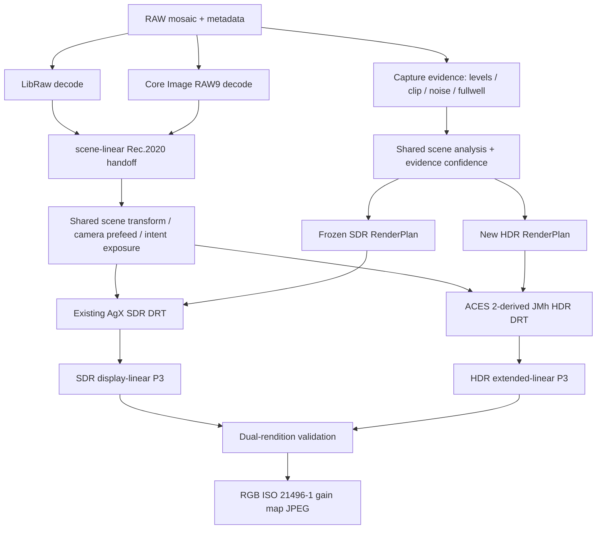

# dngscan ACES 2 HDR 双成像管线实现计划

> 状态：实现规格，供 Cursor 按阶段执行  
> **Phase 0：已落地**（`tests/sdr_freeze/` + `tests/test_sdr_freeze.py` + `tools/regen_sdr_freeze.py`）  
> **Phase 1：已落地**（`SceneScaleContract` + `dngscan/scene_scale.py` + `tests/test_scene_scale_contract.py`）
> **Phase 2：已落地**（`dngscan/aces2/` + reference vectors；自称 ACES 2-derived，待 CTL 交叉验证）
> **Phase 3：已落地**（`hdr_tone.py` / `hdr_evidence.py` + HDR dataclasses）
> **Phase 4：已落地**（`hdr_render.py` dual-rendition bridge）
> **Phase 5：已落地**（RGB Apple gain-map writer；拒绝 L008 回落）
> **Phase 6：已落地**（CLI `--hdr-drt` / capacity 上限 / look 拦截；GUI capacity 校验）  
> 范围：独立 HDR DRT、RAW9/LibRaw scene 契约、RGB gain map 及验证  
> 不在本轮范围：视频 HDR、HEIF/AVIF、改变现有 SDR 成片、重新设计 RAW 解码器

## 0. 结论与实施原则

当前 HDR 实现不能继续在 `SDR_AgX * scalar_gain(scene_Y)` 上迭代。它只恢复亮度，继承了
SDR AgX 已经向白收敛的色度，无法针对 HDR 峰值重新决定高光的 colorfulness、hue path、
gamut boundary 和 white limiting。新的实现必须先从同一份 scene-linear 数据独立生成完整
HDR rendition，再与冻结的 SDR rendition 求比值并封装 gain map。

目标结构采用 ACES 2 的核心分解：在 JMh 感知空间中分别处理 lightness `J`、colorfulness
`M` 和 hue `h`，使 HDR tone scale 与 HDR color geometry 都由目标峰值和限制色域决定。
dngscan 不应在尚未通过 ACES 参考向量验证时声称是“严格 ACES 2”。代码和 UI 在通过门禁前
使用 `ACES 2-derived HDR` 或“ACES 2 式 HDR”命名。

以下约束不可违反：

1. 现有 SDR JPEG 是回归基线。HDR 工作不得改变 SDR 的像素、ICC、JPEG quality、4:4:4、
   AgX 参数、look、filter、dither 或文件命名。
2. RAW9 与 LibRaw 继续作为两条独立的 capture pipeline；不把 LibRaw 的空间 mask 假装对齐到
   执行过 DNG opcode 的 RAW9 图像。
3. 不做“把图像中位数拉到 18% 灰”的内容自适应曝光。夜景必须继续保持夜景。
4. `BaselineExposure` 和用户 EV 是成像意图；RAW black/white、CFA clip、噪声和 fullwell 是
   传感器事实。两类量必须分开记录和使用。
5. `--hdr-headroom` 是显示容量，不是要求每张图用满的归一化目标。
6. ISO 21496-1 / Apple Core Image 只负责从已经定义好的 SDR/HDR rendition 生成和封装 gain
   map，不能替代 HDR DRT。
7. 独立 HDR color geometry 需要 RGB gain map。单通道 gain map 只能作为兼容/诊断模式。
8. 先完成 NumPy 参考实现与参考向量验证，再移植 C++。不能同时改算法和优化内核。

## 1. 当前实现与问题边界

当前主要调用链：

```text
raw_io.load_raw
  -> RawBundle.scene_rec2020_render + scene_scale
analysis.analyze
  -> Analysis（RAW levels / clip / SNR / gamut）
tone.build_render_plan
  -> RenderPlan(scene + tone + color)
render.render_output_u8
  -> SDR sRGB/P3 JPEG
export.export_ultrahdr_jpeg
  -> gainmap.build_hdr_alternate_rgba_half
  -> gainmap.write_apple_gainmap_jpeg
```

`dngscan/gainmap.py::build_hdr_alternate_rgba_half()` 当前执行：

```text
scene Y -> scene EV -> scalar gain
quantized SDR P3 u8 -> inverse OETF -> multiply scalar gain
```

因此存在四个结构性问题：

- HDR 没有独立 tone scale，只是在 SDR 结果上恢复亮度。
- HDR 没有独立 color geometry，AgX 已经褪白的高光只能变成更亮的白。
- `HDR_DIFFUSE_WHITE_LINEAR = 0.90` 暗含 scene 数值等于物体反射率；当前 scene scale 并没有
  提供这种绝对辐射标定。
- `ToneCompressionPlan.white_ev` 是 SDR shoulder endpoint，不是传感器 fullwell，也不是 HDR
  内容峰值。它只能作为“SDR 使用了哪些 scene 范围”的诊断量，不能继续充当 HDR 上限。

旧函数保留到新实现通过 A/B 和封装测试为止，但不再扩展。完成迁移后删除：

- `gain_stops_for_scene_ev()`
- `build_hdr_alternate_rgba_half()`
- 与单通道 `L008` 强绑定的断言

不要让旧实现成为公开的第二种 HDR look；它只作为迁移期对照。

## 2. 目标管线



共享边界必须位于 display transform 之前：相机解释、WB、固定曝光标定、文件
`BaselineExposure`、用户 EV、scene transform/prefeed 对 SDR 与 HDR 相同。SDR AgX 和 HDR
ACES 2-derived DRT 从这里分叉。

## 3. 数值域与曝光契约

### 3.1 必须明确的五个域

| 名称 | 含义 | 可否受画面内容影响 |
|---|---|---|
| `raw_sensor` | black-subtracted CFA DN、fullwell、clip、noise | 否 |
| `decoded_scene` | 解码器给出的 scene-linear RGB，尚未附加用户 EV | 解码算法可以，标尺不可以 |
| `intent_scene` | 固定相机校准 + BaselineExposure + 用户 EV 后的 scene RGB | 仅文件元数据和显式用户选择 |
| `sdr_display_linear` | 现有 AgX/色域处理后的相对 SDR P3，reference white = 1 | 是，来自既有 SDR plan |
| `hdr_display_linear` | 新 HDR DRT 的扩展线性 P3，reference white = 1 | 是，峰值受 HDR target 限制 |

严禁在变量、注释或报告中把以下概念混用：

- `raw white level` / `fullwell`
- `scene diffuse-white convention`
- `SDR target_white_linear`
- `HDR target peak`
- `gain-map max boost`

### 3.2 目标曝光分解

目标表达式：

```python
decoded_scene = stored_pixels / storage_scale * decoder_calibration_gain
intent_scene = (
    decoded_scene
    * baseline_render_gain
    * fixed_midgray_gain
    * exp2(user_ev)
)
```

迁移第一阶段必须保证它与当前结果严格等价：

```python
old_scene = stored_pixels / bundle.scene_scale * bundle.exposure_gain
```

不能为了“数学更漂亮”立即移动现有乘法顺序。先引入显式字段和等价测试，再逐项拆开。

建议在 `models.py` 新增不可变结构，不要继续向 `RawBundle` 写入临时曝光值：

```python
@dataclass(frozen=True)
class SceneScaleContract:
    storage_scale: float
    decoder_calibration_gain: float
    baseline_render_gain: float
    fixed_midgray_gain: float
    user_ev_gain: float
    baseline_baked_in: bool
    scale_mode: str
    calibration_confidence: str  # calibrated / relative / decoder-native

    @property
    def total_render_gain(self) -> float: ...
```

`scene_rec2020_to_float()` 最终改为接收该 contract 或显式 gain，渲染过程不得 in-place 修改
`bundle.exposure_gain`。迁移期保留旧字段，只允许通过一个兼容构造器读取。

### 3.3 BaselineExposure

`BaselineExposure` 继续同时作用于 SDR 和 HDR，因为它是文件作者给出的 baseline rendering
intent；但 RAW clip/fullwell/headroom 统计必须在它之前定义。

Core Image 可能已在 RAW9 内部应用该量，LibRaw 则由 `scene_scale` 显式折入。不要在没有证明
Core Image 运算顺序等价之前强制把它从 RAW9 中移出。用 `baseline_baked_in` 明确记录，确保
总共只作用一次。测试必须覆盖有/无 BaselineExposure 的 DNG。

### 3.4 RAW9 scale policy

当前 `aligned` 按每张图的 LibRaw/RAW9 绿色中位比做比较对齐。它不是自动曝光，但仍是
content-dependent decoder comparison policy，不能作为“绝对 HDR 辐射标定”来描述。

实施要求：

1. 保留 `aligned`，以维持当前 SDR 和 A/B 行为。
2. 增加 `calibrated` 概念：`camera make + model + decoder version` 对应一个固定 gain。
3. 没有固定标定时，HDR 可继续使用 `aligned`，但 plan/report 标为 `relative` confidence。
4. 不得偷偷从 `aligned` 切到 `unity` 或新常数；默认切换必须另做样张回归。
5. 长期用灰卡或稳定曝光序列标定 RAW9/LibRaw 固定差值，不能用每张图中位数生成相机常数。

### 3.5 中灰和 diffuse white

保留当前固定中灰尺：scene EV 0 对应名义 18% 灰。它是曝光约定，不是逐像素反射率测量。
由此可定义中性漫反射白的参考位置：

```text
diffuse_white_ev = log2(1 / 0.18) = +2.473931 EV
```

这个量只用于建立 tone/reveal 的参考坐标，不能单独判断某个像素是白墙、灯、太阳或镜面反射。
对象性质还必须读取空间拓扑与 RAW 证据。

## 4. 数据模型重构

现有 `RenderPlan` 保持为 SDR plan，第一轮不要重命名，以减少回归面。新增以下结构：

```python
@dataclass(frozen=True)
class HdrDisplayTarget:
    limiting_gamut: str = "p3"
    white_point: str = "D65"
    reference_white_nits: float = 100.0
    capacity_ev: float = 3.0
    peak_nits: float = 800.0
    linear_output: bool = True
    aces_version: str = "<pinned release>"

@dataclass(frozen=True)
class HdrSceneMetrics:
    body_ev_p50: float
    reliable_tail_ev_p9999: float
    diffuse_white_ev: float
    broad_highlight_pct: float
    sparse_emitter_pct: float
    raw_clip_union_pct: float
    spatial_evidence: str       # cfa / aggregate / none
    scale_confidence: str       # calibrated / relative / decoder-native

@dataclass(frozen=True)
class HdrColorGeometryPlan:
    target_peak_nits: float
    limiting_gamut: str
    chroma_compression_enabled: bool
    gamut_compression_enabled: bool
    white_limiting_enabled: bool
    low_mid_match_enabled: bool
    reveal_start_ev: float
    reveal_end_ev: float
    raw_evidence_strength: float

@dataclass(frozen=True)
class HdrRenderPlan:
    target: HdrDisplayTarget
    scene: HdrSceneMetrics
    color: HdrColorGeometryPlan
    midgray_match_scale: float
    reference_transform_id: str

@dataclass(frozen=True)
class DualRenditionPlan:
    sdr: RenderPlan
    hdr: HdrRenderPlan
    scale: SceneScaleContract

@dataclass(frozen=True)
class HdrRenderDiagnostics:
    actual_content_headroom: float
    peak_luminance_ratio: float
    pct_above_reference_white: float
    pct_above_2x: float
    pct_above_4x: float
    min_channel_gain: tuple[float, float, float]
    max_channel_gain: tuple[float, float, float]
    sdr_hdr_midgray_delta_ev: float
```

字段名可按代码风格调整，但职责不能重新合并。尤其不能把 HDR peak/chroma 参数塞回
`ToneCompressionPlan` 或 `ColorGeometryPlan`，否则 SDR/HDR 又会共享错误的目标假设。

## 5. ACES 2 参考核

### 5.1 来源与许可证

使用 ACES 官方 tagged release，不追 `main`。在实现开始时把以下信息写入
`dngscan/aces2/REFERENCE.md`：

- ACES release tag
- `aces-core` 与 `aces-output` commit SHA
- 移植的源文件/函数
- 本项目函数与参考函数的对应表
- 生成参考向量的命令

ACES 官方代码为 Apache-2.0，与本项目 GPL-3.0-or-later 可组合；保留原始 copyright 和
Apache notice，并更新根目录 `NOTICE.md`。不要从博客或二次实现复制近似常数。

### 5.2 模块边界

建议新目录：

```text
dngscan/aces2/
  __init__.py
  constants.py
  input_transform.py
  jmh.py
  tone_scale.py
  chroma_compression.py
  gamut_compression.py
  white_limiting.py
  output_transform.py
  REFERENCE.md
```

NumPy 顶层 API：

```python
def render_aces2_hdr_p3_linear(
    scene_rec2020_d65: np.ndarray,
    target: HdrDisplayTarget,
) -> np.ndarray:
    """Return extended-linear Display P3 D65, where 1.0 is SDR reference white."""
```

该函数必须是纯参考核：同一 scene RGB 和 target 永远得到同一结果，不读取 `RenderPlan`、图像
percentile、RAW mask、look 或 gain-map 参数。dngscan 的 SDR matching、spatial reveal 和
sensor gating 全部放在外层 `hdr_render.py`，否则将无法再用官方向量验证 ACES 2 数学。

内部顺序严格固定：

```text
scene-linear Rec.2020 D65
-> CIE XYZ D65
-> reference-required white adaptation / ACES2065-1 handoff
-> simplified Hellwig 2022 JMh
-> tone scale on J only
-> M rescaling and chroma compression
-> J/M gamut compression against target P3 boundary
-> white limiting
-> JMh to linear Display P3 D65
-> normalize absolute luminance by reference_white_nits
```

不得在进入 ACES 2 核前执行：

- `np.clip(rgb, 0, 1)`
- sRGB/P3 OETF
- 现有 Oklab `fit_to_output_gamut()`
- AgX inset/outset/hue restore
- SDR `target_white_linear`

负分量、超 1 分量和极端值按官方参考实现的 domain handling 处理。所有生产计算使用
float32；参考测试可使用 float64 生成期望值。

### 5.3 输出目标约定

第一版只做 Display P3 D65。内部固定：

```python
reference_white_nits = 100.0
peak_nits = reference_white_nits * exp2(capacity_ev)
```

默认 `capacity_ev = 3.0`，即 800 nit target。ACES 2 官方 P3 preset 覆盖 100、300、500、
1000、2000、4000 nit；800 nit 可由同一参数化算法生成。第一版 GUI 上限设为 4000 nit
对应的 `log2(4000/100) = 5.321928 EV`。不要继续允许没有验证的 +8 EV/25,600 nit。

这里的 100 nit 是把相对 JPEG reference white 接到 ACES 绝对亮度参数所需的工程约定，不代表
拍摄物体的物理亮度。未来若改为 203 nit，必须作为版本化输出目标并重新验证全部 reference
vectors、midtone match 和 gain-map metadata，不能静默替换。

### 5.4 参考一致性门

在接入照片前，必须用官方 CTL/参考实现生成至少以下向量：

- 中性轴：`0, 2^-16 ... 2^8` 的 scene-linear ramp
- RGB primaries 和 secondaries，多档强度
- 24 色卡线性值
- 高纯度 hue wheel，至少 360 hue x 8 exposure
- 含负 RGB、零、NaN/Inf 防护边界的专门输入
- P3 100/500/1000/2000/4000 nit preset

测试允许的误差应由 float32 与官方输出实测决定，不可先写宽松阈值。建议初始目标：

```text
neutral relative error <= 2e-5
finite RGB absolute error <= 5e-5
hue error <= 0.05 degree where M is non-zero
```

若达不到，测试必须失败，不能更新 golden 去迁就实现。

## 6. HDR rendition 与 SDR 的连接

### 6.1 SDR 必须从未量化 float 生成一次

重构导出函数，使一次调用得到：

```python
sdr_float_p3 = render_output_linear(..., output_gamut="p3")
sdr_u8_p3 = quantize_final_output_linear_to_u8(sdr_float_p3, "p3")
sdr_encoded_linear = decode_display_p3_u8(sdr_u8_p3)
```

HDR rendition 从 `intent_scene` 独立渲染。gain-map 比值的 SDR 分母使用
`sdr_encoded_linear`，因为它对应实际兼容底图，而不是量化前的理想 float。不能为了少一次内存
扫描而再次完整渲染 SDR。

### 6.2 低中调匹配不是自动曝光

ACES 2 HDR 与现有 AgX SDR 的中灰响应不天然相同。用一个**不读取照片像素统计**的中性 patch
校准二者，不能读取照片中位数：

```python
sdr_mid = render_neutral_patch_through_current_sdr_plan(0.18)
hdr_mid = render_neutral_patch_through_aces2_target(0.18)
midgray_match_scale = luminance(sdr_mid) / luminance(hdr_mid)
```

该 scale 属于外层 dual-rendition bridge，不得写进第 5 节的 ACES 2 reference kernel。它可随
已经编译好的 SDR plan 和 HDR target 变化，因此可能间接反映 scene plan；但它不重新测量照片、
不移动 scene EV 0，也不构成自动曝光。要求：

```text
abs(log2(Y_hdr_mid / Y_sdr_mid)) <= 0.05 EV
```

不要用全图 p50、人物亮度或高光百分位计算这个 scale。

### 6.3 双成像 bridge

先生成两个完整候选：

```text
S = existing SDR AgX result in linear P3
A = ACES 2-derived HDR result in extended-linear P3
```

为了让 SDR 到 HDR 的显示适配稳定，最终 HDR `H` 不是直接使用未经约束的 `A`。在共同的
HDR JMh 域中建立低中调保护：

1. 把 `S` 和 `A` 转到同一 target viewing condition 的 JMh。
2. 由 scene EV 生成 C1 reveal：默认从 `diffuse_white_ev - 0.5` 开始，到
   `diffuse_white_ev + 0.5` 完成。
3. reveal 以下 `H == S`；reveal 以上逐渐使用 `A` 的 J/M/h 几何。
4. 色相用 `M*cos(h), M*sin(h)` 笛卡尔分量插值，禁止直接对 0/360 度角线性插值。
5. `J_hdr` 不得低于 `J_sdr`；转换回线性 P3 后还必须实测 `Y_hdr >= Y_sdr`。若色度变化使
   线性 Y 下降，应固定 `M/h` 对 J 做单调求解，或在该像素减小 bridge 权重；禁止使用
   `np.maximum(H, S)` 逐通道补齐，因为那会制造新的 hue shift。
6. chroma/hue 可因独立几何发生双向通道变化，因此只要求 `Y_hdr >= Y_sdr`，不要求每个 RGB
   通道 gain 都大于等于 1。
7. 最终再次通过 HDR P3 white limiting；禁止逐通道 hard clip。

`reveal == 0` 的像素必须直接旁路复制 `S`，不能依靠一次 JMh round-trip 近似身份变换；这既
保证低中调精确相同，也减少 gain map 在无 HDR 信息区域产生无意义纹理。

如果官方 ACES 2 的跨峰值 output matching 已经使低中调误差低于门限，bridge 的 reveal 可更
窄，但不能在看图后写每张照片的特例。

### 6.4 RAW 证据的职责

RAW 证据只决定“允许多少 HDR 高光表达和多少向白退让”，不改 ACES 2 tone curve 定义。

LibRaw：

- 使用 CFA `clip_masks`、per-channel fullwell、SNR confidence。
- 单通道剪切时降低高纯度恢复，避免把重建色当作实测色。
- 三通道耗尽时提高 path-to-white 权重，不伪造纯色峰值。

RAW9：

- 不存在可对齐的 CFA 空间 mask。
- 使用 aggregate clipped-cell fraction 修正统计置信度。
- 使用 RAW9 自己坐标中的亮度/色度拓扑识别 broad highlight 与 sparse emitter。
- 默认 `raw_evidence_strength` 低于 LibRaw，不能声称逐像素传感器门控。

两条路径的 ACES 2 数学相同，区别只在 evidence confidence，不允许为 RAW9 写另一条 tone
curve。

### 6.5 高光空间拓扑

新增 `dngscan/hdr_evidence.py`，输入当前 decoder 坐标中的 `intent_scene`，输出低分辨率 soft
maps；不要把大尺寸 maps 永久挂在所有导出对象上。

第一版至少计算：

- `scene_ev`
- 大尺度局部亮度 `local_ev`（边缘保持或足够宽的 Gaussian）
- `local_excess_ev = scene_ev - local_ev`
- 连通高光区域的面积分级
- `broad_highlight_weight`
- `sparse_emitter_weight`
- `clip_confidence`

组合原则：

```text
HDR reveal permission
  = luminance reveal
  * topology permission
  * sensor confidence
```

点状灯和镜面可使用更多峰值；大面积白墙/窗帘保持接近 reference white；边缘必须软化且无
halo。所有 mask 仅调节 bridge 权重，不能改变全局 exposure 或重新定义 scene EV 0。

## 7. Look、filter 与前馈的归属

位置必须明确：

- `scene_transform` / 相机前馈：在 SDR/HDR 分叉之前，共享。
- RAW clip retreat：capture-evidence operator，两条 rendition 都读取；RAW9 无空间 mask。
- AgX inset/outset/hue restore/punch：只属于当前 SDR DRT。
- ACES 2 chroma/gamut/white limiting：只属于 HDR DRT。
- 现有 display look/filter：按 SDR `[0,1]` 设计，不能直接作用于超 1 HDR 数值。

第一版生产 HDR 仅承诺 `look=none`、`display_filter=none`。如果用户选择旧 display look/filter，
必须明确报错或标记 HDR 暂不支持，不能静默忽略，也不能把 SDR Oklab/LUT 算子直接套到 HDR。

第二阶段再建立有 domain 声明的接口：

```python
class LookDomain(Enum):
    SCENE_LINEAR = "scene-linear"
    DISPLAY_RELATIVE = "display-relative"
    SDR_ONLY = "sdr-only"
```

HDR-aware look 需要在 reference-white-normalized JMh/Oklab 中重新定义强度，并在 target peak
附近平滑衰减。这个工作不应阻塞核心 HDR DRT，但必须阻止错误复用。

## 8. RGB gain map 与 Apple 封装

### 8.1 编码输入

Apple writer 接收：

- base：实际 `uint8` Display P3 SDR 底图，带 P3 ICC
- alternate：同尺寸 `float16 RGBA` Extended Linear Display P3 HDR
- base content headroom：1.0
- HDR content headroom：最终 rendition 的真实有限最大值，不是用户 slider 上限

Core Image 选项改为：

```python
kCIImageRepresentationHDRGainMapAsRGB = True
```

并删除对 `L008` 的固定要求，改为验证三通道 auxiliary pixel format。具体 FourCC 不能猜，先用
API probe 记录系统实际值，再钉测试。

### 8.2 可行性硬门

独立 color geometry 可能使某些通道 `HDR/SDR < 1`，即使整体 `Y_hdr >= Y_sdr`。实现前必须用
合成色块验证 Apple Core Image 是否能正确编码、解码这种 RGB 负 log-gain：

```text
case 1: luminance gain > 1, chroma unchanged
case 2: Y gain > 1, R gain < 1, G/B gain > 1
case 3: hue rotation across 0/360 degrees
case 4: near-black with non-zero offset
```

将输出重新用 Core Image 展开为 HDR，比较目标 alternate：

```text
mean relative error <= 1%
p99 relative error <= 3%
no hue discontinuity
```

若 Apple API 只能安全生成单通道 map，则不得把 HDR geometry 压回单通道伪装成功。改用可控的
ISO 21496-1/libultrahdr RGB backend，或暂缓该功能。

### 8.3 手工诊断公式

即使由 Core Image 编码，也要按标准公式计算诊断：

```python
offset = 1.0 / 64.0
gain_rgb = (hdr_linear + offset) / (sdr_linear + offset)
log_gain_rgb = log2(gain_rgb)
```

不得把 linear RGB 直接线性插值为中间 headroom。显示适配应在 log gain 上按 display capacity
加权。诊断报告记录 min/max log gain、实际 content headroom 和 RGB map 格式。

### 8.4 SDR 降级必须精确

现有 SDR-only 阅读器必须看到与普通 P3 SDR 导出相同的底图。验收比较的是解码后的 JPEG：

```text
mean absolute code-value error < 1
orientation / dimensions / ICC / 4:4:4 identical
```

## 9. 文件级实施步骤

### Phase 0 - 冻结基线

修改范围：仅测试和基准脚本。

1. 记录当前全部测试结果和 SDR golden hash。
2. 对现有 synthetic golden、`_SDI0150`、`_SDI0238` 的 crop 固定 SDR linear/u8 输出。
3. 新增 `tests/test_sdr_freeze.py`，覆盖 LibRaw/RAW9 可测试路径、P3、默认 AgX 和用户 EV。
4. 记录当前 HDR 输出仅作 A/B，不将它设为新 golden。

完成门：任何后续 phase 中 SDR golden 变化都直接失败；禁止“顺手 regenerate”。

### Phase 1 - 显式 scene scale contract

修改：`models.py`、`raw_io.py`、`coreimage_decode.py`、`tone.py`、`render.py`、GUI service。

1. 新增 `SceneScaleContract`。
2. 用兼容构造器表达当前 `scene_scale * exposure_gain` 行为。
3. 渲染 API 显式传 exposure/contract，停止写 `bundle.exposure_gain`。
4. 标记 RAW9 `aligned` 为 `relative`，但不改变默认像素。
5. 将 RAW sensor metrics 与 rendition metrics 的注释和类型分开。

测试：

- 旧/新 scene float 逐像素一致。
- BaselineExposure 恰好应用一次。
- 用户 +1 EV 使 DRT 前 RGB 精确乘 2。
- 改 scene 内容但不改 metadata 时 fixed gain 不变。
- 并发预览不共享可变曝光状态。

完成门：全部 SDR golden byte-identical。

### Phase 2 - ACES 2 NumPy 参考实现

修改：新增 `dngscan/aces2/`、`tests/test_aces2_reference.py`、reference vectors。

1. Pin 官方 release/SHA 和许可证。
2. 逐模块移植 input transform、JMh、tone、chroma、gamut、white limit。
3. 生成 P3 多峰值 reference vectors。
4. 先只跑数组和 synthetic patches，不接导出/GUI。

完成门：达到第 5.4 节误差阈值；所有输出 finite，neutral axis 无偏色，tone J 单调。

### Phase 3 - HDR plan compiler

修改：`models.py`、新增 `hdr_tone.py`、`hdr_evidence.py`。

1. 新增 HDR dataclasses。
2. 从共享 scene/evidence 编译 `HdrRenderPlan`。
3. 固定 `diffuse_white_ev=+2.473931` 的曝光参考。
4. 编译 target peak，但不根据 scene percentile 把内容归一化到峰值。
5. 生成 spatial evidence maps；RAW9 与 LibRaw 使用不同 confidence。

完成门：同一 scene、同一 target 的 plan 可重复；改变图像中位数不改固定曝光尺；requested
headroom 只改 target，不强制 actual peak。

### Phase 4 - 独立 HDR renderer 与 bridge

修改：新增 `hdr_render.py`，少量调整 `render.py`/`export.py`。

1. 在共同 scene transform 后分叉。
2. 生成完整 ACES 2 HDR candidate。
3. 计算内容无关 midgray match。
4. 在 JMh 中执行低中调 bridge 与 evidence reveal。
5. 执行最终 HDR white limiting。
6. 返回 extended-linear P3 float16/float32 和 diagnostics。

完成门：

- `capacity_ev=0` 时 HDR 等于 SDR。
- reveal 以下 HDR 等于 SDR（float tolerance）。
- `Y_hdr >= Y_sdr - epsilon`。
- actual peak 不超过 target peak。
- neutral ramp 单调且 C1 transition 无接缝。
- 高纯度色块随亮度平滑变化，无 hard primary plateau。

### Phase 5 - RGB Apple gain-map probe 与封装

修改：重写 `gainmap.py`，更新 `tests/test_gainmap.py`。

1. 先实现四种合成 probe，不接真实照片。
2. 打开 RGB gain-map 选项。
3. 检查 ISO auxiliary type、RGB pixel format、P3 ICC、4:4:4、orientation、实际 headroom。
4. Core Image round-trip 展开并对比 HDR alternate。
5. 只有 probe 通过后才接 `export_ultrahdr_jpeg()`。

完成门：第 8.2、8.4 节全部通过；失败时明确报错，不回落到旧 scalar HDR。

### Phase 6 - CLI/GUI

修改：`cli.py`、`gui/page.py`、`gui/service.py`、`report.py`。

保持接口：

```text
--output-format {sdr,ultrahdr}
--hdr-headroom <EV>       default 3.0, ACES2 first-release max 5.321928
```

新增内部/高级诊断参数：

```text
--hdr-drt aces2
--hdr-debug-dir <path>
```

GUI 只显示“SDR JPEG / HDR gain-map JPEG”和 headroom。不要暴露 ACES 2 内部 chroma/gamut
常数。导出结果显示：actual headroom、target capacity、RGB gain map、decoder scale confidence。

预览策略：只在 1280 proxy 上跑 HDR renderer；不得为实时预览重复解码 RAW。预览数字标“估计”，
全分辨率导出后返回权威 diagnostics。

完成门：预览缓存不因 headroom 变化重解码；导出错误不会留下半成品；Finder reveal 保持可用。

### Phase 7 - C++ 生产内核

修改：`cpp/include/dngscan_fast/aces2_hdr.h`、`cpp/src/aces2_hdr.cpp`、`bindings.cpp`、`_fast.py`。

1. NumPy 是唯一参考语义。
2. C++ 按相同阶段实现，预计算 target P3 cusp/gamut tables。
3. 输入输出 contiguous float32，分块，释放 GIL。
4. Python fallback 保留；strict native 模式错误时不得静默回落。
5. 每个 reference vector 同时比较 NumPy、C++、官方 CTL。

性能门：

- warm proxy HDR render <= 1.5 s（目标机器）。
- 24 MP HDR 总导出时间不超过同图 SDR 的 1.8 倍。
- 峰值额外内存不超过一张全分辨率 float32 RGB 加一张 float16 RGBA；不同时常驻多个
  full-resolution JMh buffer。

### Phase 8 - 样张与发布门

样张矩阵：

- Sigma fp 日间高反差人像 `_SDI0238`
- Sigma fp 夜间暖光人像 `_SDI0150`
- 日景城市/白墙/云层
- 夜间点灯、霓虹、镜面
- iPhone 16 Pro Standard RAW 三张现有样本
- synthetic neutral ramp / hue wheel / staggered CFA clip

每张输出：SDR P3、旧 scalar HDR 对照、新 ACES 2 HDR、gain-map 展开后的 1x/2x/4x/8x
模拟图。记录而不是只目测：

- 中灰 EV 差
- 肤色 hue/colorfulness 差
- 大面积近白占比
- 峰值连通区域面积
- P3 越界率与 white-limiter 介入率
- actual headroom
- LibRaw/RAW9 的同区域差异

发布门：

1. 夜景主体不因 HDR 变暗。
2. 大面积白墙/窗帘不被推到峰值平台。
3. 点状灯和镜面能获得高于 reference white 的光感。
4. 高光色度随亮度平滑，不出现单通道硬顶和色相跳变。
5. SDR-only 显示与普通 SDR 导出一致。
6. Apple Photos/Preview 正确识别；Android 15/Chrome 真机至少完成一次跨平台识别。

## 10. 测试清单

新增测试文件建议：

```text
tests/test_scene_scale_contract.py
tests/test_aces2_reference.py
tests/test_aces2_jmh.py
tests/test_aces2_tone_scale.py
tests/test_aces2_chroma.py
tests/test_aces2_gamut.py
tests/test_hdr_evidence.py
tests/test_hdr_plan.py
tests/test_hdr_bridge.py
tests/test_gainmap_rgb.py
tests/test_sdr_freeze.py
tests/test_hdr_backend_ab.py
```

必须覆盖的性质：

- scene scale 与曝光只应用一次
- neutral axis 保持 neutral
- J tone 单调、连接连续
- chroma stage 不改 J/h（参考算法规定范围内）
- gamut stage 输出在 target boundary 内
- white limiting 不产生 NaN/Inf/负峰值
- hue circular interpolation 正确
- HDR target 不超过 capacity
- HDR luminance 不低于 SDR
- RGB gain map near-black offset 有限
- orientation 与主图一致
- P3 ICC 存在
- SDR golden 不变

Golden 只能由官方 reference 或明确批准的视觉版本生成。测试失败时禁止默认运行
`tools/regen_golden.py`。

## 11. 失败策略与兼容策略

- RAW9 不支持当前文件：沿用现有明确提示/LibRaw fallback 策略。
- RAW9 没有固定 scale calibration：允许 HDR，但报告 `relative`，不声称物理标定。
- P3 ICC 缺失：硬失败。
- Apple RGB gain-map API 缺失或 round-trip probe 失败：HDR 硬失败，提示使用 SDR；不得写出
  错标 HDR 文件。
- 场景没有高于 reference white 的有效 HDR 内容：可输出普通 SDR，或明确返回“无 HDR
  alternate”；不得把噪声归一化到 target peak。
- look/filter 尚未 HDR 化：明确阻止，不静默忽略。
- native 内核不可用：允许 NumPy reference fallback，但 GUI 标注可能较慢。

## 12. Cursor 执行纪律

1. 每个 phase 单独 commit；commit 信息写明通过的 gate。
2. 一次只改一个数值契约。不要把 scale refactor、ACES math 和 GUI 混在同一 commit。
3. 每个 phase 开始先跑当前全套测试，结束再跑全套测试。
4. 不删除现有注释中的 RAW9/LibRaw 边界说明；新注释必须说明数值所在域。
5. 不修改用户本地 LUT，不新增厂商 LUT。
6. 不把 `colour-science`、OpenColorIO 或 CTL runtime 变成普通用户依赖；它们只可用于离线
   生成/验证 reference vectors。
7. 不改变 SDR 默认项，不重新生成 SDR golden，不修改 README 的现有 SDR 结论，直到 HDR
   实现全部通过。
8. 任一 reference mismatch、RGB gain-map probe 失败或 SDR 像素变化都应停在当前 phase，不能
   继续接 GUI。

## 13. 完成定义

只有同时满足以下条件，才能把旧 scalar HDR 删除并把新实现称为完成：

- ACES 2 数学通过官方 reference vectors。
- HDR 有独立 J tone、M compression、gamut compression 和 white limiting。
- RAW9/LibRaw 共享明确 scene 契约，同时保持各自 evidence confidence。
- SDR 输出保持回归一致。
- RGB ISO gain map 在 Apple API 上 round-trip 正确。
- actual headroom 由成片决定，slider 只给 capacity。
- 日景、夜景、广域白和点状灯样张通过客观指标与视觉验收。
- README 中英双语更新了新架构、限制、许可证来源和使用方法。

## 14. 主要参考

- [ACES 2 Output Transforms](https://docs.acescentral.com/system-components/output-transforms/)
- [ACES 2 Tone Mapping](https://docs.acescentral.com/system-components/output-transforms/technical-details/tone-mapping/)
- [ACES 2 Chroma Compression](https://docs.acescentral.com/system-components/output-transforms/technical-details/chroma-compression/)
- [ACES 2 Gamut Compression](https://docs.acescentral.com/system-components/output-transforms/technical-details/gamut-compression/)
- [ACES 2 White Limiting](https://docs.acescentral.com/system-components/output-transforms/technical-details/white-limiting/)
- [ACES official repository](https://github.com/aces-aswf/aces)
- [ACES output reference repository](https://github.com/aces-aswf/aces-output)
- [Apple WWDC24: Use HDR for dynamic image experiences](https://developer.apple.com/videos/play/wwdc2024/10177/)
- [Android Ultra HDR Image Format v1.1](https://developer.android.com/media/platform/hdr-image-format)
- [ISO 21496-1](https://www.iso.org/standard/86775.html)
