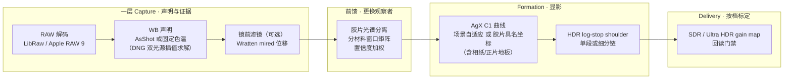

# dngscan 工程决策记录：问题、证据与推理过程

> 文档用途：给 reviewer 看的推理档案。每个案例按**问题 → 证据 → 推理 → 解法 → 教训**
> 记录，并指向对应 commit。README 讲"现在是什么样"，本文讲"为什么长成这样、
> 中间错过什么、怎么发现的"。
>
> 时间范围：v0.2.0 前后的集中开发期（2026-07）。

## 前言：认识论基调

本项目的起点来自高端电声领域：Playback Designs（Andreas Koch）与 Chord（Rob Watts）
证明了一件事——足够深的数字工程（DSD2048、高速嵌套反馈、百万抽头滤波）可以在听感上
**彻底透明地传递模拟介质的能力**。数字在那里的意义不是取代模拟，而是一种技术上的完善：
模拟回放链的粗粝放大、log 曲线、黑胶自身的信噪比、甲类放大的阻抗与热漂——载体的
缺陷被数字的低噪声、可处理性与高动态取代，而介质的签名原样送达。

dngscan 是同一命题在影像上的执行：**把介质的签名与介质的载体缺陷分离，只运送前者**。
胶片的签名是乳剂分离颜色的方式、特性曲线的节奏、染料耗尽收白的路径——以出处和残差
保存；胶片的载体缺陷是颗粒、halation、扫描噪声、Dmax 天花板——不运送，由数字载体的
长处（HDR、验证、低噪声）取代。正如 Koch 不会往 DSD 流里加炒豆声。

分离的前提是能区分签名与缺陷，而这只有科学路线做得到——眼配的仿真把两者拌在一起。
同色异谱又决定了"复现眼前的观感"从定义上不可达（Luther-Ives 对任何相机都不成立，
观察者之间亦互不相同），所以本项目只宣称可达的那一层：**忠实转译某个声明观察者的
报告**。声明三原则（有公开出处、有明确层位、拟合质量可测可报告）由此而来；以下
每一个案例，都是这条基调的一次执行。

## 0. 全局架构（含胶片观察层）

四层的共同准入条件（"声明三原则"）：**有公开出处、有明确层位、拟合质量可测可报告**。
以下每个案例都是这三条原则的一次实战。

---

## 1. HDR：单段域证明漏了 headroom 轴

**问题**：权威 HDR shoulder 只允许单段 Hermite，α>3 时整个 HDR 关闭（fail-closed）。
设计文档声称"完整策略域已证明 α<3"。

**证据**：域扫描测试把显示 headroom 固定在 3.0 EV，而 `--hdr-headroom` 是用户可调的。
`H_content = min(H_display, H_signal)` 使 H_display 成为独立变量：它压低 Z_peak（分母）
而 W 随尾部增长（分子）。contrast 4.5 + headroom 1.5 + 尾部 8 EV 时 α≈3.78。

**推理**：α>3 的低 headroom 请求不是畸形输入，只是压缩很强的 shoulder——SDR AgX 自己
的肩部就是同类；Blender HDR AgX 在同一处境下的做法是连续加大肩部弯折而非关闭。
fail-closed 的悬崖从未被有意设计，它是证明漏洞的副产品。

**解法**：权威编译在 α>3 时细分为多段单调 Hermite 链，结构合同不变（K 锚定、白端零导、
段间 C1、逐段单调，同一验收函数）；fail-closed 只留给真正退化的输入。域证明补上
headroom 轴。（commit `f2c538c`）

**教训**：*"全域证明"必须枚举每一个独立自由度*；被认为不可达的失败分支等价于
未设计的行为。

## 2. Delivery：合成渐变标定的门限在真实照片上全军覆没

**问题**：share 档（q90/4:2:0）的回读容差用一张 32×64 合成渐变标定。首次在三张真实
样张上运行：**六次导出全部失败**（舞台帧 JPEG 超 block median，HEIC 超底图码值门）。

**证据**：12 组实测矩阵（archive/share × JPEG/HEIC × 3 帧）。同时发现历史像素级色度门
0.02 连 archive 高 ISO 帧（实测 0.073）都会拒绝——这正是它当年被删的真实原因。

**推理**：块均值恰好在 4:2:0 的平均网格上取平均，对色度抽样损伤几乎失明——删掉像素门
的同一个 commit 引入了 4:2:0，等于无门。门限是回归界不是画质宣称，但回归界必须让
代表性样张能通过，否则它是"渲染完成后的崩溃"而不是合同。

**解法**：全部容差按 (档位, 容器) 在真实样张上重标定，share HEVC 单独一套（同名义参数
下损失约为 JPEG 的 1.8 倍）；像素色度门按语料最坏值带余量恢复。（commit `de0ee4e`）

**教训**：*标定数据必须与生产内容同分布*；加宽门限前先量真实地形。
另获两个操作点事实：Apple writer 的 4:4:4 只在恰好 q100 出现（q99 仍是 4:2:0，
中间没有台阶）；微信原图上限 25MB → share 预设定在 q90。

## 3. WB：肉眼调整 vs 声明标准的分界

**问题**：想做胶片模拟（日光卷锁 5500K），但此前刻意不提供白平衡调整——肉眼找"准"
永远输给机内测光。

**推理**：两种操作性质不同。"找中性"是感知判断（人眼自带色适应，是漂移的仪器）；
"锁 5500K"是**声明**——数值来自胶片标定，准确性取决于文件自身的颜色标定，与眼睛无关。
不暴露滑杆、只提供具名标准，两者不矛盾。

**解法**：五个固定色温声明 + 9300K（日本广播白）。LibRaw 侧经 DNG ColorMatrix1/2 双光
源倒数色温插值求解（fp 实测与厂商日光元数据吻合 0.1%）；RAW9 侧走 CIRAWFilter 原生
neutralTemperature/neutralTint（tint 显式钉零）。发现过程中：fp 的 `rgb_xyz_matrix`
为空 → 被迫实现了正确的 DNG 标签解析，因祸得福。（commit `5d1b889`）

**教训**：同一声明允许两条管线用各自最准的标定去兑现——结果的细微差异是特征不是缺陷。

## 4. 胶片曲线拟合器：三个缺陷，三次都是拟合输出先报警

这是本文最重要的方法论案例。三个缺陷全部由**参数钉边界 + 残差分布**暴露，
无一例外。

**4a. 标量目标用了通道算术平均**。Superia 三层失衡（蓝层 γ0.76 对 R/G 的 0.59，疑掺
富士更强 masking coupler 的 Status M 信号），经相纸放大后蓝通道早早撞纸白，算术平均被
单条失控通道拖垮 → white_ev 3.5 / contrast 4.08，画面又橙又冲。**解法**：标量色调目标
改为打印中性阶的亮度（Y 加权）——架构定义使然：色调=亮度坐标，单通道高光偏色属于
分离层职权。Portra 双定义几乎重合，恰好解释了缺陷为何在基准卷上隐形。

**4b. 拟合域截断在 +3.5 EV**。域外的白点全是无约束外推（Portra 的 7.23 是编的）。
扩到数据支持的 +6 EV 后落到数据约束的 6.61。

**4c. 反转片缺观看条件变换**（用户从暗场观感捕捉到）。正片的高 γ 是**暗环境投影的
环绕补偿**（暗环境感知对比降约 1.5×）；把投影介质的原始透射率直接当明环境显示目标
= 补偿吃两遍。证据：三款正片 black_ev/toe_power 全部精确钉死在参数边界、残差集中暗部。
**解法**：反转目标经声明的 `T^(1/1.5)` 外观变换（写入 source.model），全部参数脱离
边界、暗场地板从 0.1% 抬到 1–2.7%、残差全族下降。负片不动——相纸本来就是明环境介质。
（commits `f184d2a`、`b3fbe41`）

**教训**：*边界钉死 + 残差集中 = 模型错误的报警器，不是调宽门限的理由*。
"每个预设携带残差"这条房规三次把账算清。

## 5. 镜前滤镜：mired 语义的坐标系陷阱

**问题**：首版 85B 矩阵测试失败——80A 作用于中性得到 31514K 的荒谬值。

**推理**：混淆了两个坐标系。"85B 把 5500K 光变 3200K"描述的是**光**；渲染域里中性轴
已被白平衡归一到工作白点（D65），滤镜的 mired 位移作用于**渲染后的平衡**——所以从
D65 出发 −131 mired 本来就该冲向极高色温。mired 位移近似位置无关（这正是滤镜用 mired
标定的原因），实现应锚定固定参考对。

**解法**：以工作白点 mired 为中心对称取参考对（m₀±Δ/2）——等值反号滤镜对（85B/80A）
**按构造严格色度互逆**（实测残差只剩两个亮度归一化的标量积）。滤镜无强度滑杆：
玻璃没有半片。（commit `e2cd4a1`）

**教训**：光学量搬进渲染域前，先写清楚它作用在哪个坐标系。

## 6. RAW9 独立管线的证据纪律

**问题**：Core Image 执行 DNG opcode（角部位移 ~70px），LibRaw 的逐像素 CFA 证据无法映射。

**解法与纪律**：mask **丢弃而不是假装对齐**；聚合统计（剪切率、电平）仍取自 LibRaw
马赛克；可靠尾部用 rank-trim（按实测剪切 cell 比例从亮度顶端剔除）防止重建高光购买
白点；色度自由度 rho 压 0.25 上限；aligned 尺度对齐的参考解码必须与主解码同白平衡
（否则绿中位比较跨光源失义）。实测两解码器可靠尾部差 0.09 EV，全部钉入
`Raw9HdrCouplingTests`。（commit `ec4f986`）

**教训**：证据不能跨管线迁移时，诚实的降级路径（聚合约束 + 全局上限）好过伪造对齐。

## 7. 性能：先剖析，后动手

**实测基线**（半尺寸 Ultra HDR 导出）：4.2s 导出中渲染占 60%、验证读回占 30%；
并行度仅 1.2×；峰值内存 1.8GB（全尺寸外推 5–7GB）。

**解法**：①HDR 曲线 8192 点表编译（设计文档 P3 拖欠半年的项目，顺带消除 SDR 原生/
HDR NumPy 的算术分歧）；②流水线 worker 2→min(6, cores−2)，dither 有序归并保确定性；
③验证读回 f16 源 + 512 行带化 + 精确 top-K 选择（逐位一致有测试钉住）。
**结果**：导出 −38%，全尺寸 9.0s / 峰值 3.6GB。（commit 见 perf 系列）

**教训**：优化的安全网就是全套回归（SDR 字节冻结、金标、门禁）——先有网，再动刀。

## 8. 两句设计口号的共同缺陷：省略了参照物（2026-07-30）

**问题**：计算审计抓到两处异常——①强滤镜下前馈窗口静默淡出（当时判为
fail-soft）；②电影链（Vision3→2383 放映拷贝）没有 surround 补偿而反转片有。
追根发现两句核心设计口号各自省略了机制的参照物：

- **"滤镜的目的就是移动中性轴"**——把副作用当成了目的。滤镜的第一语义是
  **把光源搬到胶片校准点**（日光卷+钨丝灯+80A ≈ 设计光源），在胶片参考系里
  中性轴恰恰不动；"移动"只是单独应用时（WB 已先中性化）的现象。省略的参照物：
  **滤镜的配对光源失配**。重审后，窗口淡出从 fail-soft 升格为"按拟合域拒绝
  外推"的正确行为，配对使用（WB 3200K+85B 等）窗口全程有效。
- **"声明观察者的忠实翻译"**——省略了**报告的阅读条件**。2383 的密度是"在
  黑暗影厅里读"的报告，原样搬到明环境显示搬运的是脱离校准的裸数字（同
  Cineon 码值不带 95/1023 锚点）。反转片的 T^(1/1.5) 早已越过"不做色貌"的
  旧边界，暴露合同表述不完整。

**解法**：合同修订为"观看条件完整的忠实翻译"（FILM_OBSERVATION_PLAN §8.1）：
surround 项量化为三经典常数（dark 1.5 / dim 1.2 / average 1.0，Bartleson-
Breneman，Fairchild 2013），翻译指数 = γ_target/γ_native，只补这一项。电影链
补上 dark 项重拟后残差全线减半（Verita rms 0.104→0.053，Vision3 全系 ≤0.053），
contrast ~2.2→~2.0——被除掉的正是放映补偿，数据确认了理论。相纸链恒等从
"假设的边界"升格为"条件重合的推论"。同批：latitude 界 1.5→2.5 解钉，拟合器
新增 `fit.pinned` 钉界报告（域外端点参数是声明的外推，不冒充测量值）。

**续（同日）：被推翻的"结构距离"**。重拟后反转片残差仍高（Velvia rms 0.284），
当时归因为"AgX 族与幻灯片膝部的结构距离"。按区间定位残差后该论断被推翻：
膝部/高光近乎完美（0.003–0.005 stop），误差全部堆在深阴影且符号为正——拟合
曲线被钉在**错误的地板**上。地板常数用通道算术平均合成，而目标中性曲线用亮度
加权：Velvia 三层染料 Dmax 差异大，算术平均地板比亮度渐近线高 0.57 stop。这与
案例 4 的标量目标缺陷**同类同源**（mean vs luminance），只是藏在再往下一层的
常数里。地板改为亮度合成后 Velvia rms 0.284→0.013，四款反转片全部成为无钉界
的内点解——曲线族充分表达，反转片例外门（×2.5）退役，全族门收紧至
rms 0.10 / max 0.25。"结构性"的判据（放宽界后收敛到同一点）只证明了
界无关，不证明族距离——残差的**空间分布**才是指向根因的证据。

**教训**：口号式设计原则要逐一补全隐含配对物——滤镜配光源失配、报告配阅读
条件、密度配校准锚点。审计的"不一致"往往不是哪一边错了，而是共享的前提
少写了一项。

**续二（同日）：曝光依赖色彩落地与两个报告层缺口**。比率场运行时
（`out_c = C(EV_c)·r_c(EV_c)/r_c(EV_Y)`，agx.channel_ratio_gain）在 SDR/HDR
的共同咽喉 `finish_formation` 施加，hue restore 之后（介质报告不受渲染器
hue 纪律稀释）、outset 之前；HDR plan 经 replace 继承 curve_preset，双路一致
不靠论证靠投递门——Ultra HDR 胶片导出过 archive 档像素色度门。原生核无比率级，
`supports_agx` 如实拒绝回退 NumPy（48MP 帧无显著回归）。落地后按波及面自查，
一中一误：JPEG 策略行的 formation 顺序漏报新比率级（已修，"如实报告"必须
覆盖新增阶段——**每加一级管线，报告行是第八个交付物**）；RAW9 kelvin 只设
温度不设 tint 的嫌疑排除（setNeutralTint_ 0.0 早已实现且注释了理由）。同批
修复 WB 报告标签停留在 Kelvin 模式之前的问题（声明的 5500K 被标"相机白平衡"
——隐藏 WB 的报告侧孪生），统一为 describe_wb_mode。

## 9. 光谱印相：一句观感抱怨终结了 Status 捷径（2026-07-30）

**问题**：用户看 Superia 样张："怎么感觉非常生硬，阴影突兀感很重，一些颜色又
很容易转黑"——与该卷"宽容"的公认口碑相悖。拟合残差只有 0.02，说明 AgX 忠实
拟合了目标；**问题在目标的构造**。

**证据链**：①端到端中段 gamma：富士链 1.5–2.0 vs 柯达链 1.05–1.45，分裂沿
配对相纸走；②核对上游 agx-emulsion 源码发现 profile 的 `density_curves` 语义
是**逐染料量**（C/M/Y），不是 Status 通道读数——我们的"接触印相"从第一天起
就把染料量当通道密度直接印，跳过了旁带串扰与遮罩物理；③语义经各卷
`midscale_neutral_density` 光谱重建验证（rms 0.01–0.03，注意各卷"中灰"在
自家 logE 轴上位置不同：+0.16~+0.40）。

**解法**：接触印相升级为光谱印相（负片染料堆栈透过谱 × 相纸光谱感度 ×
3200K 放大机 → 相纸逐染料显影 → 声明观看光源下相对比色），配三个声明修正：
观看闪光按介质观看条件分派（反射 1% IEC / 投影 0——Velvia 曾被误配 1% 毁掉
暗部）、曝光锚改全局求解（测光表语义，profile 的 le=0 非场景中灰）、白点取
介质 Dmin 态（裸片基当白会把幻灯片相对亮度封顶 0.46）。

**裁决**：DiVERE 外部尺子二次出场——升级前 B 通道 rms 0.383 且尺度阶梯
0.75/0.84/0.96 随波长单调（简化的光谱签名）；升级后阶梯消失、B 塌到 0.048、
三通道 ≤0.086 合流。全家 25 支 rms ≤0.061，黑端域外钉界清零。

**教训**：①**同一把外部尺子用两次**——先定量简化的代价，再验证升级的正确；
交叉验证工具不是一次性仪式。②读上游数据先读上游代码：字段名（density_curves）
诱导了整整一代模型的误读。③观感抱怨是合法的测量输入：它与口碑的矛盾指向了
残差看不见的结构问题（拟合再好，目标错了就全错）。

**续：信任维度分裂与双模式合同（同日）**。光谱升级后用户指出新问题：
theatrical 观感变怪、Kodachrome 改版前后漂移巨大，并陈述审美锚点"一直最喜欢
AgX"。逐层信任盘点显示：音调维度有外部裁决，**色彩维度（比率场承载）是无
oracle 的重建**——两个未验证版本之间的巨大漂移正是"无锚"的直接证据。且逐
通道滚降本身就是颜色操作，"AgX 管滚降、胶片管颜色"在算子层面切不开。裁决：
分工画在数据可信边界上，做成两极开关——observe（默认：胶片声明观察、AgX
显影）/ full（实验：胶片接管显影，`film_develop` 核，色彩侧标注无验证）。
教训：④**审美偏好在无 oracle 的维度上就是最高级证据**——用户偏爱 AgX 不是
口味让步，而是指向了全管线唯一被充分验证的优选再现；⑤模型改版间的输出漂移
本身是可测量的"无锚度"，比任何单版本的好看更能说明该维度的真实状态。

**续二：错误为何存活——谱系论证与审计仪器的双盲区（同日复盘）**。
最初的设计前提"AgX 就是胶片曲线族，预设=其参数空间的具名坐标"按维度拆开
后**真假各半**：标量音调维度为真（后被拟合与外部裁决证实），色彩维度为假
（AgX 的逐通道施加+色彩几何是完整的优选再现，两个 preferred rendering 不能
共住一个算子位）——当时没有做维度分解，被"卤化银词源"式的谱系相似性带走。
错误长期存活的机制：手头全部仪器（中性阶残差、EV0 锚、单调性门）只照得见
标量维度，错误恰好住在无仪器的维度里，每轮测试都在"确认"设计；连
Kelly/Siragusano 对照审计也只核对了已建成机制的对应关系，没有对"胶片继续
向色彩扩张"跑碰撞推演。最终照亮盲区的是用户的眼睛。教训：⑥**谱系相似性
论证必须按维度拆开审查——一个维度的可测之真不能背书另一个维度的不可测之
真**；⑦**审计要对趋势可预见的扩张跑碰撞推演**，只核对已建成物的审计会
系统性漏掉将建之物的冲突。

**续三：风格配对的哨兵陷阱（差值图抓获，同日）**。用户质疑轴对比图"区别
小到指不出"，按规矩先量化再展示——放大差值图当场抓获一个 bug：
`separation ×1.6 vs ×1.0` 两格**逐字节相同**。根因：配对用"值等于默认即视
为未设置"填充（`abs(strength−1.0)<1e-9`），显式传入的 ×1.0 与默认 1.0 无法
区分，被静默改写成配对的 ×1.6——此前两张文档轴图的"×1.0 标定"格实际全是
×1.6，第一段差异从未被展示。修复：argparse 默认改 None 哨兵，"用户没给"
与"值恰好等于默认"分离编码，膨胀段后统一解析回落；显式 ×1.0/base 现在
必然生效（回归测试钉住）。教训：⑧**意图不能用值等式编码**——WB 的
"camera" 枚举哨兵当初就做对了，浮点参数偷懒复用默认值当哨兵是同一决策的
坏实现；⑨**"先量化再展示"不只是诚实规范，还是仪器**——差值图的本职是
展示微小差异，副产物是让"本应有差异却全零"的异常无处藏身。

## 10. 全量影响矩阵：把每层的"声称"变成可判定的数字（2026-07-30）

**问题**：多轮观感争议（风格弱/浓、差异可见不可见）暴露出我们对"每个选择
到底改了多少"只有定性感觉。工具 `tools/pipeline_impact.py` 就此诞生：同帧
同基线，逐轴单变量渲染，实测 Δ（mean/p99/max + 亮度/色度加性拆分），拿量级
对照每层声称的角色。

**首轮实测（室内钨丝帧，单位 codes）**：WB 5500K=14.3（色度主导 14.4/3.6 ✓
声明色温不偷曝光）；85B 滤镜=12.6（色度主导 ✓）；胶片曲线=9.8（亮度主导
8.1/3.8，色度分量即"逐通道曲线本身是颜色操作"的实测注脚）；比率场净贡献
=8.5（色度主导 8.4/1.9 ✓ 色彩载体确认）；surround 项净贡献=12.6；前馈分离
=1.4，×2.2 超驱动=2.6（近线性 ✓ 有界）；punch=0.8；高光模式=0.5（严格局部，
max 71 集中灯带 ✓）；gated≈lum（暗场景 SNR 权限收缩，按设计退守 ✓）；组合
19.1 < 分量和 25.5（次可加，无隐藏泄漏）。**风格层级定量化**：曲线 > 比率场
≫ 分离 > punch——observe 与 full 之差＝比率场的 8.5，而 look 层两杠杆合计
~3：补味杠杆比缺口小三倍是结构事实。

**平价取证**：native vs NumPy 逐像素 99.933% 相同、0.041% 差 1 code、0.026%
差 >1（max 5）且呈 8×8 小簇——单码抖动翻转经 JPEG DCT 放大的指纹，内核无罪；
平价判定应看 ==0/==1 占比而非 max。

**仪器自省（首轮抓出的三处度量学缺陷，已修入工具注释）**：①默认值即 clip
使该轴自比测零——变量表必须标注默认；②加性亮度/色度拆分会把保比例缩放记入
色度（lum 核假象）；③decoder 轴被 RAW9 几何 warp 混杂，量级不可与他轴同表。

**结论与教训**：数学架构全量过审——无死接线、无越界泄漏、无未声明相互作用。
⑧**"声称"必须配"量级"**：每层文档写角色时同时写预期 Δ 量级带，影响矩阵
成为架构改动的常备回归仪器；⑨审计仪器自身要先过一轮自省（本轮三处度量学
缺陷都是仪器问题冒充管线问题的未遂案例）。

## 11. 经验的沉淀形式

- **声明 vs 手调**：凡有公开标准可引的参数（色温、滤镜、胶片曲线、环绕补偿）做成
  具名选项并记录出处与残差；凡纯感知判断（找中性、halation 强度）宁可不做。
- **优雅降级 vs fail-closed 的分类学**：良态但超出表达力的请求 → 同合同下降级
  （细分链）；真正退化的输入 → 拒绝。分类错误会制造隐藏的悬崖（案例 1）。
- **三级出处链**：NOTICE.md（许可）→ 数据目录 README（分类与用途）→
  预设 source 字段（具体文件 + 模型 + 残差）。
- **对照组的价值**：正片 vs 负片的残差族对比两次指路——先指向观看模型缺项
  （surround 项，案例 8），地板修正后全族收敛 rms ≤0.07 又反证族距离不存在；
  全家福的家族一致性是最便宜的集成测试。
- **残差要看分布，不只看总量**：rms 相同的两个失配可以来自完全不同的根因；
  按 EV 区间定位（案例 8 续：误差全在深阴影→地板常数，而非全域→曲线族）
  一步就把"换架构"的大动作降级成"改一个常数"。
