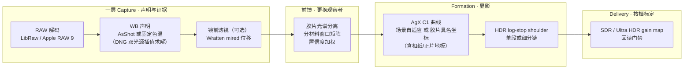

# dngscan 工程决策记录：问题、证据与推理过程

> 文档用途：给 reviewer 看的推理档案。每个案例按**问题 → 证据 → 推理 → 解法 → 教训**
> 记录，并指向对应 commit。README 讲"现在是什么样"，本文讲"为什么长成这样、
> 中间错过什么、怎么发现的"。
>
> 时间范围：v0.2.0 前后的集中开发期（2026-07）。

## 前言：认识论基调

本项目的起点来自高端电声领域：Playback Designs（Andreas Koch）与 Chord（Rob Watts）
证明了一件事——足够深的数字工程（DSD2048、高速嵌套反馈、百万抽头滤波）可以在听感上
**彻底透明地传递模拟介质的能力**。数字在那里的意义不是取代模拟，而是一种技术上的完善：
模拟回放链的粗粝放大、log 曲线、黑胶自身的信噪比、甲类放大的阻抗与热漂——载体的
缺陷被数字的低噪声、可处理性与高动态取代，而介质的签名原样送达。

dngscan 是同一命题在影像上的执行：**把介质的签名与介质的载体缺陷分离，只运送前者**。
胶片的签名是乳剂分离颜色的方式、特性曲线的节奏、染料耗尽收白的路径——以出处和残差
保存；胶片的载体缺陷是颗粒、halation、扫描噪声、Dmax 天花板——不运送，由数字载体的
长处（HDR、验证、低噪声）取代。正如 Koch 不会往 DSD 流里加炒豆声。

分离的前提是能区分签名与缺陷，而这只有科学路线做得到——眼配的仿真把两者拌在一起。
同色异谱又决定了"复现眼前的观感"从定义上不可达（Luther-Ives 对任何相机都不成立，
观察者之间亦互不相同），所以本项目只宣称可达的那一层：**忠实转译某个声明观察者的
报告**。声明三原则（有公开出处、有明确层位、拟合质量可测可报告）由此而来；以下
每一个案例，都是这条基调的一次执行。

## 0. 全局架构（含胶片观察层）

四层的共同准入条件（"声明三原则"）：**有公开出处、有明确层位、拟合质量可测可报告**。
以下每个案例都是这三条原则的一次实战。

---

## 1. HDR：单段域证明漏了 headroom 轴

**问题**：权威 HDR shoulder 只允许单段 Hermite，α>3 时整个 HDR 关闭（fail-closed）。
设计文档声称"完整策略域已证明 α<3"。

**证据**：域扫描测试把显示 headroom 固定在 3.0 EV，而 `--hdr-headroom` 是用户可调的。
`H_content = min(H_display, H_signal)` 使 H_display 成为独立变量：它压低 Z_peak（分母）
而 W 随尾部增长（分子）。contrast 4.5 + headroom 1.5 + 尾部 8 EV 时 α≈3.78。

**推理**：α>3 的低 headroom 请求不是畸形输入，只是压缩很强的 shoulder——SDR AgX 自己
的肩部就是同类；Blender HDR AgX 在同一处境下的做法是连续加大肩部弯折而非关闭。
fail-closed 的悬崖从未被有意设计，它是证明漏洞的副产品。

**解法**：权威编译在 α>3 时细分为多段单调 Hermite 链，结构合同不变（K 锚定、白端零导、
段间 C1、逐段单调，同一验收函数）；fail-closed 只留给真正退化的输入。域证明补上
headroom 轴。（commit `f2c538c`）

**教训**：*"全域证明"必须枚举每一个独立自由度*；被认为不可达的失败分支等价于
未设计的行为。

## 2. Delivery：合成渐变标定的门限在真实照片上全军覆没

**问题**：share 档（q90/4:2:0）的回读容差用一张 32×64 合成渐变标定。首次在三张真实
样张上运行：**六次导出全部失败**（舞台帧 JPEG 超 block median，HEIC 超底图码值门）。

**证据**：12 组实测矩阵（archive/share × JPEG/HEIC × 3 帧）。同时发现历史像素级色度门
0.02 连 archive 高 ISO 帧（实测 0.073）都会拒绝——这正是它当年被删的真实原因。

**推理**：块均值恰好在 4:2:0 的平均网格上取平均，对色度抽样损伤几乎失明——删掉像素门
的同一个 commit 引入了 4:2:0，等于无门。门限是回归界不是画质宣称，但回归界必须让
代表性样张能通过，否则它是"渲染完成后的崩溃"而不是合同。

**解法**：全部容差按 (档位, 容器) 在真实样张上重标定，share HEVC 单独一套（同名义参数
下损失约为 JPEG 的 1.8 倍）；像素色度门按语料最坏值带余量恢复。（commit `de0ee4e`）

**教训**：*标定数据必须与生产内容同分布*；加宽门限前先量真实地形。
另获两个操作点事实：Apple writer 的 4:4:4 只在恰好 q100 出现（q99 仍是 4:2:0，
中间没有台阶）；微信原图上限 25MB → share 预设定在 q90。

## 3. WB：肉眼调整 vs 声明标准的分界

**问题**：想做胶片模拟（日光卷锁 5500K），但此前刻意不提供白平衡调整——肉眼找"准"
永远输给机内测光。

**推理**：两种操作性质不同。"找中性"是感知判断（人眼自带色适应，是漂移的仪器）；
"锁 5500K"是**声明**——数值来自胶片标定，准确性取决于文件自身的颜色标定，与眼睛无关。
不暴露滑杆、只提供具名标准，两者不矛盾。

**解法**：五个固定色温声明 + 9300K（日本广播白）。LibRaw 侧经 DNG ColorMatrix1/2 双光
源倒数色温插值求解（fp 实测与厂商日光元数据吻合 0.1%）；RAW9 侧走 CIRAWFilter 原生
neutralTemperature/neutralTint（tint 显式钉零）。发现过程中：fp 的 `rgb_xyz_matrix`
为空 → 被迫实现了正确的 DNG 标签解析，因祸得福。（commit `5d1b889`）

**教训**：同一声明允许两条管线用各自最准的标定去兑现——结果的细微差异是特征不是缺陷。

## 4. 胶片曲线拟合器：三个缺陷，三次都是拟合输出先报警

这是本文最重要的方法论案例。三个缺陷全部由**参数钉边界 + 残差分布**暴露，
无一例外。

**4a. 标量目标用了通道算术平均**。Superia 三层失衡（蓝层 γ0.76 对 R/G 的 0.59，疑掺
富士更强 masking coupler 的 Status M 信号），经相纸放大后蓝通道早早撞纸白，算术平均被
单条失控通道拖垮 → white_ev 3.5 / contrast 4.08，画面又橙又冲。**解法**：标量色调目标
改为打印中性阶的亮度（Y 加权）——架构定义使然：色调=亮度坐标，单通道高光偏色属于
分离层职权。Portra 双定义几乎重合，恰好解释了缺陷为何在基准卷上隐形。

**4b. 拟合域截断在 +3.5 EV**。域外的白点全是无约束外推（Portra 的 7.23 是编的）。
扩到数据支持的 +6 EV 后落到数据约束的 6.61。

**4c. 反转片缺观看条件变换**（用户从暗场观感捕捉到）。正片的高 γ 是**暗环境投影的
环绕补偿**（暗环境感知对比降约 1.5×）；把投影介质的原始透射率直接当明环境显示目标
= 补偿吃两遍。证据：三款正片 black_ev/toe_power 全部精确钉死在参数边界、残差集中暗部。
**解法**：反转目标经声明的 `T^(1/1.5)` 外观变换（写入 source.model），全部参数脱离
边界、暗场地板从 0.1% 抬到 1–2.7%、残差全族下降。负片不动——相纸本来就是明环境介质。
（commits `f184d2a`、`b3fbe41`）

**教训**：*边界钉死 + 残差集中 = 模型错误的报警器，不是调宽门限的理由*。
"每个预设携带残差"这条房规三次把账算清。

## 5. 镜前滤镜：mired 语义的坐标系陷阱

**问题**：首版 85B 矩阵测试失败——80A 作用于中性得到 31514K 的荒谬值。

**推理**：混淆了两个坐标系。"85B 把 5500K 光变 3200K"描述的是**光**；渲染域里中性轴
已被白平衡归一到工作白点（D65），滤镜的 mired 位移作用于**渲染后的平衡**——所以从
D65 出发 −131 mired 本来就该冲向极高色温。mired 位移近似位置无关（这正是滤镜用 mired
标定的原因），实现应锚定固定参考对。

**解法**：以工作白点 mired 为中心对称取参考对（m₀±Δ/2）——等值反号滤镜对（85B/80A）
**按构造严格色度互逆**（实测残差只剩两个亮度归一化的标量积）。滤镜无强度滑杆：
玻璃没有半片。（commit `e2cd4a1`）

**教训**：光学量搬进渲染域前，先写清楚它作用在哪个坐标系。

## 6. RAW9 独立管线的证据纪律

**问题**：Core Image 执行 DNG opcode（角部位移 ~70px），LibRaw 的逐像素 CFA 证据无法映射。

**解法与纪律**：mask **丢弃而不是假装对齐**；聚合统计（剪切率、电平）仍取自 LibRaw
马赛克；可靠尾部用 rank-trim（按实测剪切 cell 比例从亮度顶端剔除）防止重建高光购买
白点；色度自由度 rho 压 0.25 上限；aligned 尺度对齐的参考解码必须与主解码同白平衡
（否则绿中位比较跨光源失义）。实测两解码器可靠尾部差 0.09 EV，全部钉入
`Raw9HdrCouplingTests`。（commit `ec4f986`）

**教训**：证据不能跨管线迁移时，诚实的降级路径（聚合约束 + 全局上限）好过伪造对齐。

## 7. 性能：先剖析，后动手

**实测基线**（半尺寸 Ultra HDR 导出）：4.2s 导出中渲染占 60%、验证读回占 30%；
并行度仅 1.2×；峰值内存 1.8GB（全尺寸外推 5–7GB）。

**解法**：①HDR 曲线 8192 点表编译（设计文档 P3 拖欠半年的项目，顺带消除 SDR 原生/
HDR NumPy 的算术分歧）；②流水线 worker 2→min(6, cores−2)，dither 有序归并保确定性；
③验证读回 f16 源 + 512 行带化 + 精确 top-K 选择（逐位一致有测试钉住）。
**结果**：导出 −38%，全尺寸 9.0s / 峰值 3.6GB。（commit 见 perf 系列）

**教训**：优化的安全网就是全套回归（SDR 字节冻结、金标、门禁）——先有网，再动刀。

## 8. 经验的沉淀形式

- **声明 vs 手调**：凡有公开标准可引的参数（色温、滤镜、胶片曲线、环绕补偿）做成
  具名选项并记录出处与残差；凡纯感知判断（找中性、halation 强度）宁可不做。
- **优雅降级 vs fail-closed 的分类学**：良态但超出表达力的请求 → 同合同下降级
  （细分链）；真正退化的输入 → 拒绝。分类错误会制造隐藏的悬崖（案例 1）。
- **三级出处链**：NOTICE.md（许可）→ 数据目录 README（分类与用途）→
  预设 source 字段（具体文件 + 模型 + 残差）。
- **对照组的价值**：负片全系 rms ≤0.10 与正片 0.15–0.28 的对比，本身就是"问题在
  观看模型不在数据"的证据（案例 4c）；全家福的家族一致性是最便宜的集成测试。
