# dngscan HDR AgX v2：设计与实现合同

> 文档用途：记录现行 HDR tone core 的数学来源、生产合同与验收边界。
>
> 状态：已进入生产实现；本文是当前权威说明。
>
> 历史：提高全局 gamma 的 v1 已删除，不再保留运行时 A/B 分支。

## 0. 结论先行

现行 HDR v1 的问题不是某个 gamma 上限略有偏差，而是自由度放错了位置：它为了把目标白从
`1.0` 抬到 `2^H`，提高整条 AgX 曲线的全局 `curve_gamma`。这虽然能让 encoded shoulder
在数学上到达扩展白，却会同时重写 toe。真实样张已经验证，gamma 从 SDR 的 `2.2` 升到
约 `4.6~4.7` 时，中灰局部导数仍可保持，但 `-3~-5 EV` 会系统性下降，最深处可损失数档。

v2 的决定是：

1. HDR 是独立 DRT，不读取 SDR 像素，也不要求和 SDR 在某个 knee 以下逐像素相同。
2. HDR headroom 只能改变 HDR 曲线的上半支；同一 HDR plan 的 toe、黑位和主体段不得随
   display headroom 改变。
3. 暗部和主体段沿用 darktable 式解析结构与摄影型默认值。
4. 高光在 output-stop 坐标中使用独立、单调、端点零导数的 HDR shoulder。
5. Blender Rec.2100 HLG LUT 用作 HDR 形状和绝对亮度关系的参考，不把其中的经验常数直接
   冒充标准。
6. HLG/PQ/gain map 都是 delivery；DRT 内部统一输出 reference-white-relative、display-linear
   Display P3，其中 `1.0` 是参考白，`2^H` 是内容峰值。

目标拓扑：

```mermaid
flowchart LR
    RAW["RAW / RAW9 scene-linear Rec.2020"] --> RETREAT["RAW clip retreat"]
    RETREAT --> INSET["AgX inset + primaries rotation"]
    INSET --> BODY["darktable-style toe / body"]
    BODY --> SHOULDER["独立 HDR log-stop shoulder"]
    SHOULDER --> COLOR["RAW 门控的 HDR 色彩路径"]
    COLOR --> OUTSET["hue restore + outset"]
    OUTSET --> P3["extended-linear Display P3 volume fit"]
    P3 --> ALT["float16 HDR alternate"]
    ALT --> CI["Core Image ISO 21496-1 gain-map JPEG"]
```



## 1. 设计依据

### 1.1 darktable SDR AgX 提供什么

darktable 当前 AgX 是可解析、可调的 scene-to-display formation。默认参数来自
[`src/iop/agx.c`](https://github.com/darktable-org/darktable/blob/master/src/iop/agx.c)：

```text
black relative EV      = -10
white relative EV      = +6.5
historical range       = 16.5 EV
linear mid-gray        = 0.18
curve gamma            = 2.2
contrast around pivot  = 3.0
toe power              = 1.5
shoulder power         = 3.3
target black / white   = 0 / 1
hue restore            = 0.6 original hue
```

darktable 的 gamma 是内部 y 坐标编码，不是显示器 gamma。曲线完成后会执行
`linear = encoded ^ gamma`。contrast 会根据动态范围和 gamma 做导数补偿，以维持最终 linear
输出的 pivot 对比度。官方技术说明见
[`darktable AgX manual`](https://darktable-org.github.io/dtdocs/en/module-reference/processing-modules/agx/)。

darktable 对 v2 的价值：

- 它给出摄影用途已经调过的 toe、pivot contrast 与参数语义；
- 它把 primaries inset/outset、hue restore 和 tone formation 分开；
- 它允许解析计算连接点和导数；
- 它没有定义扩展白 HDR，所以不能把 SDR 参数界面的 `gamma <= 5` 当成 HDR 标准。

### 1.2 Blender SDR AgX 与 darktable 默认的区别

Blender SDR Base 使用：

```text
black / white EV       = -10 / +6.5
mid-gray               = 0.18
curve gamma            = 2.4
pivot slope            = 2.4
toe / shoulder power   = 1.5 / 1.5
hue mix                = 40% processed hue
```

来源是 Blender 所用 LUT 的公开生成脚本
[`AgXBaseRec2020.py`](https://github.com/EaryChow/AgX_LUT_Gen/blob/main/AgXBaseRec2020.py)。
darktable 源码也提供 `blender-like` preset，并明确恢复上述 `2.4 / 2.4 / 1.5 / 1.5`。

因此 Blender SDR Base 是较低 pivot contrast、对称 toe/shoulder 的 CG view transform；
darktable 默认则是更高的摄影型 pivot contrast，并用 `shoulder_power=3.3` 让高光对比保持更久、
更接近白端才集中弯折。

### 1.3 Blender HDR 真正改变了什么

Blender 当前 Rec.2100 HLG HDR LUT 生成脚本是
[`AgXHLG.py`](https://github.com/EaryChow/AgX_LUT_Gen/blob/main/AgXHLG.py)。1000 nit 峰值、
100 nit 参考白时，脚本保留：

```text
curve gamma = 2.4
pivot slope = 2.4
toe power   = 1.5
```

它没有把全局 gamma 提到 4 或 5。HDR 专属变化是：

```text
HDR_SDR_ratio = 1000 / 100 = 10
HDR_extra_shoulder_power_factor = 2.0
shoulder power = 1.5 * 2.0 = 3.0
HDR_purity = 0.5
```

`2.0` 的生成公式为：

```text
10 ** log10(2) = 2
```

这不是显示标准推导，而是 LUT 作者选择的 shoulder 形状标定点。`HDR_purity=0.5` 同样是经验
参数。二者只能作为参考曲线，不能直接命名为物理或 AgX 标准常数。

更重要的是 `darken_middle_grey()`：它把 base formation 的 `0.18` 映射到 peak-normalized
的 `0.18 / 10`，同时让白端到达 1.0。随后乘 1000 nit 并编码 HLG。由代码可推得，中灰最终
仍约为 18 nit，而峰值扩展到 1000 nit。Blender 因而用 HDR 专属的上部形成解耦中灰与峰值，
而不是通过全局 gamma 牺牲 toe。

### 1.4 Apple/Core Image 对内部坐标的约束

Apple HDR 文档使用 reference-white-relative 线性表示：`1.0` 是参考白，允许值扩展到显示或
内容 headroom。headroom 是峰值与参考白的比值：

```text
H = log2(peak / reference_white)
peak_linear = 2 ** H
```

参考：

- [Applying Apple HDR effect to your photos](https://developer.apple.com/documentation/appkit/applying-apple-hdr-effect-to-your-photos)
- [Headroom Adaptive Gain Curve](https://developer.apple.com/documentation/colorsync/headroom-adaptive-gain-curve)
- [WWDC24: Use HDR for dynamic image experiences](https://developer.apple.com/videos/play/wwdc2024/10177/)

dngscan 的 `100 nit` 是 authoring convention，不是 Apple 强制值。以 100 nit 为参考白时，
`+3 EV` 等于 800 nit；Blender 的 1000/100 等于 `log2(10)=3.321928 EV`。

## 2. 非目标

v2 不做以下事情：

- 不让显示峰值决定自动曝光；
- 不以画面中位数对齐 18% 灰；
- 不从 SDR 成片反推 HDR；
- 不要求 HDR 与 SDR 在 knee 以下逐像素相同；
- 不复制 Blender 的 3D LUT；
- 不在 tone core 中编码 HLG/PQ；
- 不使用 ACES 2 JMh DRT 替换现有 AgX 色彩几何；
- 不改变 Core Image gain-map 打包机制本身。（历史注：v2 初版曾把"不动 round-trip 验证"
  也列为非目标；delivery profile / HEIC 容器落地后，验收门禁已按 §9 重新按档位与容器
  标定，此项非目标随之废除。formation 与 delivery 的边界不变。）

## 3. 坐标、符号与单位

所有 tone 数学先在单通道上定义，运行时对 AgX inset 后的 R/G/B 分别应用。

| 符号 | 单位 | 定义 |
|---|---|---|
| `c` | scene-linear | inset 后的单通道值 |
| `e` | scene EV | `log2(c / 0.18)` |
| `B` | scene EV | HDR 黑端，由噪声和 RAW 可用动态范围决定 |
| `K` | scene EV | HDR shoulder 起点 |
| `W` | scene EV | HDR 输入白端，位于可靠 RAW 尾部之后 |
| `T(e)` | display-linear | reference-white-relative 输出，允许大于 1 |
| `z(e)` | output stops | `log2(T(e) / 0.18)` |
| `E_tail` | scene EV | 排除不可靠高光后的 RAW p99.99 尾部 |
| `H_display` | stops | 显示/authoring 容量 |
| `H_content` | stops | RAW 允许请求的参考白以上余量 |
| `P` | display-linear | HDR tone endpoint，`2^H_content` |

三个容易混淆的坐标必须分开：

```text
scene e=0                  -> 18% 场景灰
output T=0.18, z=0         -> 18% 输出中灰
output T=1.0               -> 显示参考白
output z=log2(1/0.18)      -> 参考白距中灰的输出档数
output T=2^H               -> HDR 内容峰值
```

## 4. 常数来源与处理决定

### 4.1 保留的基础常数

| 名称 | 数值 | 来源 | v2 用途 |
|---|---:|---|---|
| `SCENE_MIDGRAY` | `0.18` | Blender AgX、darktable AgX | scene/output 中灰锚点 |
| `DARKTABLE_BASE_GAMMA` | `2.2` | darktable 默认 | HDR lower/body 内部编码 |
| `AGX_REFERENCE_RANGE_EV` | `16.5` | `-10..+6.5` 历史范围 | 保持 darktable contrast 参数语义 |
| `BASE_CONTRAST` | `3.0` | darktable 默认 | 摄影型主体局部对比起点 |
| `BASE_TOE_POWER` | `1.5` | darktable/Blender | HDR toe 起点，允许 RAW 驱动调整 |
| `DEFAULT_HUE_RESTORE` | `0.6` | darktable；等价于 Blender 40% processed hue | HDR hue mix 起点 |

### 4.2 保留但必须改名的常数

现有：

```python
DIFFUSE_WHITE_EV = log2(1 / 0.18)
```

改为：

```python
OUTPUT_REFERENCE_WHITE_STOPS = log2(1 / SCENE_MIDGRAY)
```

数值仍是：

```text
2.473931188332412
```

它只表示 output `T=1` 相对 output `T=0.18` 的档数。它不是实测场景 diffuse white，不能用于
声称某个 RAW EV 就是白色物体。

### 4.3 删除的 v1 求解常数

以下符号必须从生产代码、测试、README 和旧设计说明中删除：

```text
MIN_HDR_CURVE_GAMMA = 2.2
MAX_HDR_CURVE_GAMMA = 5.0
MIN_SHOULDER_SLOPE_RESERVE = 1.01
_minimum_feasible_gamma()
全局 HDR gamma 二分
gamma 不可行时的 headroom 二分
```

原因：

- `5.0` 只对应 darktable GUI/项目已有搜索范围，没有 HDR 理论来源；
- `1.01` 在现行求解器中总是最终工作点，不是数值 epsilon；
- gamma 是整条曲线坐标，不能承担只属于 HDR 高光的 endpoint 自由度；
- v2 shoulder 自己具有白端位置和端点导数，不再需要 `slope_reserve` 证明。

### 4.4 只作为参考、不进入生产常数的 Blender 数值

```text
Blender SDR/HDR gamma         = 2.4
Blender pivot slope           = 2.4
Blender SDR toe/shoulder      = 1.5 / 1.5
Blender HDR shoulder at 10x   = 3.0
Blender HDR purity            = 0.5
Blender HDR peak/reference    = 1000 / 100
```

这些数值用于生成 neutral-ramp 参考和 A/B，不直接覆盖 darktable lower/body。

### 4.5 继续保留为 dngscan policy 的常数

| 常数 | 当前值 | 状态 |
|---|---:|---|
| 默认 reference white | `100 nit` | authoring convention |
| 默认峰值 | `800 nit` | `+3 EV` 的产品默认 |
| 最大峰值 | `4000 nit` | UI/资源限制，不是格式极限 |
| reliable tail | `p99.99` | RAW 鲁棒统计策略 |
| 普通 white margin | `0.30 EV` | 待样本标定 |
| 稀疏光源 margin | `0.50 EV` | 待样本标定 |
| 普通/稀疏最低 W | `3.0 / 3.5 EV` | 待样本标定 |
| 最大 W | `8.5 EV` | 防御性项目上限 |
| 普通/稀疏 K 初值 | `+0.20 / 0.00 EV` | darktable-style latitude policy |

v2 第一阶段保留这些值，以隔离 tone-core 改动。后续再根据真实 EDR 样本，将 white margin 改为
由 percentile spacing、可靠样本数和 clipping topology 推导的 uncertainty margin。

## 5. HDR 内容峰值编译

### 5.1 显示容量

```text
H_display = log2(peak_nits / reference_white_nits)
```

只作为上限，不保证每张图使用全部容量。

### 5.2 RAW 请求

v2 初版保留：

```text
Z_ref = OUTPUT_REFERENCE_WHITE_STOPS
H_signal = max(0, E_tail - Z_ref)
H_content = min(H_display, H_signal)
P = 2 ** H_content
Z_peak = Z_ref + H_content
```

准确解释是：

> 以 `e=0 -> z=0` 为曝光锚，假设可靠 RAW 尾部的曝光间距可一比一转成输出 stops，尾部超过
> output reference white 的部分就是可请求 HDR headroom。

这是一条固定、内容感知但不改变曝光的 rendering policy。它不使用画面中位数，不把夜景抬成
日景。若 `E_tail` 缺失、非 finite 或可靠样本不足，则 `H_content=0`。

### 5.3 HDR 输入白端

```text
W = clamp(
    max(E_tail + margin, minimum_white_ev),
    minimum_white_ev,
    maximum_white_ev,
)
```

`margin` 的作用仅是把数学 clamp 放在可靠数据尾部之外。它不增加 `H_content`，也不能让重建或
剪切像素购买 HDR 亮度。

## 6. lower/body 数学

### 6.1 编码坐标

令：

```text
g_b = 2.2
q = T ** (1 / g_b)
q0 = 0.18 ** (1 / g_b)
```

数值：

```text
q0 = 0.4586564468643811
```

darktable contrast 的历史归一范围为 `R0=16.5 EV`。当 gamma 为默认 2.2 时，central encoded
line 对 scene EV 的斜率为：

```text
a_q = contrast / R0
```

默认 contrast 3.0 时：

```text
a_q = 3 / 16.5 = 0.1818181818 per scene EV
q_linear(e) = q0 + a_q * e
T_linear_body(e) = q_linear(e) ** 2.2
```

因此 pivot 的 display-linear 导数不是手填常数，而是：

```text
dT/de | e=0 = g_b * q0 ** (g_b - 1) * a_q
              = 0.15698024194847843
```

换成 output stops 的导数：

```text
dz/de = (dT/de) / (ln(2) * T)
dz/de | e=0 = 1.2581923143145526
```

这些是由 `0.18 / 2.2 / 3.0 / 16.5` 推出的诊断值，不应再定义成独立常数。

### 6.2 toe

`B -> toe transition -> pivot` 继续复用现有 darktable-style scaled sigmoid：

- black endpoint 由 HDR 自己的 capture/noise plan 决定；
- toe power 默认 1.5；
- dngscan 现有 RAW 噪声门控可以把 toe power 降低，但结果写入 HDR plan 后必须固定；
- 对同一 HDR plan，改变 display headroom 不得改变 `B`、toe power、toe transition 或
  `e <= K` 的任何输出。

### 6.3 shoulder 起点

初值：

```text
K = +0.20 EV  # 普通场景
K =  0.00 EV  # 稀疏光源场景
```

在 K 点从 body 求：

```text
T_K = T_body(K)
Z_K = log2(T_K / 0.18)
M_K = dz_body/de at K
```

生产实现不得直接假定 K 位于 central encoded line。真实 plan 中，`latitude_hi_ev`
可能让 K 恰好落在或轻微越过 darktable body 自身的 shoulder transition；此时下面的
central-line 闭式解只是一条理想参照，不是权威锚点。

生产锚点必须从**将要真正渲染的同一条曲线**取得：

1. 用 `curve_params_from_plan()` 得到和 renderer 相同、经过同样取整的参数；
2. `T_K` 走 `apply_curve()` 的实际 float32 分段和值域钳制路径；
3. `dT/de` 用该分段方程的解析导数计算，再换算为
   `M_K = (dT/de) / (ln(2) * T_K)`；
4. 禁止用相邻 float32 输出做微小步长有限差分。`1e-5 EV` 量级已经接近 float32
   输出的分辨率，尤其在分段边界会让导数随步长明显漂移。

scaled sigmoid 的 encoded-domain 导数来自现有方程本身。令：

```text
t = slope * (x - transition_x) / scale
dy/dx = slope * (1 + t ** power) ** (-1 / power - 1)
```

central line 上 `dy/dx=slope`；fallback toe/shoulder 分别对其幂函数直接求导。
最后经 `T=y**gamma` 和 `x=(e-B)/(W-B)` 链式换算：

```text
dT/de = gamma * y ** (gamma - 1) * (dy/dx) / (W - B)
```

这样 C0 使用实际渲染值，C1 使用同一组曲线参数的解析切线；K 位于 toe、latitude 或
shoulder 哪一段都不改变合同。

若 K 位于 central encoded line：

```text
qK = q0 + a_q * K
T_K = qK ** g_b
Z_K = log2(T_K / 0.18)
M_K = g_b * a_q / (ln(2) * qK)
```

默认 K=0.20 EV 时：

```text
qK  = 0.4950200832280175
T_K = 0.21289732342815634
Z_K = 0.24216090560632872 stops
M_K = 1.1657668767547156 output-stops / scene-EV
```

## 7. HDR upper shoulder 数学

### 7.1 为什么用 output-stop 坐标

在线性 T 中，scene exposure 的一档变化本来就是指数增长；从 `0.18` 走到数倍参考白时，线性
斜率自然快速增加。直接在线性 T 中要求全段“纯凹、持续减速”，会把正常曝光比例误判成不可行。

`z=log2(T/0.18)` 将亮度比例变成 stops：

- 一比一曝光保真是 `z=e`；
- display peak 是有限的 `Z_peak`；
- shoulder 是对 output-stop 增长率的平滑降低；
- endpoint 的 `dz/de=0` 同时保证 `dT/de=0`。

### 7.2 单段 cubic Hermite

定义：

```text
DeltaE = W - K
DeltaZ = Z_peak - Z_K
u = clamp((e - K) / DeltaE, 0, 1)
```

Hermite basis：

```text
h00 =  2u^3 - 3u^2 + 1
h10 =    u^3 - 2u^2 + u
h01 = -2u^3 + 3u^2
h11 =    u^3 -   u^2
```

白端导数要求为 0：

```text
M_W = 0
```

于是：

```text
z(e) = h00 * Z_K
     + h10 * DeltaE * M_K
     + h01 * Z_peak
     + h11 * DeltaE * M_W

T(e) = 0.18 * 2 ** z(e)
```

边界条件：

```text
T(K-)  = T(K+)
T'(K-) = T'(K+)
T(W)   = P
T'(W-) = 0
T'(W+) = 0  # e>=W clamp 到 P
```

因此整个 K 连接和 white clamp 都是 C1；这比 v1 仅保证内部 shoulder 连接更严格。

### 7.3 单调条件

归一化起始切线：

```text
alpha = M_K * DeltaE / DeltaZ
beta  = M_W * DeltaE / DeltaZ = 0
```

单段 monotone cubic Hermite 的充分条件：

```text
DeltaE > 0
DeltaZ > 0
alpha >= 0
beta >= 0
alpha^2 + beta^2 <= 9
```

当前 `beta=0`，所以要求：

```text
0 <= alpha <= 3
```

这取代 v1 的 `shoulder_slope_reserve >= 1.01`。它是明确的单调插值条件，不是观感常数。

### 7.4 单段可行域、低 headroom 细分与越界行为

单段 Hermite 是首选形态，`alpha <= 3` 时必须且只会得到一段。在显示容量固定为 3.0 EV 的
条件下扫描可靠尾部完整策略域得到：

```text
默认 contrast=3:
  普通场景 alpha_max = 1.8494437932436134
  稀疏光源 alpha_max = 1.9537393335285478

完整用户控制域 contrast=[1.5, 4.5]:
  普通场景 alpha_max = 2.7357483714059394
  稀疏光源 alpha_max = 2.9306090002928213

单段边界 alpha = 3
```

**但这个扫描少了一根轴。** 本文早期版本断言"W 与 `H_content` 都由同一个 `E_tail` 编译，
不能独立取极值"——这是错的：`H_content = min(H_display, H_signal)`，`H_display` 是用户
可调的独立变量。低 headroom 显示把 `Z_peak`（分母）压低，而 W（分子）继续随 `E_tail`
增长，`alpha` 因此无界。例如 contrast=4.5、`--hdr-headroom 1.5`、尾部 8 EV 时
`alpha ≈ 3.78`。

这样的请求不是畸形请求——它只是一个压缩很强的 shoulder，与 SDR AgX 自己的肩部同类；
Blender 的 HDR AgX 在同一处境下的做法也是连续地加大肩部弯折，而不是关闭 HDR。因此权威
编译在 `alpha > 3` 时**细分**为多段单调 Hermite 链（Fritsch-Carlson 内点切线），保持与
单段完全相同的结构合同：K 点锚定值与切线不动、白端导数为零、段间 C1、逐段单调，由同一个
`validate_hdr_shoulder` 验收。`describe_hdr_plan` 如实报告"单段 / 细分 n 段"，
`shoulder_alpha` 记录细分前请求本身的归一化起始切线作为诊断。property test 同时固定
上表四个单段域上界，并扫描 headroom 轴证明：每个良态请求都编译出通过验收的曲线，
`alpha <= 3` 时恰好一段（细分不得无故发生）。

严格 fail-closed 只保留给真正的退化输入：`DeltaZ<=0`、`W<=K`、锚点非有限。这时结果为空，
调用端将 `H_rendered` 归零并拒绝 HDR；不得提高全局 gamma、修改 toe、移动 K 或静默进入
另一种未验证的 tone shape。

固定为 1.0 的 reference-white 色度候选同样经由显式 `allow_subdivision=True` 使用细分：
它不具备 W/H 耦合，高 W 时经常超过单段边界。它只提供 path-to-white 色度，随后被归一到
原生 HDR 曲线的 Y；不会写入 `HdrToneCurve`，也没有亮度决定权。通用 PCHIP limiter 仍不
允许改写 K 点 `M_K`。

### 7.5 `_SDI0150` 的已知实例

现有分析近似：

```text
E_tail    = 3.838 EV
margin    = 0.30 EV
W         = 4.138 EV
H_content = 3.838 - 2.473931 = 1.364 EV
Z_peak    = 3.838 stops
K         = 0.20 EV
Z_K       = 0.2422 stops
M_K       = 1.1658
alpha     ~= 1.28
```

`alpha` 明显位于 `[0,3]`，单段 Hermite 可行。v1 为同一请求求得约 `gamma=4.714`，导致
`-4 EV` 相对 SDR 下降约 `1.55 EV`。v2 的 `e<=K` 完全不读 `H_content`，因此这个暗部变化按
结构不可能发生。按上述单段公式计算，W 点精确达到 `+1.3641 EV`，可靠尾部本身约达到
`+1.329 EV`；0.30 EV margin 只留下温和的端点缓冲，不再通过全局 gamma 间接压低暗部。

## 8. RGB formation 与色彩几何

### 8.1 运算位置

保持：

```text
scene-linear Rec.2020
-> optional scene transform / prefeed
-> RAW clip retreat
-> AgX gamut guard rail
-> inset + primaries rotation
-> per-channel HDR tone
-> HDR color geometry
-> hue restore
-> outset
-> extended-linear output gamut
-> HDR color-volume fit
```

曲线必须在 inset 后逐通道执行，这样三个通道接近 W 时自然收敛到同一个 P，形成 AgX 的
path-to-white。不能改成单纯 luminance curve 后保持 RGB 比例，否则会丢掉 AgX 的核心色彩路径。

### 8.2 native 与 conservative 色度候选

保留当前“一个亮度权威、两个色度候选”的架构，但两条候选都改用 v2 shoulder primitive：

```text
F_native = HDR curve with endpoint P
F_ref    = HDR curve with endpoint 1.0
```

`F_ref` 只提供更保守的 reference-white path-to-white 色度。亮度始终来自 `F_native`：

```text
Y_native = dot(F_native, w_form)
Y_ref    = dot(F_ref,    w_form)
F_common = F_ref * Y_native / max(Y_ref, eps)

Pmix = (1-rho) * F_common + rho * F_native
Fout = Pmix * Y_native / max(dot(Pmix, w_form), eps)
```

因此 rho 只改变 chroma，不能改变 tone endpoint、主体亮度或 HDR headroom。

若后续验证发现双候选仍然产生不必要的色相拐点，可以换成 native 与中性 opponent-vector 的
混合；这属于 color geometry v3，不阻塞 tone v2。

### 8.3 RAW 权限

`rho` 的信号来源继续分开：

- CFA single/multi-channel clip：决定高光色相是否仍有实测依据；
- tail SNR：决定扩展色度是否会放大噪声；
- P3 gamut pressure：决定保留色度最终是否仍会被输出体积压回；
- decoder alignment：RAW9 没有逐像素 CFA mask，只能使用保守全局 cap。

Blender 的 `HDR_purity=0.5` 只作为视觉参考。它与 dngscan 的 RAW confidence 不是同一个量，不能
直接写成 `rho=0.5` 的来源。

### 8.4 hue restore 与 outset

初始继续使用 darktable/Blender 对应的 60% original hue：

```text
hue_restore = 0.6
```

hue restore 只混合 hue angle，不恢复已经退去的 saturation；outset 后仍必须经过 extended-P3
volume fit。neutral RGB 必须严格保持 neutral。

## 9. Delivery 边界

HDR tone core 输出：

```text
float32/float16 extended-linear Display P3
reference white = 1.0
content peak <= 2 ** H_content
```

之后：

```text
SDR P3 base + HDR linear alternate
-> Core Image ISO 21496-1 RGB gain map（JPEG 或 HEIC 容器）
-> 写入 ICC/profile/headroom metadata
-> 回读展开并验证
```

回读门禁按 (delivery profile, container) 分别标定（`dngscan/delivery.py`，2026-07-29
三帧真实样张语料）：archive=q100/4:4:4 严格档；share=q90/4:2:0 宽档；share HEVC 在同样
名义参数下损失明显大于 share JPEG，因此单独一套容差。块级门禁承载色调合同；像素级色品
p99 门禁与之并列，因为 8x8 块均值恰好在 4:2:0 的平均网格上取平均，对该损伤几乎不敏感。
encode 边界的 alternate 裁剪峰值是内容峰值 `2^H_content`，不是显示容量。

禁止：

- 在 tone core 内调用 HLG/PQ OETF；
- 将 Blender HLG LUT 直接用于 gain-map alternate；
- 让 Core Image 再做自动 HDR tone mapping；
- 用容器声明的 display capacity 替代内容实际 `H_content`。

## 10. 数据模型调整

建议替换现有 `HdrToneCurve` 字段：

```python
@dataclass(frozen=True)
class HdrToneCurve:
    black_ev: float
    shoulder_start_ev: float       # K
    white_ev: float                # W
    body_gamma: float              # 固定 2.2
    body_contrast: float
    toe_power: float

    reference_white_stops: float   # log2(1/0.18)
    display_headroom_ev: float
    requested_headroom_ev: float
    rendered_headroom_ev: float
    peak_linear: float             # 2^H_rendered
    reliable_tail_ev: float
    white_margin_ev: float

    shoulder_segments: tuple[HdrShoulderSegment, ...]  # alpha<=3 时单段；低 headroom 细分链；0 段=无 HDR
    # 诊断值（细分前请求的归一化起始切线），不参与二次决策
    shoulder_alpha: float
```

segment：

```python
@dataclass(frozen=True)
class HdrShoulderSegment:
    e0: float
    e1: float
    z0: float
    z1: float
    m0: float
    m1: float
```

兼容策略：

- `budget_headroom_ev` 可以保留一个版本作为 `rendered_headroom_ev` alias；
- 删除 `curve_gamma` 与 `shoulder_slope_reserve`；
- plan 序列化/报告必须显示 `K/W/H_requested/H_rendered/alpha`；
- 旧缓存若包含 v1 plan，必须通过 schema/version key 失效。

## 11. 文件级实施任务

### P1：纯数学核

文件：`dngscan/hdr_agx_math.py`

删除：

```text
_params_for
_slope_reserve
_is_feasible
_minimum_feasible_gamma
solve_native_hdr_curve
gamma/headroom bisection constants
```

新增：

```text
requested_headroom_ev        # 更正术语与 docstring
body_anchor_at_ev
body_anchor_from_curve       # 生产值 + 同参数解析导数；禁止有限差分
compile_hdr_shoulder
evaluate_hdr_shoulder
validate_hdr_shoulder
adaptive_monotone_segments   # 仅 reference-white 辅助色度候选显式使用
```

纯数学核不得 import 图像、Core Image 或 renderer。

### P2：plan compiler

文件：`dngscan/hdr_agx_plan.py`

- 从 `SceneToneMetrics` 读取可靠 tail、sparse topology；
- 编译 B/K/W，不继承 SDR white endpoint；
- 编译 `H_content/P/Z_peak`；
- 从 HDR body 的实际渲染值和同参数解析导数求 `T_K/Z_K/M_K`；
- 编译且只编译一个权威 shoulder segment；越界时 fail closed；
- 保留现有 rho/clip/gamut confidence 编译；
- 报告内容与显示容量分离。

### P3：runtime formation

文件：`dngscan/hdr_agx.py`，必要时新增 `dngscan/hdr_curve.py`。

- `prepare_formation()` 与 inset matrix 继续复用；
- 替换 `apply_formation_curve()` 的 HDR 调用为 v2 evaluator；
- `e<=K` 走 body，`K<e<W` 走 shoulder，`e>=W` 输出 P；
- native/ref 两个色度候选均使用同一 primitive 和各自 endpoint；
- 分块渲染、float32 输出和无副作用约束保持；
- 不触碰 SDR `agx.py` 的既有像素结果。

性能建议：

- 每张图/每个 plan 预生成 4096 或 8192 点的一维 curve table；
- table 横轴使用 scene EV，包含 B..W；
- native/ref 各一张，float32 总量很小；
- C++ fast backend 最终可接收 table，不需要在内核重复解方程；
- Python reference path 保留解析 evaluator，测试 table 误差。

### P4：color geometry

文件：`dngscan/hdr_color.py`

- 保证 blend 前后 `Y_native` 不变；
- `H=0` 时 native/ref 相同，直接返回避免浮点漂移；
- CFA mask 只能撤回 rho，不能写 tone 值；
- P3 projector 的 peak 上界改读 `peak_linear`；
- neutral、finite、monotone luminance 单测保持。

### P5：export 与报告

文件：`dngscan/export.py`、GUI API、`tools/hdr_ab.py`。

报告字段：

```text
display headroom
RAW requested headroom
rendered headroom
actual p99.99 headroom
reliable tail EV
K / W
shoulder alpha
authoritative shoulder state（single / disabled）
rho / decoder confidence
```

删除 gamma 与 reserve UI/日志文案。

### P6：已完成的旧说明清理

- 已删除旧 `docs/DARKTABLE_HDR_AGX_DESIGN.zh-CN.md`，避免 v1/v2 同时自称现行设计；
- 双语 README 已改为 fixed-gamma body + log-stop Hermite shoulder 拓扑；
- 已删除 gamma `<=5`、reserve `>=1.01` 与 smootherstep allocation 的现行合同；
- v1 只作为本文的失败原因留档，不再拥有代码路径、CLI 开关或独立设计文档。

## 12. 测试规范

### 12.1 常数与推导测试

```text
SCENE_MIDGRAY == 0.18
OUTPUT_REFERENCE_WHITE_STOPS == log2(1/0.18)
q0 == 0.18 ** (1/2.2)
pivot derivative 来自公式，不读魔法常数
```

不要测试注释中未被生产读取的重复默认值；所有默认只允许一个 source of truth。

### 12.2 曲线性质

对网格和 property-based 随机 plan 验证：

```text
T(B) = 0
T(0) = 0.18
T(K-) = T(K+)
T'(K-) = T'(K+)
T(W) = P
T'(W-) = 0
T'(W+) = 0
T(e) 单调非降
0 <= T(e) <= P
无 NaN / inf
```

核心不变量：

```text
对固定 B/K/W/body，改变 H 时：
T_H1(e) == T_H2(e), for all e <= K
```

这是防止 HDR headroom 再次污染 toe 的最重要测试。

### 12.3 table 误差

若 runtime 使用 LUT：

```text
max absolute linear error <= 2e-5
max output-stop error <= 1e-3 EV  # 排除接近零的数值区
endpoint/pivot 必须用精确值覆盖 table 插值
```

### 12.4 RGB 与色彩几何

```text
neutral in -> neutral out
通道相等时 hue restore/outset 不产生偏色
rho 改变不改变 Y_native
clip mask=1 时色度权限只能降低
输出位于 0..P 的 extended-P3 体积
```

### 12.5 Blender 参考曲线

建立离线测试工具，不把 Blender LUT 作为运行依赖：

1. 向 Blender `AgX_Rec2100-HLG_p3_lim.cube` 输入 neutral ramp；
2. 解码 HLG 到线性 nits；
3. 除以 100 nit，转为 dngscan reference-white-relative 单位；
4. 记录 `-6..+6.5 EV` 的 neutral response；
5. 比较 pivot、reference-white crossing、peak、shoulder 斜率分布。

这不是逐点 golden match。v2 lower/body 来自 darktable，预期与 Blender 不同。比较目的是确认：

- 中灰绝对亮度没有因 HDR 峰值变化而下降；
- HDR 扩展集中在上半支；
- 接近 peak 时导数平滑下降；
- 没有全局 gamma 导致的 toe collapse。

### 12.6 真实 RAW 回归集

最低样本：

```text
_SDI0150  夜景混合光、人像、深阴影
_SDI0199  舞台/灯源、高饱和高光
_SDI0133  餐厅与局部灯光
_SDI0222  日景人像
_SDI0238  日景/叶片/太阳高光
3 张 iPhone Standard RAW
```

每张至少记录：

```text
EV0 output
-3 / -4 / -5 EV output
K/W/Z_peak
near-white / over-reference-white occupancy
p99.9 / p99.99 actual headroom
HDR-SDR body/shadow differences（诊断，不要求为零）
gain-map min/max gain
P3 out-of-volume before/after fit
round-trip luminance/chroma error
```

验收线：

- EV0 精确为 0.18，误差 `<=1e-5`；
- 同一 HDR body 在不同 headroom 下，`e<=K` 差异 `<=1e-6`；
- `_SDI0150` 不再出现由 headroom 引起的 `-4 EV` 约 `-1.5 EV` 塌陷；
- 白端无局部反转、无导数发散、无离散纯白闪点带；
- actual headroom 不得超过 rendered/display headroom；
- gain-map round-trip 继续通过现有严格门禁。

## 13. 实施顺序与提交边界

建议按以下提交拆分，便于 review 和回退：

1. `tests: pin HDR v2 coordinates and body invariance`
   - 先写失败测试和 neutral-ramp fixture。
2. `core: add log-stop HDR shoulder compiler`
   - 只加入纯数学结构，不接 renderer。
3. `plan: compile HDR v2 tone plans`
   - 权威 plan 只允许单段 shoulder，越界关闭 HDR。
4. `render: route HDR formation through v2`
   - SDR 像素必须逐字节不变。
5. `color: align native/reference chroma paths with v2`
6. `tests: add RAW corpus and Core Image round-trip`
7. `cleanup: remove global-gamma HDR v1`
8. `docs: replace topology, equations and screenshots`

v1 及临时版本开关均未保留。历史 A/B 使用固定 commit 或已保存的 golden，不让已否定的
全局-gamma 算法继续进入用户接口。

## 14. Review 检查表

实现端提交前逐项回答：

- [ ] 是否还有任何代码通过提高全局 gamma 来购买 HDR peak？
- [ ] `2.473931` 是否只叫 output reference white stops？
- [ ] display headroom 是否只作为上限？
- [ ] reliable tail 缺失时是否严格不给 HDR headroom？
- [ ] headroom 改变是否能做到 `e<=K` 完全不变？
- [ ] K 和 W 连接是否为 C1？
- [ ] white clamp 的内外导数是否都为 0？
- [ ] 单调性是否由数学条件验证，而不是只看样张？
- [ ] 单段域证明是否覆盖 contrast、tail **和 display headroom** 三根轴？
- [ ] `alpha>3` 的良态请求是否细分为通过同一结构验收的单调链，而不是关闭 HDR？
- [ ] 细分是否从不无故发生（`alpha<=3` 恰好一段）？
- [ ] 自适应细分是否都经由显式 `allow_subdivision=True`（权威编译与辅助色度路径各自声明）？
- [ ] rho 是否仍然只能改变色度？
- [ ] RAW clip 是否没有反向重写 tone endpoint？
- [ ] HLG/PQ 是否仍然只存在于 delivery/test reference？
- [ ] SDR golden 是否逐字节不变？
- [ ] Core Image round-trip 是否仍然验证 ICC、4:4:4、gain map 与展开误差？

## 15. 最终设计定义

v2 可以准确描述为：

> 一条独立的、reference-white-relative HDR AgX DRT。它使用 darktable 式 toe 和摄影型主体段，
> 在 AgX inset 后的逐通道 log-exposure 域中，以可靠 RAW 尾部和显示容量编译独立的 log-stop
> shoulder；高光最终收敛到扩展白，RAW 剪切和输出色域压力只控制色度权限。Blender HDR LUT
> 提供中灰/峰值解耦和高光形状的参考，但运行时不依赖 LUT，也不复制 HLG 编码。

它不是 SDR 成片乘 gain，不是 Blender LUT 移植，也不是 darktable 官方 HDR 模块。它是以
darktable 的可解析 AgX 骨架为基础、利用一体化 RAW 证据编译参数的 dngscan HDR 实现。
