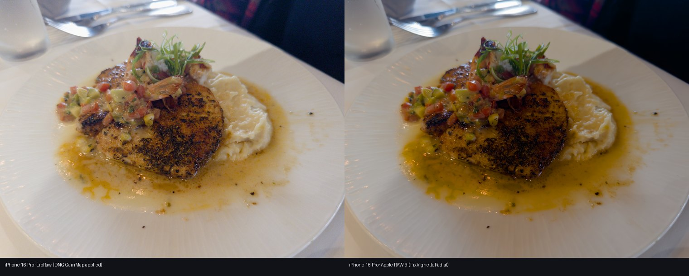

# 传感器支持与开放接口策略

> 2026-07-30 建立。回应"很多相机导出显示接口不支持"：两条解码接口全部开放，
> 缺数据的机型**降级并警示**，不再拒绝。本文记录策略、数据出处与逐机型状态。

## 策略：三级降级，永不静默

1. **颜色标定阶梯**（固定 Kelvin 白平衡求解，`raw_io.solve_wb_for_mode`）：
   文件自带 DNG 双光源标定 → 安装版 LibRaw 的机型矩阵 → 本项目回退矩阵表
   （`camera_matrices.py`，取自 LibRaw master 的 Adobe 系数，GPL 同族许可）→
   全部缺失时**退化为相机 AsShot 并在报告显式警示**（"结果可用，但白平衡声明
   与色彩精度可能有偏差"）。渲染照常出片——声明的降级可用，静默的降级等于
   隐藏白平衡。
2. **传感器先验**（`priors.py` + `sensor_priors.json`）：有 PhotonsToPhotos
   实测曲线的机型获得绝对标尺（PDR/读出噪声/unity gain/满阱）；无条目的机型
   全部退回单帧实测，报告注明"传感器标定数据不完整，绝对档位/动态范围数字
   可能有偏差，渲染仍可正常使用"。
3. **RAW 9**：逐文件探测支持版本（Apple 兼容列表是文件属性不是配置），不支持
   时明确提示降级 RAW 8/7 或改用 LibRaw，从不静默换算法（原有行为，未变）。

LibRaw 主解码对未知新机型的可用性事实：ARW/RAF/NEF 等容器格式跨代稳定，
文件几乎总能解包；缺的是**逐机型颜色矩阵**——这正是回退表补的洞。注意边界：
回退矩阵服务于 Kelvin 求解与报告，无法注入 LibRaw 内部的色彩转换；对 LibRaw
完全不认识的机型，Rec.2020 转换精度取决于 LibRaw 的内部回退，报告如实说明。

## 新机型适配状态（2026-07-30）

| 机型 | 先验（P2P） | 颜色矩阵 | 备注 |
|---|---|---|---|
| Sony A7 V (ILCE-7M5) | ✓ unityEv 7.16 / FWC 71k | ✓ LibRaw master | |
| Sony A7S III (ILCE-7SM3) | ✓ unityEv 8.51 / FWC 228k | ✓ LibRaw master | 大像素签名明显 |
| Sony A7R VI (ILCE-7RM6) | ✓ unityEv 6.18 / FWC 36k | **无**（刻意缺席） | 未找到已发布系数；矩阵宁缺毋猜，降级路径覆盖 |
| Ricoh GR IV | ✓ unityEv 5.73 / FWC 27k | 无需（DNG 自带 ColorMatrix） | |
| Nikon Zf | ✓ unityEv 7.42 / FWC 82k | ✓ LibRaw master | |
| Fujifilm X100VI | ✓ unityEv 5.98 / FWC 24k | ✓ LibRaw master | |
| Fujifilm X-E5 | ✓ unityEv 5.91 / FWC 23k | ✓ 借自 X100VI | 同款 40MP X-Trans CMOS 5 HR，声明的借用 |

数据出处：PhotonsToPhotos PDR.htm / RN_e.htm（2026-07-30 提取，含 P2P 直接
发布的 `fwc` 与 `unityEv` 字段；PDR 曲线只取实心点，三角标记起点记入
`suspect_iso_min`）；矩阵出处逐条记录在 `camera_matrices.py`。

## LibRaw 项目依赖（2026-08-01，已执行）

轮子版 rawpy 0.27.0 捆绑 LibRaw **0.22.1 发布版**。对本清单实测：0.22.1 已知
A7S III、X100VI、**Zf**（初判"缺 Zf"是 `strings` 默认 4 字符下限吃掉了
"Z f" 3 字符串的工具假象，已用 `-n 3` 复核更正——教训：用工具探测前先想清
工具自己的截断规则）；master（快照 2026-07-18，commit e419de08）对本清单的
增益是 **A7 V** 一台，外加约两年其他新机型表项。X-E5/GR IV/A7R VI 连 master
都没有——回退矩阵表对它们仍是必需层。

升级不能走 dylib 换装：master 把共享库 soname 从 25 升到 26（ABI 声明不兼容，
结构体布局可能变化，强行换装是内存踩踏不是升级）。项目现在把 rawpy fork 的
`cc7b4748` 精确提交同时写入 `requirements.txt` 和 `pyproject.toml`；该 fork 又把
`external/LibRaw` 精确锁在 `e419de08`。因此常规 `pip install -r requirements.txt`
会直接构建并安装验证过的组合，不再依赖某台机器事后运行升级脚本，也不会被 PyPI
的 0.27.0 发布轮子悄悄替换。`tools/build_libraw_master.sh` 仅保留为已有虚拟环境的
显式修复入口；换钉必须全套回归，若解码输出漂移则重基线 SDR 冻结/金标。

项目构建已验证：`rawpy.__version__ = 0.27.0+libraw.e419de08`，并公开记录完整
LibRaw 来源提交；`rawpy.libraw_version = (0, 22, 0)`（master 线），soname 26，
A7 V 入表；**全套 454 项测试在 NumPy/原生两条路径零漂移通过**——master 对既有机型
（fp/iPhone 样张）的解码逐字节兼容，SDR 冻结与金标均未失效。

两层的分工从此明确：**LibRaw 升级**解决"LibRaw 内部色彩转换缺矩阵"（回退表
够不到的那一半）；**回退矩阵表**覆盖"比 master 还新"的机型窗口期（当前：
X-E5 借 X100VI 矩阵、A7R VI 待上游、GR IV 走 DNG 自带标签）。0.22.1 已知
机型的回退条目（A7S III/X100VI/Zf）永不触发，保留作老构建环境的防御层。

## 解码格式支持：颜色表缺口 vs 格式缺口（2026-07-30）

新机型解码失败分两类，处置完全不同：

- **颜色表缺口**（文件能解包、缺机型矩阵）：走上文的标定阶梯优雅降级，回退表
  可补——A7 V、X-E5 这类属于此类。
- **格式缺口**（LibRaw 根本打不开文件）：回退表无能为力，升级 LibRaw 也未必
  有用。**典型案例：尼康高效压缩（HE/HE\*）NEF**——Z9/Z8/Z6III/Z50II 世代的
  HE 格式使用 intoPIX **TicoRAW** 编码，授权原因 LibRaw（连 master）与
  darktable 的 rawspeed 都无法解码。同机身的『无损压缩』NEF 不受影响。

格式缺口的处置（`raw_io._unsupported_format_guidance`，报错即引导）：

1. **Adobe DNG Converter**（免费，持有 TicoRAW 授权）把 HE NEF 转 DNG——
   转换后本工具全功能可用（含 CFA 证据层与 HDR）；
2. 相机内改用**无损压缩** RAW；
3. **切换 Apple RAW 不能绕过格式缺口**：Apple RAW 只替换 scene decoder，
   `RawEvidence` 仍固定由 LibRaw 获取。这样不论选择哪条 scene 管线，分析依据都完全
   相同；代价是 LibRaw 无法打开的文件会在 Evidence 阶段一致失败。Z50 II 等机型即使
   位于 [Apple 的 RAW 兼容名单](https://support.apple.com/en-us/122870)，也需要先转 DNG
   或改拍无损压缩 RAW。

Apple 覆盖注记：Z50 II 在 macOS Sequoia/26 名单上（标准 NEF 确认；HE 变体的
Apple 原生解码覆盖待真实样张验证——第三方如 RAW Power 以自带扩展解码支持
HE/HE\*，说明系统级覆盖可能不完整）。

### 证据层的能力边界（局限的精确表述，2026-08-01）

格式缺口上"证据不可得"是**工具能力的客观交集为空**，与我们的实现选择无关：

> 马赛克数据在文件里存在（只是以 TicoRAW 压缩）。**LibRaw** 肯原样暴露马赛克
> （`raw_image_visible` 一族接口），但解不开该压缩；**Apple CIRAWFilter** 解得开
> 压缩，但它是黑盒显影器——输入文件、输出解拜耳后的成品场景图像，API 不暴露
> 马赛克、CFA 排列或逐像素电平。能开锁的不给看原件，肯给看原件的开不了锁。

证据层支撑的能力（此类文件上因此不可得）：逐像素 CFA 剪切掩码（clip retreat、
gated core）、**可靠高光尾部＝HDR 预算的唯一依据**、满阱/黑白电平的绝对 EV
标尺、RAW 健康度（lag1/空码）、**RAW 码值直方图**（未解拜耳计数分布）。

**不**依赖证据层的能力（证据缺失也完整可用）：场景解码与全部渲染（AgX/胶片、
SDR 交付）、元数据级信息（机型/ISO/部分电平，自有 TIFF 解析）、以及**渲染侧
直方图**——scene-referred（EV 轴）与 display-referred（输出码值）两个口径都
只读渲染缓冲，未来做 GUI 实时直方图属于此侧，任何证据状态下均可实时；证据
只影响直方图上的**注记线**（RAW 剪切点、可靠尾部、满阱线）：有证据时叠加，
无证据时如实略去。

当前架构立场（DEA-4 起）：**证据一致性优先**——`RawEvidence` 恒由 LibRaw 获取，
使任意 scene 解码器下的分析依据完全相同；代价即格式缺口两线一致失败，用户
经由 DNG Converter/无损压缩绕行。若未来放开"证据缺席的独立解码模式"，其降级
形态已由上述边界完全确定：SDR 全功能、分析数字如实标注缺席、HDR 因无实测
尾部而诚实拒绝——这是记录在案的可选演进，不是模糊承诺。

## 逐文件支持探针（`--support`）

"支持"不再是一个模糊词：`dngscan <文件> --support` 输出该文件在两条解码线上的
**逐档确定性报告**（`decode_support.probe_decode_support`，只读元数据不解码；
GUI 选中文件后同一报告显示在解码器控件下方）：

```text
机型：SIGMA SIGMA fp
Evidence（LibRaw）：✓ 完整支持（文件自带 DNG 双光源标定）
LibRaw 场景解码：✓ 完整支持（文件自带 DNG 双光源标定）
Apple RAW：✓ RAW 9（最新解码模型）
传感器先验：✓ 有（PhotonsToPhotos 实测标尺）
```

分层定义——LibRaw：`✗ 格式缺口`（打不开，回退表无效，如 HE NEF）→
`△ 色彩无锚`（可解码、零标定）→ `△ 回退矩阵`（WB 已代偿、内部转换仍缺）→
`✓ DNG 自带标定` / `✓ 矩阵在表`；Apple RAW：`✗ 不支持` → `△ 仅 RAW 7/8`
（可显式降级）→ `✓ RAW 9`，另有 `⚠ 统一 Evidence 策略要求 LibRaw` 的标记（格式缺口
文件即使 Apple 支持也整体不可用）；传感器先验单列（只影响
分析标尺，不影响渲染）。格式缺口的报错信息与本探针互链。

## iPhone 双解码对照

同一 iPhone 16 Pro ProRAW 帧、同一 AgX plan：LibRaw 施加文件内的 DNG `GainMap`，
RAW 9 施加 `FixVignetteRadial`——两条路径的角部暗场矫正相互印证：



## iPhone 主摄 CMOS（IMX903）检索纪要

iPhone 16 Pro / Pro Max 主摄为索尼定制 IMX903：48MP quad-Bayer、1.22µm、
**双层晶体管像素**（光电二极管与像素晶体管分层堆叠，放大管加大使饱和信号量
约翻倍——这是它 FWC 的结构来源）、14-bit ADC、像素级 DCG（双转换增益）、
22nm 制程、100% Focus Pixels。

**尺寸存在信源分歧**：多数英文信源与实拍规格链为 1/1.28"（与 15 Pro 光学
连续），部分中文信源沿用早期 1/1.14" 传闻。判定：**1/1.28" 更可信**——
1/1.14" 出自发布前的传闻链，未获拆解证实。

**为什么 iPhone 不进先验表**：①PhotonsToPhotos 无 iPhone 16 Pro 条目（最近
的是 14 Pro Max/IMX803，同为 48MP 1/1.28" 前代架构，可作参照级但不可冒充
本机数据）；②ProRAW DNG 是多帧计算融合（Deep Fusion）的产物，单帧光子
转移意义上的"传感器先验"对它定义不良——RAW 健康度检查（lag1 自相关、
直方图空码）才是逐文件的实测判据；③ProRAW DNG 自带完整双光源 ColorMatrix，
颜色标定阶梯第一级直接命中，无需回退。

来源：[GHOSTEK iPhone 16 相机规格](https://ghostek.com/blogs/ghostek-insider/the-iphone-16-camera-pros-cons-specs) ·
[MacRumors 论坛 IMX903 讨论](https://forums.macrumors.com/threads/sony-imx903-sensor-on-16-pro.2438445/) ·
[AppleInsider 规格泄露](https://forums.appleinsider.com/discussion/237374/exclusive-every-iphone-16-iphone-16-pro-camera-spec-capture-button-detail-revealed) ·
[知乎：索尼主摄级传感器综述](https://zhuanlan.zhihu.com/p/15276408972) ·
[EET-China IMX903 报道](https://www.eet-china.com/mp/a318363.html)
