# HDR comparison gallery / HDR 对比页

> Archived development record: these sheets use the retired post-curve smootherstep HDR
> allocator and are not a pixel reference for the current native extended-white solver.
>
> 归档开发记录：这些图使用已经删除的曲线后 smootherstep HDR allocator，不代表当前原生
> 扩展白 solver 的像素输出。

These sheets were generated from three iPhone 16 Pro Standard RAW frames and three Sigma
fp DNG frames on 2026-07-28. They are diagnostics for the rendition pipeline, not a way to
judge peak brightness on an SDR browser.

这些图来自三张 iPhone 16 Pro Standard RAW 与三张 Sigma fp DNG。它们用于检查 rendition
管线，不是在 SDR 浏览器里模拟 HDR 屏幕峰值亮度。

In the RAW9/LibRaw sheets, the top row is SDR AgX. The bottom row is the completed HDR AgX
rendition exposed down by its measured headroom, so the extended highlight range can be
inspected on an SDR page. A darker lower row is therefore expected. The RAW9 AgX/neutral
sheets use the same convention and isolate what AgX formation changes.

RAW9/LibRaw 图的上排是 SDR AgX；下排是已经完成的 HDR AgX rendition，再按实测 headroom
降曝光以便普通网页容纳扩展高光。RAW9 AgX/neutral 图沿用相同方法，用来单独观察 AgX
formation 的影响。

## RAW9 / LibRaw

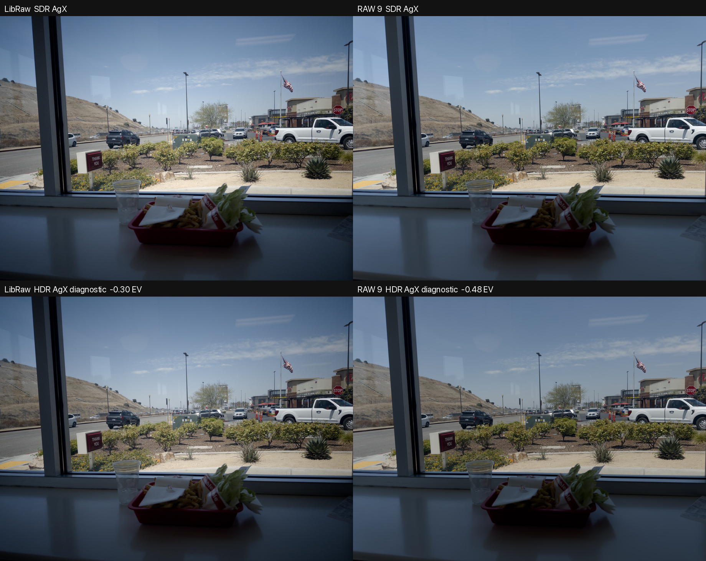

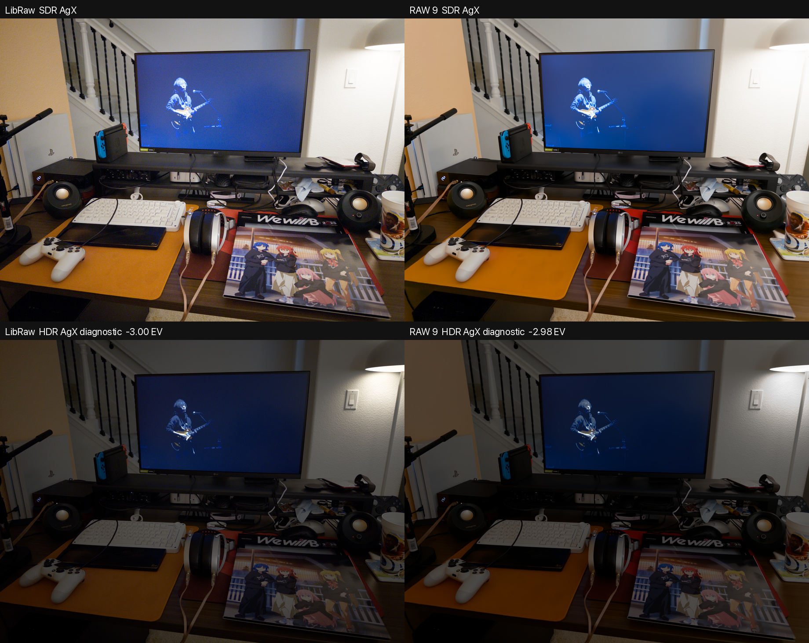

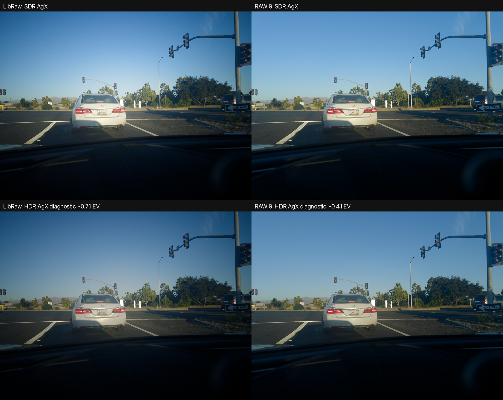

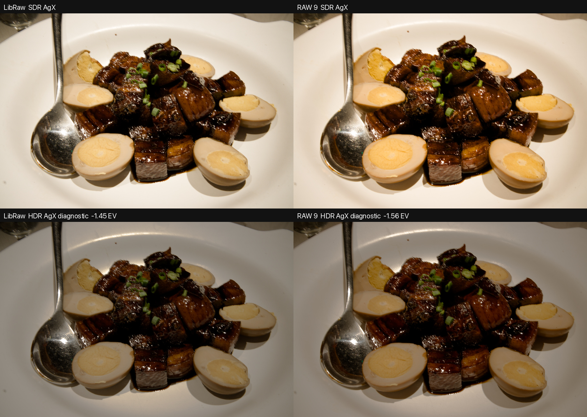

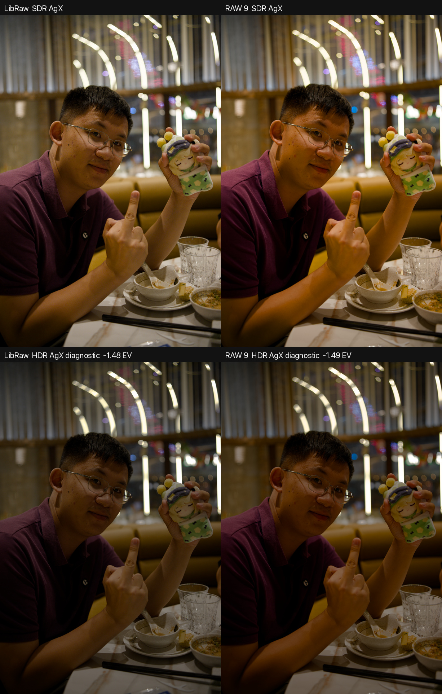

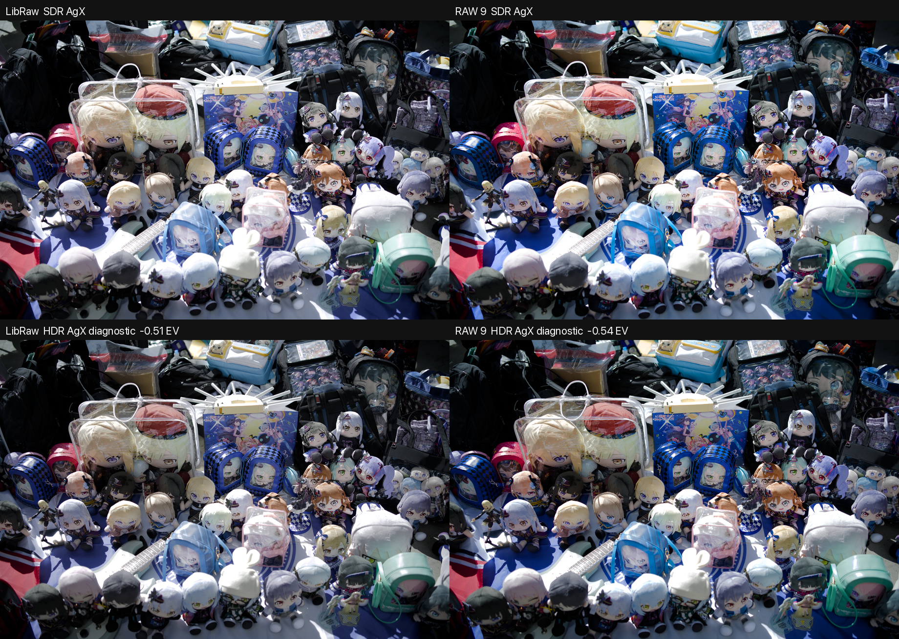

[Captured metrics](../assets/hdr-comparisons/raw9-libraw-metrics.json)

## RAW9 AgX / neutral

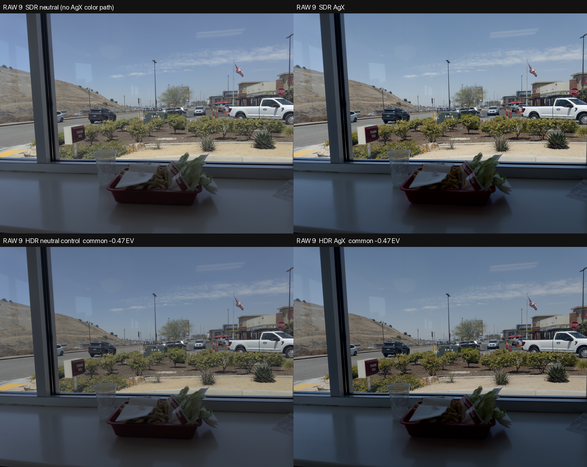

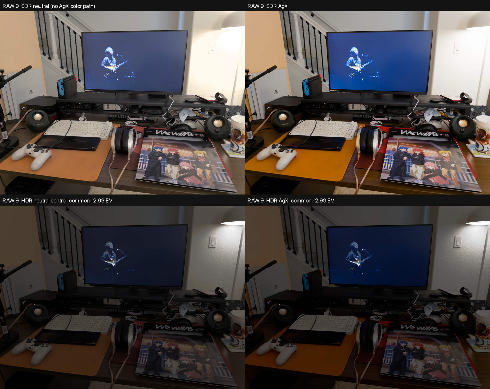

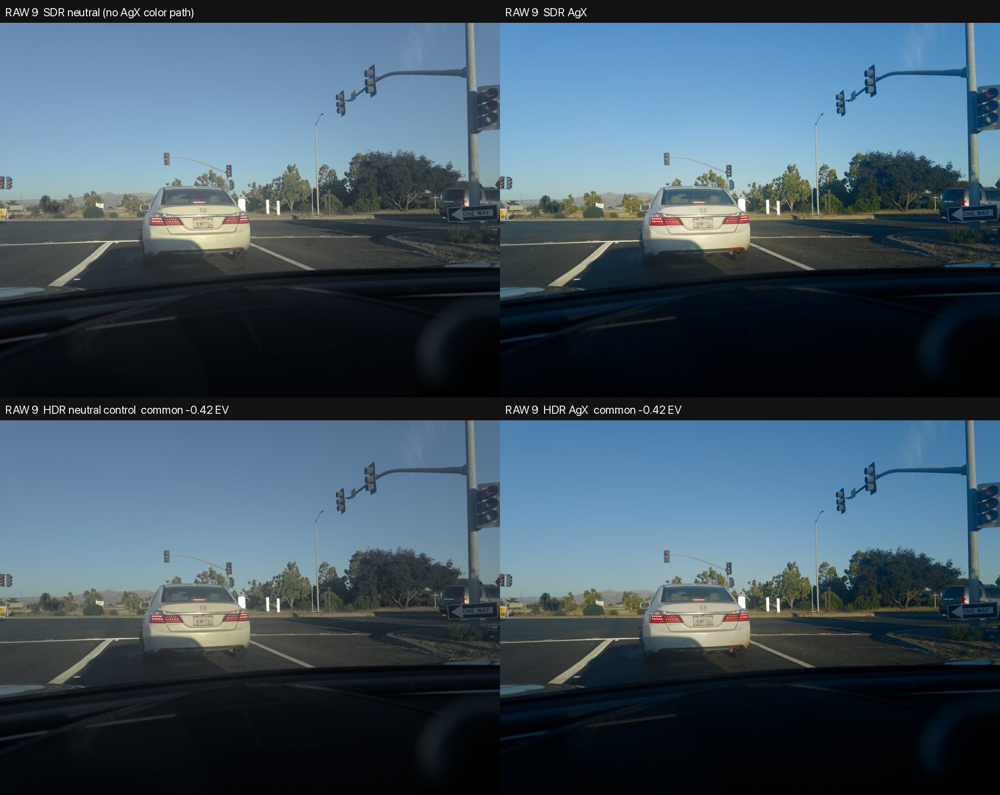

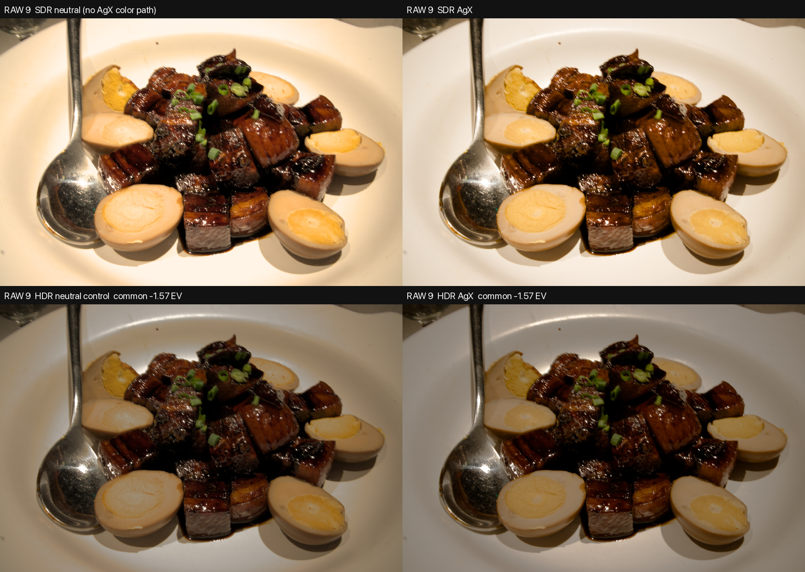

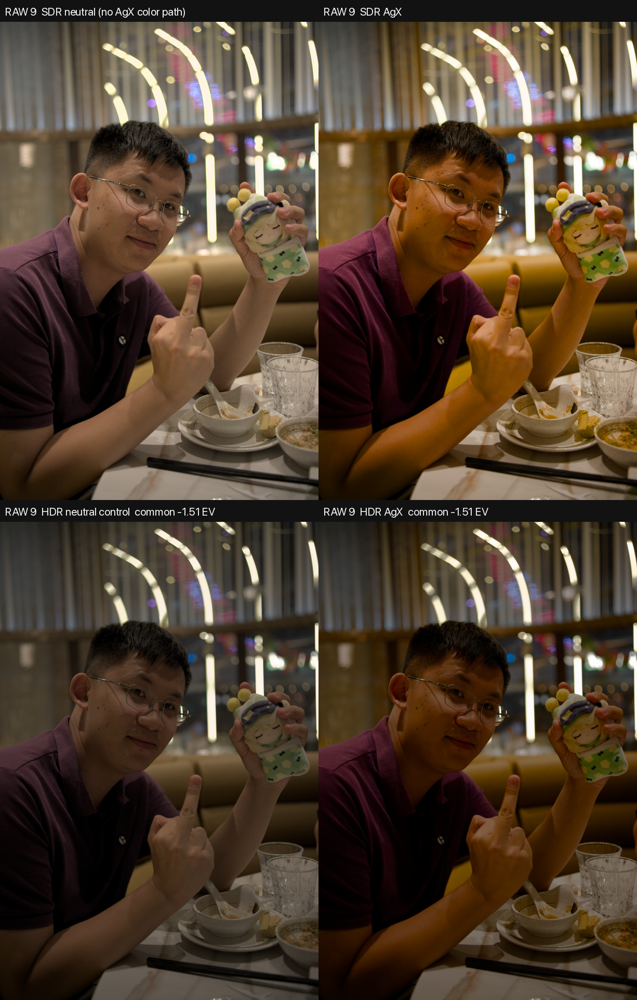

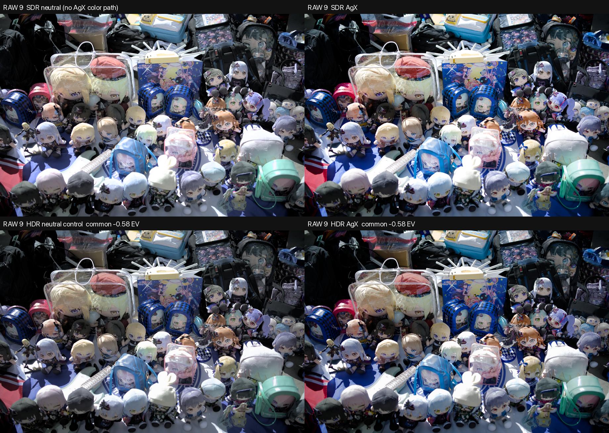

[Captured metrics](../assets/hdr-comparisons/raw9-agx-neutral-metrics.json)

The files written by the HDR exporter are Display P3, 4:4:4 ISO 21496-1 gain-map JPEGs.
Each export is expanded through Core Image and checked against the intended full-frame
extended-linear P3 rendition before the temporary file is accepted. Cross-platform
Android/Chrome recognition remains a physical-device test, not something these SDR sheets
can prove.

HDR 导出文件本身是 Display P3、4:4:4 的 ISO 21496-1 gain-map JPEG。每次导出都会通过
Core Image 展开并与目标全图 extended-linear P3 rendition 对比后才保留文件。Android/
Chrome 的跨平台识别仍属于真机验收，不能由这些 SDR 对比图代替。
